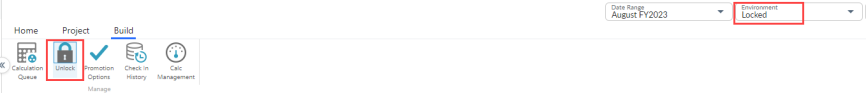
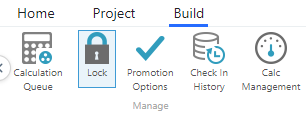
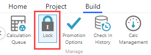
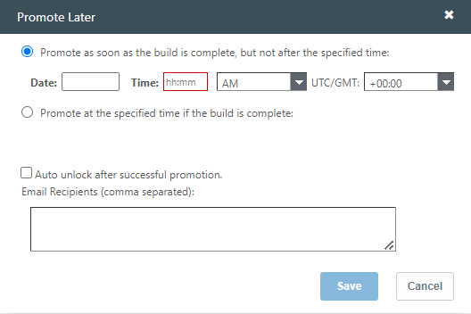
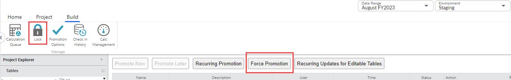
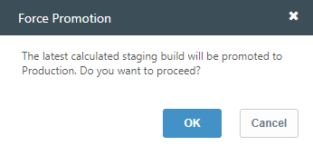
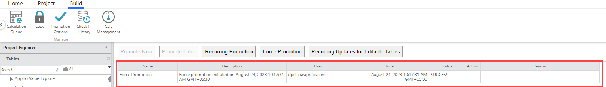
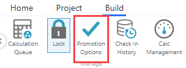
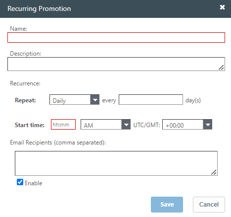
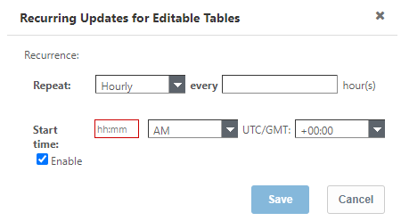

# Lock and promote a project

**Applies to**: TBM Studio 12.0 and later. Apptio TBM Studio supports two modes,
*on-demand* and *recurring*, for promotions.

## On-demand promotions

This is a basic mode where TBMAs promote builds on an as-needed basis. The TBMAs on the team are
not required to coordinate with each other in this mode. The following steps show the high-level,
expected sequence of promotion the TBMA follows. Refer to [Manage on-demand
promotions](#Lockandpromoteaproject__Manage) for detailed instructions.

1. TBMA validates the current build in stage.
2. TBMA locks the project.

   Note: A calculation in progress may trigger a new build. Otherwise, no
   new build will be triggered.
3. Locking prevents new check ins from other TBMAs while the build and subsequent promotion is in
   progress.
4. TBMA promotes the build with one of the following two options (these options are available only
   if the project is locked):
   - Promote Now
   - Promote Later

## Recurring promotions

This is an advanced mode. This mode is appropriate for a team that meets the following criteria:

- The team has a well-established rhythm of check ins and validation on a schedule.
- The team wants to ensure prod is updated on a known cadence for consumption.
- TBMAs on the team coordinate among themselves about the same.

The following steps show the high-level, expected sequence of recurring promotion the TBMA
follows. Refer to [Manage on-demand promotions](#Lockandpromoteaproject__Manage) for detailed instructions.

1. The team configures the promotion schedule.
2. The team ensures Stage is validated well in advance of the scheduled promotion.
3. Promotion takes place at the scheduled time.

If, during the pre-configured scheduled promotion time, the project is locked, the scheduled
promotion will fail. As a result, locking cannot be used in conjunction with scheduled
promotions.

## Manage on-demand promotions

- When a project is locked, users can check out documents, but they cannot check in
  documents.
- For a project to be promoted from the Staging environment to the Production environment, the
  project must be locked.
- Only users with Admin privileges can promote a project to the Production environment.

  Note: When
  a project is locked, the Environment drop-down in the global header is set to
  **Locked**.

Locking should be coordinated so that what gets promoted is known. In small teams, it is easier
to track informally. However, in larger teams or situations where check ins occur frequently with a
variety of changes to different documents within the system, it may be necessary to coordinate to
help ensure that when the specific set of changes targeted for prod is checked in, the associated
build is locked.

When Stage is locked, users will not be able to check in. The locking mechanism is provided so
that TBMAs have a way to block further changes from impacting a publication event.

## Lock or unlock a project

1. Select the Staging environment.

   
2. On the **Build** tab select **Lock** (or if previously
   locked, select **Unlock**).

   

After you lock a project, you can promote it. The **Promote Now** and **Promote Later**
buttons will be enabled and **Force Promotion** button will be disabled.

## Promote a project from Staging to Production environment

To promote a project, go to the **Build** tab and select **Promotion
Options**. Select one of the following options:

**Promote Now**

Immediately promotes the project. This button is disabled when the build is unlocked or when
another build is still running.

**Promote Later**

This button is disabled when the build is unlocked.

1. The Promote Later dialog appears.

   
2. Select **one** of the options:
   - Promote as soon as build is complete, but not after the specified time
   - Promote at the specified time if the build is complete
3. Enter the **Date** and **Time** to schedule the promotion
4. Select or unselect the checkbox for **Auto unlock after successful
   promotion**
5. Enter email ids in the **Email Recipients** textbox
6. Select Save.

## Force Promotion

Applies to: 12.11.0 and later. The **Force Promotion** button allows you to promote the last
calculated build for the project to Production, without locking the staging environment. To force
promote the build, do the following:

1. Navigate to **Build** tab and ensure the build is unlocked.

   
2. Select the **Force Promotion** button. A warning pop up appears as shown:

   
3. Select **Ok** to complete the action

   

   .

## Manage recurring promotions

Note: As described in the Introduction, setting up a recurring promotion is an advanced feature
intended for mature teams.

## Recurring Promotion

1. From the Staging environment and Build tab, select Promotion Options.

   
2. Select **Recurring Promotion**. The Recurring Promotion dialog is
   displayed.

   
3. Enter data in the following fields

   | Fields | Description |
   | --- | --- |
   | Name | Name of the recurrent promotion |
   | Description | Description of why the recurrent promotion is required |
   | Recurrence | **Repeat**: Select Daily, Weekly, or Monthly every <frequency of repetitions> days  **Start time**: Enter the <hh:mm> <AM/PM> and select **UTC/GMT** < timezone> |
   | Email recipients | Enter the email id of those who must receive the notifications |
   | Enable | Select this checkbox to enable / disable email notifications |
4. Select **Save**

## Recurring Updates for Editable Tables

1. From Promotion Options, select **Recurring Updates for Editable Tables**.

   
2. Enter data in the following fields

   | Fields | Description |
   | --- | --- |
   | Recurrence | **Repeat**: Select Hourly (default), Daily, Weekly, or Monthly every <frequency of repetitions> hour/days/month.  **Start time**: Enter the <hh:mm> <AM/PM> and select **UTC/GMT** < timezone> |
   | Add new Start time | This button appears for Daily, Weekly, and Monthly recurrence.  Click the button to add **Repeat** and **Start time** values as mentioned above. You can click this button 23 times (to repeat the start time for every hour) after which the button will be disabled.  Click the x icon to delete any start time |
   | Repeat On | This field appears for **Weekly** recurrence. Select the days on which you want the recurrence to work. |
   | Enable | Select this checkbox to enable / disable email notifications |
3. Select **Save**.

## Scenarios and best practices

**Scenario** - The team has a day-to-day rhythm of smaller
changes, but a TBMA, or set of TBMAs, want to perform long-running configuration
activity.

**Best practise** - The team can use schedule promotions on the
main branch. A separate branch can be created for long-running configuration, which uses on-demand
promotions.

**Scenario** The team has a day-to-day rhythm of smaller
changes, but new data is loaded into the system every month with a data link.

**Best
practise**

- The team can use schedule promotions on the main branch.
- Loading data via Datalink (Classic) takes place in a branch, is
  validated, and then merged to the main branch.

**Scenario** - The team has an established promotion rhythm, but due to
specific events or some break, the team needs to perform a one-off out-of-band
promotion.

**Best practise**

- The team configures and uses a scheduled promotion.
- The team can use out-of-band, on-demand promotion without the scheduled promotion conflicting
  with the on-demand promotion. In case of a conflict, the on-demand promotion proceeds and the
  scheduled promotion is aborted.
