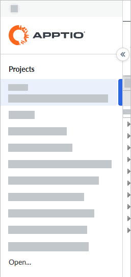

# Open a project

**Applies to**: TBM Studio 12.0 and later. You can create many projects in the application, but
you can have open only one project at a time. To open a project, open the Project menu in the Global
header and click on the project's name.

All users with roles other than View Only can select a project from the Project menu.

Note: If you are assigned a View Only role, you will have access to a single project.
