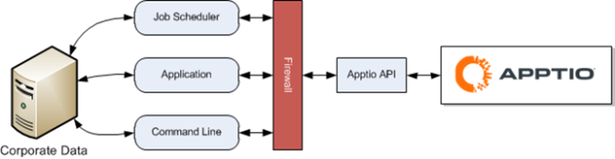

# Platform API

**Applies to**: TBM Studio 12.0 and later

Note: In release 12.9 and above, include the following header values on any API calls to the
platform API.

app-type="Flagship"

app-version="NA"

This includes API calls which
upload to or download from Costing Standard or other platform projects. These are in addition to
existing API headers you may already be using.

Apptio's API can be used to implement the scripted automation of data uploads to Apptio projects
or data download from Apptio projects. This API is provided as an alternative to the Apptio Datalink product. Datalink (Classic) does not require
the user to have a specialized scripting skill, and it has its own API to help integrate with
third-party ETL tools.

Some typical reasons that the Apptio Platform API might be used instead of Datalink (Classic)include the following:

- The inability to install an on-prem Apptio Datalink (Classic) agent to
  upload data from on-prem sources
- The desire to use embedded scripting in a third-party ETL tool

The Apptio API provides a direct link between corporate data and Apptio through simple commands.
The commands describe how data is posted to Apptio and pulled from Apptio, including where to put
the data and the appropriate time period.

For example, you can upload monthly or quarterly server utilization data or general ledger data
to ensure reports are up to date. Also, you can download data from the Apptio data sets and report
components.

The commands can be integrated into any job scheduler, added to any customizable application with
a few lines of code, or issued directly from a command line.

The simplicity and versatility of the API has many benefits:

- Ease of implementation: there is no software to install
- Compatibility with all corporate data systems and data extract tools
- Automation through corporate job schedulers
- Versatility through implementation options: job scheduler, application integration, command
  line

## API authentication

In order to execute an upload or download, the script must first authenticate. See [https://www.ibm.com/docs/en/apptio-platform/access-administration/saas?topic=apis-enhanced-access-administration-api-authentication-via-api-keys](https://www.ibm.com/docs/en/apptio-platform/access-administration/saas?topic=apis-enhanced-access-administration-api-authentication-via-api-keys "(Opens in a new tab or window)") for information on how to authenticate using these methods. While
out-of-the-box roles can be used, you might prefer to limit the access of accounts to the specific
action being executed. In this case, roles that authenticate should have the following minimum
permission sets for uploading and downloading:

- Upload permissions:
- AccessDev
- UploadData
- Upload Data

  Note: Note that “UploadData” and “Upload Data” permissions are indeed separate
  permissions. Be sure to include both.
- Download permissions:
- AccessProd
- AccessStg
- DrillDown
- View Proactive
- AllDataView
- InteractiveBenchmarksAndCostData
- ViewMetricReports
- ViewObjectReports
- ViewReportsSavedForEveryone
- ViewTransformReports
- ViewTransparencyReports
- ViewUnitReports

Note that Some of the “View” permissions listed above might not be required depending on the
products you have installed and the type of data you're downloading. When in doubt, test.

**Examples**:

Please read [License for examples](../studio/apis/studio_license_examples.html "Applies to: v12.0, v12.1, v12.2+").

- [API URL for
  uploading a table](../studio/apis/studio_api_url_table.html "♦ Applies to: v11.x, v12.0, v12.1, v12.2+")
- [API
  URL upload examples](../studio/apis/studio_api_url_upload_examples.html "Applies to: v11.x, v12.0, v12.1, v12.2+")
- [API:
  Downloading data](../studio/apis/studio_api_download_data.html "Applies to: TBM Studio v11.x, v12.0, v12.1, v12.2 and later")
- [API URL for uploading and editing
  user data in pre-Enhanced Access Administration systems](../studio/apis/studio_api_url_upload_edit.html "Applies to: v11.x, v12.0, v12.1")
- [API tutorial:
  Download and upload v.12 Costing Standard table using Postman tool](../studio/apis/studio_tutorial.html)
- [How to access R12 API through Enhanced Access Administration via curl](../studio/apis/studio_access_api.html)
- [Apptio API
  demo scripts](../studio/apis/studio_demo_scripts.html)
