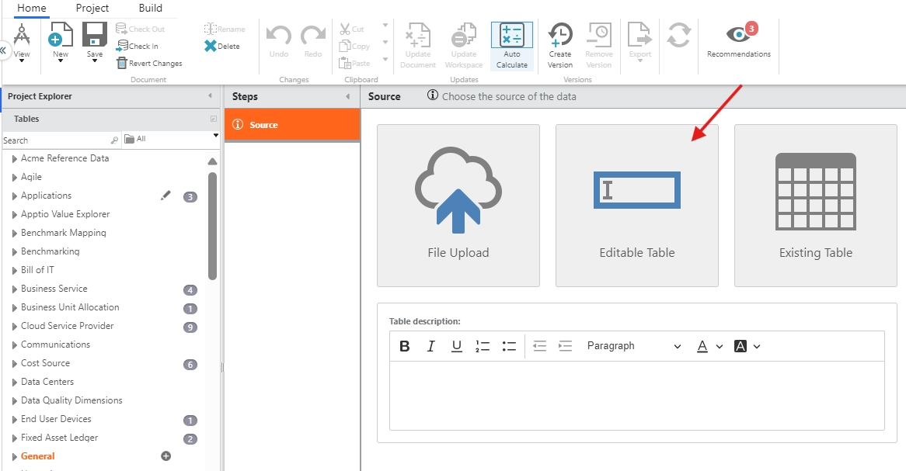
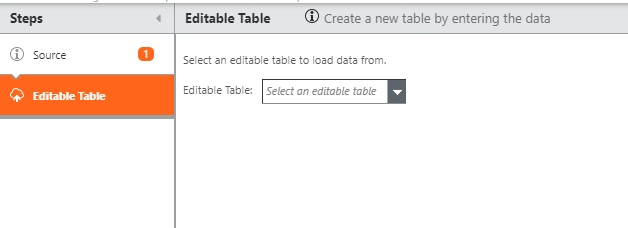
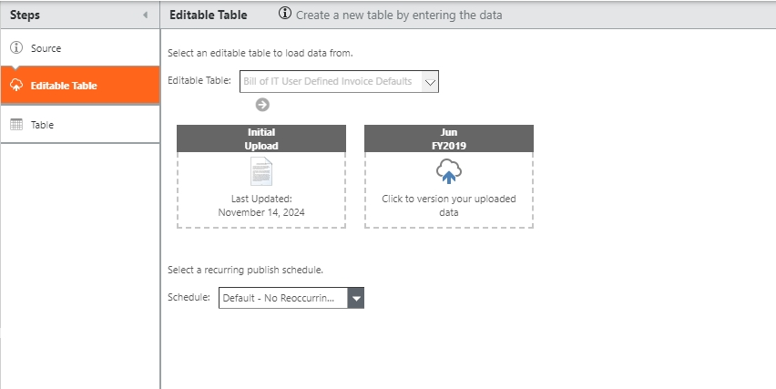
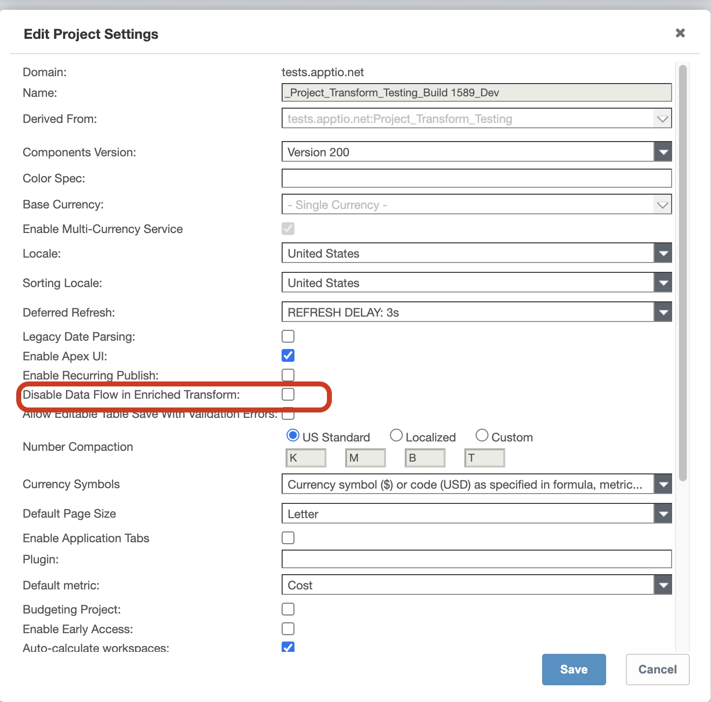
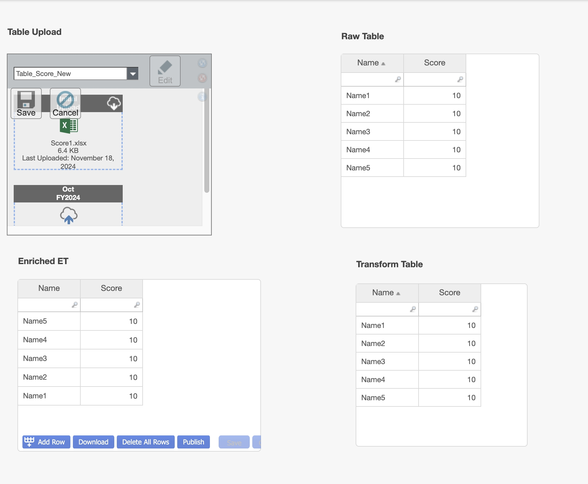
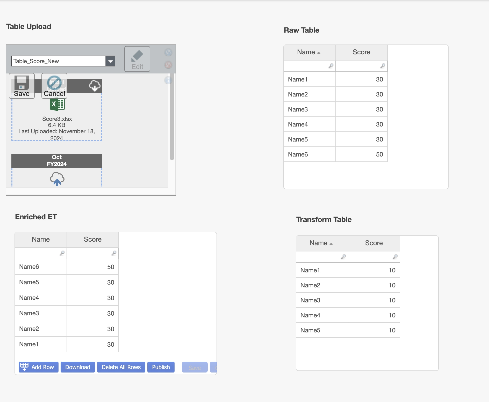
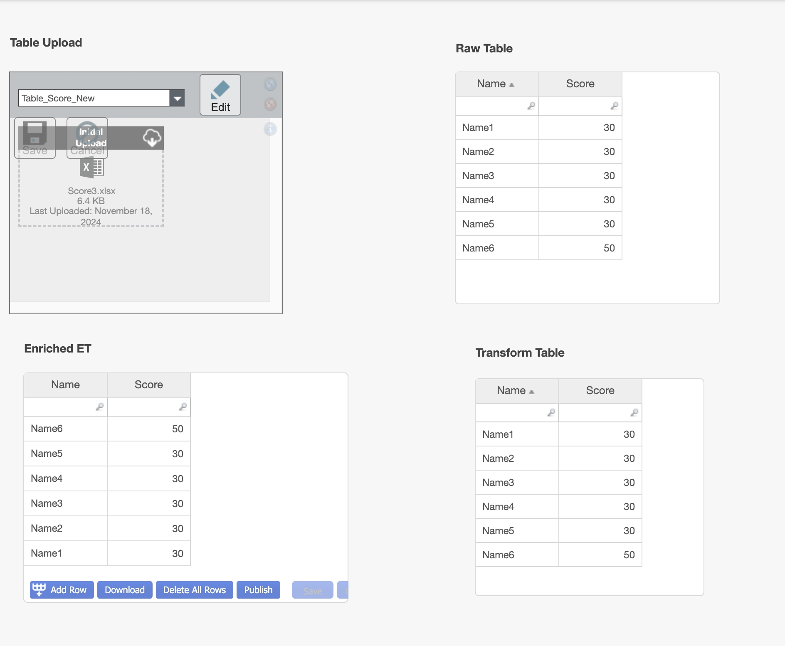
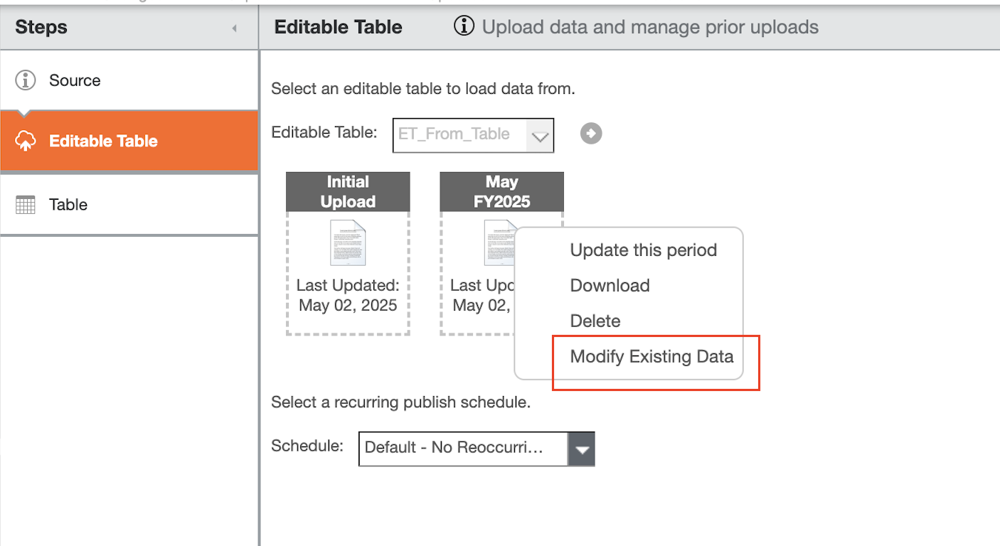

# Create a table from editable table

You can create a table from an existing Editable Table using the following steps:

From TBM Studio, go to  **Home**  tab >�  **New**   dropdown > select  **Table** 
.

In the Create Table popup, enter a name for the table and select Ok.

Select the  **Editable Table**  tile.

Select a value from the Editable Table dropdown.

Choose the method of upload and select the recurring publish schedule

Save and check-in the table.

## Disable Data Flow in Enriched Transform

If you configure an enriched editable table and then change the information in the source
transform table in the development stage, the data will not flow automatically to the enriched
editable table. Only once the table is Published, the data will flow from the source table to the
enriched editable table.

To enable this feature, navigate to TBM Studio > Project Settings, and select the  **Disable
Data Flow in Enriched Transform**  option.

If the feature is disabled, the data flow will be as shown below.

If the feature is enabled, the data flow will be as shown below.

After checking in the changes, the data will appear as shown.

For the current enriched editable table flow, consider 3 tables involved:

- Table\_1 – source transform table
- EET\_Table\_2 – enriched editable table built off Table\_1
- Trf\_Table\_3 – transform table created off ET\_Table\_2.

The Values shown in Trf\_Table\_3 come from 2 tables:

- Table\_1 has the original source rows, and
- EET\_Table\_2 has the overlay records which modifies the cells in the original source rows from
  Table\_1, and may include new, added rows. (It cannot delete any existing rows in Table\_1).

When you upload a new dataset to Table\_1, the changes will be seen immediately in EET\_Table\_2
and Trf\_Table\_3 even though you have NOT published changes from the EET\_Table\_2 to Trf\_Table\_3.
EET\_Table\_2 only has the overlay records to the source rows from Table\_1.

This new feature gives you the option to control which behavior you prefer and is controlled via
a new project setting: “Disable Data Flow in Enriched Transforms”

- Disabled (default) – the transform table will receive updates from the source table (Table\_1)
  immediately (current behavior)
- Enabled – the transform table will only see the updates from the source table (Table\_1) when the
  table upload is “checked in”

Note: Editable Tables are now branch-specific, allowing work in each branch without impacting the
main Trunk. That is, creating a branch will have its own copy of Editable Tables and
modification in trunk will not be visible in branch.

## Uploading and Publishing Data to a Transform Table

The Transform Table feature allows administrators to upload and publish data from an editable
table in the data pipeline.

**Correcting Errors in Editable Table Changes**

You can correct errors in editable table changes that were published to an earlier period.
Suppose you published changes to an editable table in January, but later discovered that there were
errors in the data. You can download the data from the Transform Table for January, make the
necessary corrections, and then upload the corrected data directly to the Transform Table. This will
correct the errors in the cost model and ensure that the data is accurate and up-to-date.

Note: This
feature is applicable only for blank ET and not enriched ET

1. Navigate to the data pipeline step and select the Transform Table for which you want to upload
   data.
2. **Download** the table data for a specific period.
3. Make the necessary changes to the downloaded file. The data should be in the same format - it
   can only by modified, rows/ column can neither be deleted nor added.
4. **Upload** the corrected data directly to the Transform Table for the specific period. This
   will overwrite the original data and correct the errors in the cost model.

**Parent topic:** [Edit project settings](../../studio/admin/edit-project-settings.html "Applies to: TBM Studio 12.0 and later. Some settings are available in later versions of TBM Studio, as noted below.")

**Parent topic:** [Upload data](../../studio/data_studio/upload-data.html "Applies to: TBM Studio 12.0 and later")
