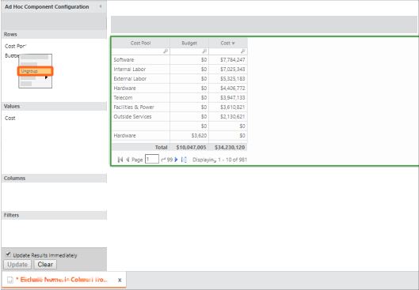

# Exclude a numeric column from a trend

◆ Applies to: TBM Studio 11.0 and later, TBM Studio 12.0 and later

Sometimes when creating an ad-hoc report, you want to trend some numbers and exclude others from
trending. This article describes how to exclude one or more columns from the trend.

This article contains TBM Studio R12 screenshots, but the same principles apply to TBM Studio
v.11.

Let's say you start with a report that has a trend of the prior three months of costs by Cost
Pool:

If you simply add Budget, you get this:

However, in this example, our budget number is the same every month and so we only want to
display it once and not have it appear under the trend. So, instead, we do the following:

1. Temporarily remove the time values from **Columns**.
2. Insert a formula column and set it equal to the Budget metric:

   
3. Drag the **Budget** column from the **Values** section to
   the **Rows** section.
4. Right click on the Budget column, and then select Ungroup.

   If you forget to ungroup the column
   when you add the time trend back, the table will have zeros in that column.

   
5. Add the trend back into the columns:

   
