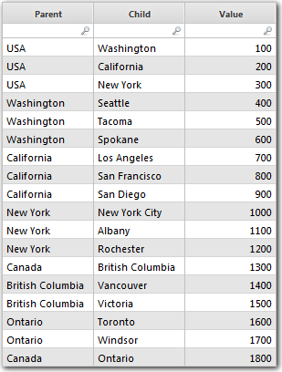
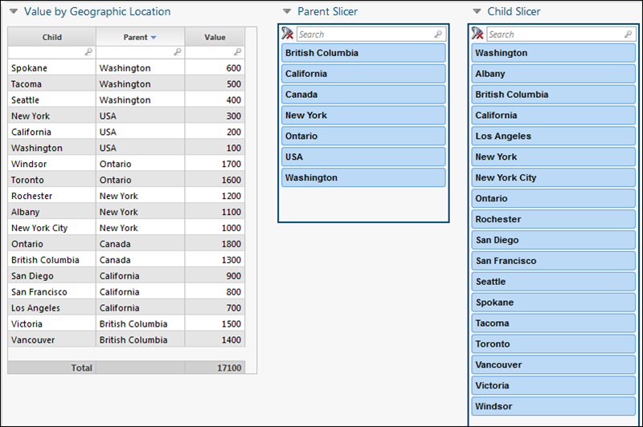
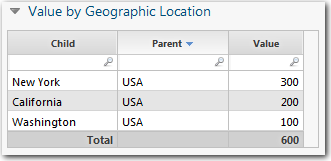
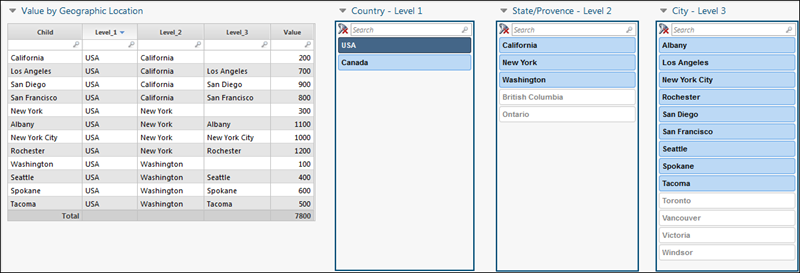

# Flatten a data hierarchy

**Applies to**: TBM Studio 12.0 and later

If you are working with a table that has hierarchical data and a parent column and a child
column, and you place that table on a report, you will have limited slicer capabilities. To provide
users with the maximum flexibility using slicers, flatten the data set by adding a Flatten Hierarchy
step to the transform pipeline. This feature adds columns to the data set transform (one column for
each level in the hierarchy). You can then create slicers for each of the columns.

## Example

The data set shown in the following image is based on a geographic hierarchy. If you create a
report from the data set, and add slicers for the **Parent** and **Child** columns, you get
the report shown in the following image:

Suppose you want to see all the entries in the USA. When you select **USA** from the
**Parent** slicer, you get the result shown in the following image:

But, what if you want the users to be able to see all the entries associated with the USA? You
can achieve this by flattening the hierarchy using the **Flatten Hierarchy** feature. The
**Flatten Hierarchy** feature takes the information in a **Parent** column and a **Child**
column and adds Level columns that can be used with slicers. The result is shown in the following
image. By flattening the hierarchy, you provide users with the maximum flexibility when using
slicers.

For the **Flatten Hierarchy** feature to work correctly:

- Each parent-child combination must be unique. If there are duplicated combinations, an error
  message will be displayed in the newly generated columns.
- For each parent-child combination, the child cannot have more than one parent.
