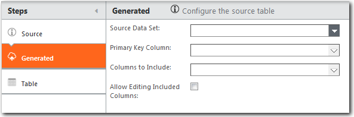

# Generate a table

**Applies to**: TBM Studio 12.0 and later

To create a new table from an existing table in the current project, use the Generated Table
option. The new table will be linked to the source table.

## Source data set

Select a data set from the list.

## Primary Key Column

Select the column that will serve as the primary key. The application will automatically filter
the entries in this column to unique entries. For example, if there are two rows for Smith in the
source table, there will be only one row in the generated table. To maintain integrity between the
source table and generated table, select a column whose values will not change.

If you wish to preserve duplicate entries, create a new column in the source table that combines
the primary key column with a second column. Use the new column as the primary key in the generated
table.

## Columns to Include

Check the columns you want included in the generated table.

## Allow Editing-Included Columns

Generally, columns included from the source table are static in the generated table. If you want
users to be able to edit the columns included from the source table, select this option. Columns
that will be editable usually are added to the generated table after the table has been
generated.
