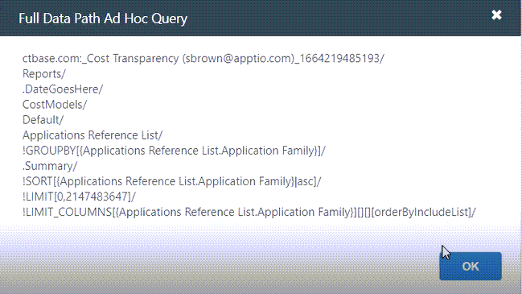
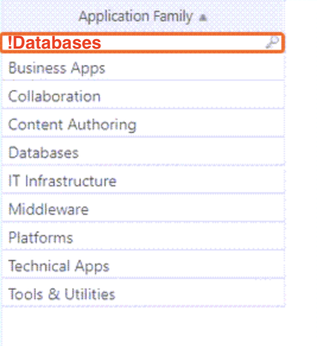

# Table Functions

**Applies to**: TBM Studio 12.0 and later

## How the table functions are used in a path?

1. In the TBM Studio **Project Explorer** view, select
   **Tables**.
2. Select a table (For example, table name: XYZ) **>** Check out XYZ).
3. Add a model step **>** select **Model**
   **>** select XYZ **>** select **Use object
   identifier**.
4. Select the dropdown **>** select **Application Family**
   and **Application Function**
   **>** select **Save**.
5. Now, you need to create a new report. Select **New**
   **>Report**
   **>** Write a report Name **>**
   **Ok**.**Note:** You need to start the report name with Text,
   and not with numbers.
6. Select the XYZ table in the **Ad Hoc Component Configuration section**.
7. In the **Project Explorer**, expand  beside the XYZ table, then drag **Application
   Family** to **Rows**. The table components load with automatic grouping.
8. Right click inside the table **>** select Show full datapath. You can see the
   table functions GROUPBY, SORT, and LIMIT\_COLUMNS.

   
9. To apply the !FILTER function in this table, click **OK** to come out of this
   window.
10. Now suppose you do not want to use Databases. Put !Databases here:

    
11. Databases is not there anymore. Now, right click inside the table **>**
    select **Show Full Data Path**. Now you can see the !Filter function

## How to use these table functions to get your values in editable table?

1. Check out an editable table.
2. Select **Configure Columns >** select **Add a new column
   >** select **Possible Values >**.
3. You can put your table function syntax in the **Possible values >** select
   **Save >** select **Editable Table** in the pipeline.
4. After the table loads, you will get a new column. You can click on the cells of the new column
   to select from the drop down with the table functions.

Learn more about the various table functions to get your values in the editable table:

- [!GROUPBY[]](groupby.html)
- [!LIMIT\_COLUMNS[]](limit-columns.html "Determines the columns displayed in a table. You can limit columns using the Ribbon.")
- [!SORT[]](sort.html "Sorts a table on one or more specified columns in the table. You can sort a table using the Ribbon. The !SORT function can be applied using one, two, or more columns in a table.")

**Parent topic:** [Editable tables: Accommodating user input](../../studio/data_studio/editabletables.html "Applies to: TBM Studio 12.6 and later")
