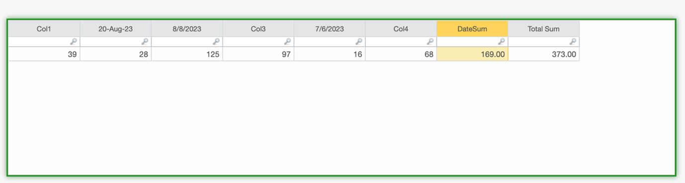
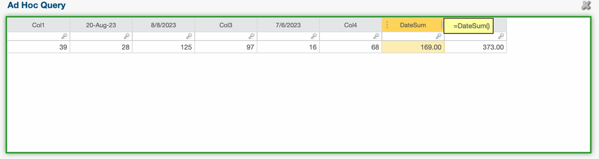

# DateSum function

Sums the values in all columns whose names conform to recognized date formats, ignoring
non-date columns.

The DateSum function is useful if you have tables with columns that have numerical data in date
columns as well as other columns. The function sums only the columns with date headers.

## Syntax

`DateSum()`

## Behavior

- Scans the columns of the current table.
- Identifies columns whose names match standard application date formats (such as 'Jan
  2025', '02/2025', etc.).
- Sums the numeric values across all identified date columns.
- Ignores columns that do not match a date format.

## Parameters

There are no arguments for this function.

## Return type

Number

## Example

Sums all columns whose headers are dates, skipping any non-date columns.

The table below shows a simple example of the DateSum function. The function adds the 2nd,3rd and
5th columns, which are columns with date as their headers, but ignores the 1st,4th and 5th column.
And difference between Datesum and Total sum can be seen in below example

Example screenshot with syntax

Note: This function is useful for tables that combine regular
columns with columns representing time periods. Date formats recognized are determined by
the application's locale and configuration. This function does not take any arguments.
