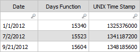

# Days function

Converts a specified date to a numeric value representing the number of days since
January 1, 1970.

Converts a specified date to a decimal value, which can be used in formulas. The decimal value is
the number of days since January 1, 1970.

## Syntax

`Days(date_expression [, from_format])`

## Parameters

*date\_expression*

An expression that evaluates to a date to be converted to a numeric value. The expression must
represent a date only and cannot include a time component. Note: This parameter accepts an
expression, meaning you can provide a literal value, a column reference, or the result of
another function. Required

## Behavior

- Converts the provided date to the number of days since January 1, 1970.
- If from\_format is specified, the function uses it to parse the input date string.
- If the date\_expression includes a time component, it must be ignored or truncated.

## Return type

Number

## Example

The following example calculates the project duration in days and multiplies it by the daily
project cost.

`=(Days(ProjectEnd)-Days(ProjectStart))*ProjectCostPerDay`

Note: Only date values (without time) are supported. If from\_format is omitted and the
date\_expression is a string, the system attempts to parse based on default locale settings.

## Converting days to a UNIX time stamp

A UNIX time stamp is the number of seconds that have elapsed since January 1, 1970. This number
can be useful if you want to do math with dates. You can convert the result from the Days function
into a UNIX time stamp using the following formula:

`=Days(date_expression)*24*60*60`

This takes the out put from the Days function and multiplies it by the number of seconds in a
day: 24 hours x 60 minutes x 60 seconds.

For example, you could convert the dates shown in the table below:

The formula for the Days Function column is: =Days(Date)

The formula for the UNIX Time Stamp column is: =(Days Function)\*24\*60\*60

See also:

- [CurrentDate](currentdate.html "Returns the starting date of the currently selected time period, if time is enabled. If not, returns Eon 2000.")
- [Hours](hours.html "Converts a date value into the number of hours since January 1, 1970, as a numeric value.")
- [Minutes](minutes.html "Converts a date value into the number of minutes since January 1, 1970, as a numeric value.")
- [Months](months.html "Converts a specified date to a decimal value representing the number of periods since January 1, 1970. Useful for time-based calculations such as determining durations or pro-rating costs.")
