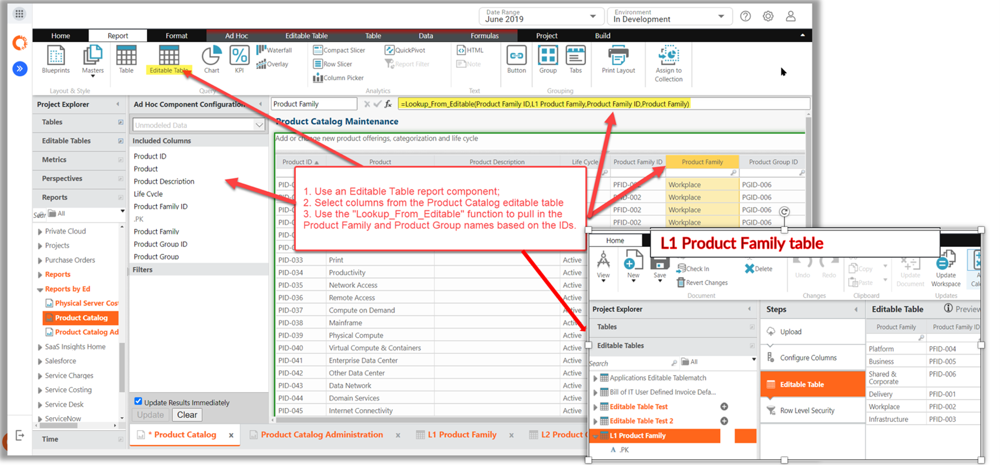

# Lookup_From_Editable function

This function brings columns from an editable table via a lookup to include it in report tables
that are displaying either data from a different editable table, or data from a transform/model.

## Where to use

This function can be used in:

- Data sets
- Formula columns in editable tables

## Where NOT to use

Transform pipeline, model driver, or advanced allocation formula.

## Syntax

=Lookup\_From\_Editable(source\_column,lookup\_table,matching\_column,lookup\_value\_column,
[leave\_original\_value], (replace\_nulls], [ignore\_case])

**Arguments**

- *source\_column* is the column in the current data set that will match a column in the other
  data set.
- *lookup\_table* is the editable name from where you need to translate data from.
- *matching\_column* is the column in the lookup\_table that matches the data in the column you
  specified in source\_column.
- *lookup\_value\_column* is the column in the lookup\_table that you need to translate back to
  the current data set.
- *leave\_original\_value* is boolean which doesn't update the result if the lookup is
  unsuccessful
- *replace\_nulls* is boolean which replaces null with a defined default value
- *ignore\_case* is boolean to ignore case for other params

## Return type

The type of the lookup column.

**Notes**:

- If the LookUp\_From\_Editable function finds multiple matching rows, it returns {Various} instead
  of a null.
- If you are using the replace\_nulls or ignore\_case optional arguments, you also must specify the
  optional arguments that come before them.
- Use the standard curly braces { } to escape special characters or operators that might appear in
  column names being referenced. For example, {P&L Rate}.
- Inference linking multiple tables is preferable to doing lookups and can be used anytime the
  resulting column is not needed in a data set.

## Examples

This formula can be used to create a lookup column in one Editable table from another Editable
Table.

Note: This lookup column will not add data to the Editable tables in the backend, it is just a
column that is visible on the reporting surface.

Example Syntax

`=Lookup_From_Editable(Product Family ID, L1 Product Family, Product Family ID, Product
Family)`
