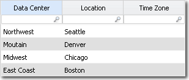
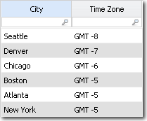
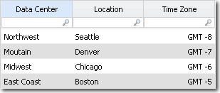

# Lookup function

Searches for a value in a lookup table based on a match between a column in the current
table and a column in the lookup table, and returns the corresponding value from a replacement
column.

Finds the value in a specified source column in the current table and in a specified column
of a lookup table. Lookup and Lookup\_Wild return the value in the corresponding specified
replacement column of the lookup table. If two or more values are found in the lookup table,
the value {Various} is returned. The only difference between the two functions is that
Lookup\_Wild supports regular expressions in the matching column and Lookup does not.

To increase row count by creating a new row for every return value instead of {Various},
use [LookupEx](lookupexandlookupex_wild.html "Performs a lookup across tables and returns all matching values, creating new rows for each match. This function enables a one-to-many relationship by joining every matching row from the lookup table into the transformed table.").

If you are using Lookup to bring in a numeric value, and you want the values summed instead
of returning various, use the [Data lookup](../data-lookup.html) syntax.

## Syntax

```
Lookup(source_column, lookup_table, matching_column, replacement_column, leave_original_value, replace_nulls, ignore_case, default_value)
```

## Parameters

- *source\_column*: The column in the current table used to find matches. Supports
  multiple columns joined with & or &&. Required
- *lookup\_table*: The name of the lookup table that contains the matching and
  replacement values. Must be a constant. Required
- *matching\_column*: The column in the lookup table to match against the source
  column. Supports regular expressions only in Lookup\_Wild. Required
- *replacement\_column*: The column in the lookup table from which to return the
  value. Prefix with '=' to dynamically select a column using the source table.
  Required
- *leave\_original\_value*: Returns the original source value if no match is found. If
  false, returns blank. Optional (default: False)
- *replace\_nulls*: Determines behavior when the source value is null. If true,
  attempts to match a null value in the lookup column. Optional (default: False)
- *ignore\_case*: If true, performs a case-insensitive match. If false, matching is
  case-sensitive. Optional (default: False)
- *default\_value*: Optional default value to return when no match is found and
  leave\_original\_value is false. Optional

## Behavior

- Finds a match between the source column and the matching column in the lookup table.
- Returns the value from the replacement column for the last match found.
- If multiple rows match, returns '{Various}'.
- Supports optional boolean flags for behavior customization: leave\_original\_value,
  replace\_nulls, and ignore\_case.
- Only works with label-type columns in source and matching columns (numeric types not
  supported).

## Return type

Matches the data type of the replacement column

## Examples

`Lookup({Product ID}, ProductTable, ProductCode, Description)`: Returns the
Description from the ProductTable that matches the current row's Product ID.

`Lookup(ProductType, LookupTable, Type, Label, true)`: Returns the Label for
matching ProductType; if no match is found, returns the original ProductType.

`Lookup(Region & SubRegion, GeographyTable, Region & SubRegion, Code, false,
false, true)`: Performs a case-insensitive lookup using two combined columns.

Assume you have the following table called Data Centers that lists data centers and their
location:



Based on the location, you want to fill in the Time Zone column. You have the following
table called Time Zone that can supply the GMT offset.



You enter the following in the Value Override field for the Location column in the Data
Centers table:

```
=Lookup(Location,Time Zone,City,Time
      Zone)
```

The result is:



Note:

- If using replace\_nulls or ignore\_case, you must also include all preceding optional
  parameters.
- When no match is found and leave\_original\_value is false, the function returns blank
  unless a default\_value is specified.
- Use Lookup\_Wild if you need pattern matching via regular expressions in the matching
  column.
- If multiple matching rows are found, Lookup returns '{Various}'. If this is not
  acceptable, use LookupEx instead.
