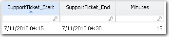

# Minutes function

Converts a date value into the number of minutes since January 1, 1970, as a numeric
value.

## Syntax

`Minutes(date_expression, date_format)`

## Parameters

- *date\_expression*: The date to convert. Format must be a supported date format.
  Note: This parameter accepts an expression, meaning you can provide a literal value, a
  column reference, or the result of another function. Required
- *date\_format*: The format of the date string. Required only if the date\_expression
  is not in a standard supported format. OptionalAn expression that evaluates to a date to
  be converted to a double value. The format is MM/DD/YYYY HH:MM or any other standard date
  format supported by the application.

## Behavior

- Takes a date input and converts it to a numeric value representing minutes since the
  epoch (January 1, 1970).
- If no date\_format is provided, the application assumes the input is in a supported
  standard format.
- The result is useful for calculating time differences, durations, or performing
  time-based arithmetic.

## Return type

Number

## Example

Assume you want to calculate the duration of support calls. You have a data set with two columns:
SupportTicket\_Start and SupportTicket\_End. The data in the columns is in the format MMDDYYYY HH:MM.
You define a third column in the table to calculate the length of each call. The formula for the
third column is:

`=(Minutes({SupportTicket_End}))-(Minutes({SupportTicket_Start}))`

The result is shown below:

Note:

- If the input date is in a non-standard format, use the date\_format parameter to
  specify the correct format.
- See the DateFormat function for formatting rules.
- Common date formats include MM/DD/YYYY, YYYY-MM-DD, and MM/DD/YYYY HH:MM.
