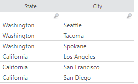
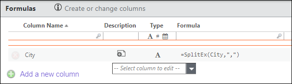

# SplitEx function

Splits a string in a column into multiple rows based on one or more delimiter characters.
Each segment of the split becomes a separate row in the transformed dataset.. If a column in
your data contains multiple values separated by a character such as a comma, and you want to
generate a separate row for each value, use the SplitEx function. For example, assume you have
the table shown below:

You want to generate a separate row for each
city as shown below:

Enter the formula shown below for the
**City** column:

## Syntax

`Split(column,delimiter)`

## Parameters

*column*: The column in a table to be split.

*delimiter*: One or more characters used to split the string. Delimiters must be enclosed in
double quotes. For example, ";>/" uses semicolon, greater-than, and slash as delimiters.
Required

## Return type

String

## Examples

`SplitEx(City, ",")`: Splits the {City} column on commas. For example:

**Input:**

| State | City |
| --- | --- |
| Washington | Seattle, Tacoma, Spokane |
| California | Los Angeles, San Francisco, San Diego |

**Output:**

| State | City |
| --- | --- |
| Washington | Seattle |
| Washington | Tacoma |
| Washington | Spokane |
| California | Los Angeles |
| California | San Francisco |
| California | San Diego |

`SplitEx(Items, ";>/")`: Splits the {Items} column using semicolon,
greater-than, or slash as delimiters.
