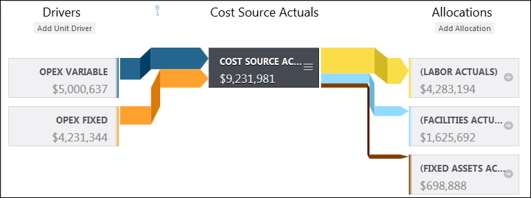
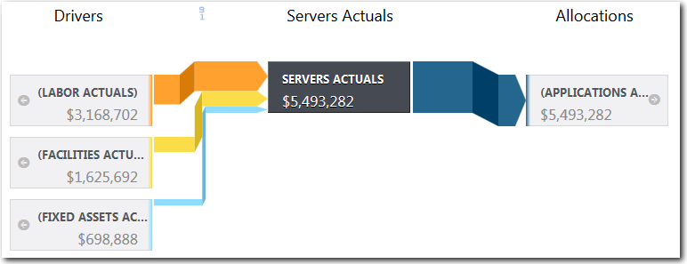

# Allocate value in a model

**Applies to**: TBM Studio 12.0 and later

One of the most powerful features in TBM Studio is the allocation schemes used to model the flow
of money and other metrics from one table in a model to other tables. Models make it possible to
relate expenses, assets and labor to applications, platforms, and transactions. The result is
detailed cost and statistical information for IT and the business units it serves.

## Sankey diagram

Allocations are displayed in a Sankey diagram like the one shown in the following image. The
width of the allocation lines in the diagram is proportional to the value.

## Tables and allocations

In a model, a table contains data that is associated with an element in the organization.
Examples include servers, networks, general ledger, facilities, data centers, email, SAP, and
business units. A table groups data together for analysis. In a model, tables are displayed as
rectangles. In the cost model shown in the preceding image, the **Cost Source Actuals** table is
the source table. It derives its value from two-unit drivers based on columns in the **Cost Source
Actuals** table: **OpEx Variable** and **OpEx Fixed**. It allocates value to three target
tables: **Labor Actuals**, **Facilities Actuals**, and **Fixed Assets Actuals**. The target
tables could then allocate their value to other tables as shown in the following image:

To allocate value:

1. Check out the source and target tables.
2. Click the source table in the **Project Explorer**.
3. Click the **Model** step in the transform pipeline.
4. In the Sankey diagram, click **Add Allocation** under the
   **Allocations** heading.
5. If there is more than one metric, in the **Allocate** section click the
   metrics to which the allocation will apply.
6. Under the **Using** section, select the type of allocation (see [Allocation types](#Allocatevalueinamodel__Allocationtypes) for a description of each).
7. Under the **To** section, select the target table.
8. Based on the allocation type, complete the remaining information.

## Allocation types

There are five types of allocations: **Weighted Value**,
**Consumption**, **Standard Value**, **Formula**, and
**Recursion**. Each allocation type is described in the subtopics that follow.

- [Weighted Value allocations](https://www.ibm.com/docs/en/apptio-commercial/tbm-studio/saas?topic=metrics-weighted-value-allocations "(Opens in a new tab or window)")
- [Consumption allocations](https://www.ibm.com/docs/en/apptio-commercial/tbm-studio/saas?topic=metrics-consumption-allocations "(Opens in a new tab or window)")
- [Standard Value allocations](https://www.ibm.com/docs/en/apptio-commercial/tbm-studio/saas?topic=metrics-standard-value-allocations "(Opens in a new tab or window)")
- [Formula allocations](https://www.ibm.com/docs/en/apptio-commercial/tbm-studio/saas?topic=metrics-formula-allocations "(Opens in a new tab or window)")
- [Recursion allocations](https://www.ibm.com/docs/en/apptio-commercial/tbm-studio/saas?topic=metrics-recursion-allocations "(Opens in a new tab or window)")
