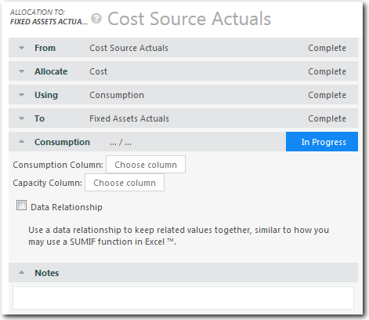

# Consumption allocations

**Applies to**: TBM Studio 12.0 and later

The **Consumption** option is used to allocate the available units in the source table to the
actual units consumed by the target table. For example, if you are modeling consumption of services,
you can indicate the number of each service to be allocated to a business unit.

When you select this option, the application displays **Consumption** options where you choose
a consumption column and a capacity column.

In the **Consumption Column** field, select a value from the target table that indicates the
number of units consumed.

In the **Capacity Column** field, select a value from the source target table that indicates
the total capacity available.

## Distribution options

There are three distribution options:

- Even
- Weight By
- Data Relationship

## Even

The **Even** option is the default option and is in effect when the **Weight By** and
**Data Relationship** options are not selected.

It distributes the allocation evenly across all units identified in the target table by the
**To** property. For example, if there is an **Applications Target** table with five
applications and $100,000 is being allocated, $20,000 will be allocated to each application.

## Weight By

The **Weight By** option distributes the allocation based on the ratio (relative size) of the
values in a column you select.

For example, assume there are five applications with various numbers of users as shown in the
table below, and $100,000 is being allocated. You want to weight the distribution by the number of
users. The $100,000 would be distributed as shown in the following **Allocation** column:

Note: If you try to weight an allocation by a numeric column that contains at least one non-numeric
value, the weighting will be ignored. To correct the problem, remove the non-numeric values from the
column.

## Data Relationship

The **Data Relationship** option distributes the allocation evenly across the units that match
the values in a column in the source table with the values in a column in the target table. For
example, assume the source table includes information about applications. Both the source and
destination tables include an **Application Category** column. One of the categories is
identified as **Databases**, but there are two database applications: Oracle and SAP. The value
from the Database entries in the source table would be aggregated and allocated evenly to the
Database entries in the target table. If $20,000 was being allocated, it would be divided into
$10,000 for Oracle and $10,000 for SAP.

You can specify more than one relationship. If you specify more than one relationship, all the
relationships must match for the value to be allocated.
