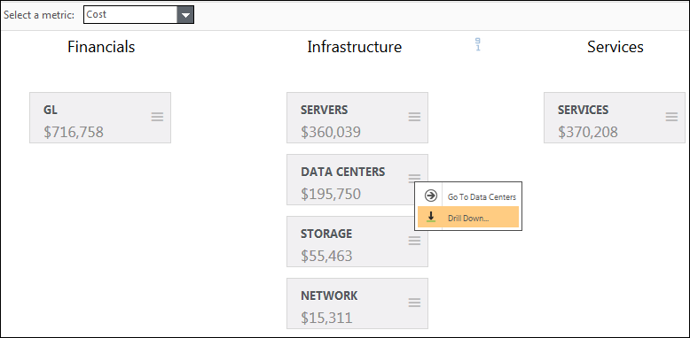
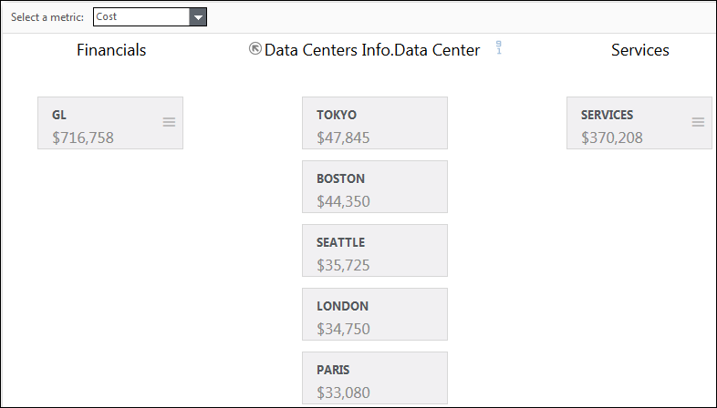

# Drill for more detail

**Applies to**: TBM Studio 12.0 and later

When working in a model, you can get more detail about the source of the value for a table by
drilling to a specific column in a source table. For example, assume you have the model shown in the
following image. You want to find out how much value is being contributed to the $195,750 by each of
the datacenters.

To drill down:

1. Click **≡** and click **Drill Down**.
2. Select a column in a table. For our example, we might select the **Data
   Center** column in the **Data Centers Info** table. The model now
   displays the data centers as shown in the following image:
3. Clicking a datacenter will show the allocation to that data center from the GL and the
   allocation from the datacenter to service.
