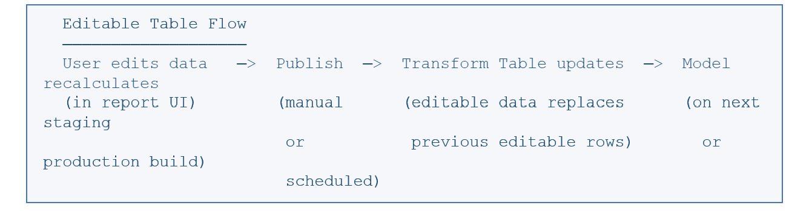

# How Editable Tables Fit in the Data Flow

Editable tables participate in the data pipeline through a publish mechanism:

Publishing overwrites the entire editable-table dataset in the associated transform table. This
can happen manually or on a recurring schedule (hourly, daily, weekly, or monthly). Optionally,
publishing can trigger an automatic promotion to production.

Note:

**Important**

Editable tables are branch-specific. Creating a branch gives it its own copy of editable tables,
and modifications in the trunk do not appear in the branch (and vice versa).

**Parent topic:** [Tables and Table Types](../../../../studio/new-uc/concepts-architecture/data-architecture/table-types.html)
