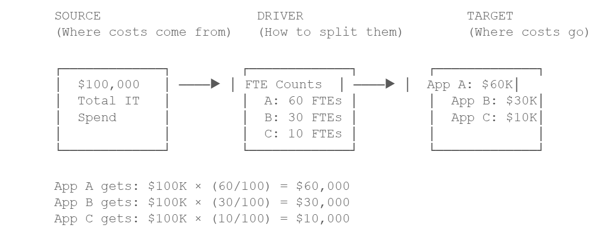

# The Allocation Engine

Allocation is the core operation that makes cost modeling possible. At its essence, allocation is
the process of distributing costs from a source object to one or more target objects based on
defined rules. This section explains how the engine works under the hood.

## Allocation Fundamentals

Every allocation follows the same basic pattern:

The driver determines the proportions. The source provides the total amount. The target receives
its share. This is the fundamental mechanism behind every allocation in TBM Studio.

## Allocation Types

TBM Studio provides five allocation types, each suited to different cost distribution scenarios.
Understanding when to use each type is essential.

**Weighted Value Allocation**

The most common allocation type. Weighted Value distributes costs proportionally based on the
ratio of values in a column from the target table.

**How it works:** Each target row receives a share of the source cost equal to its weight
divided by the total weight of all target rows.

**Formula:** *Allocated Amount = Source Total × (Row Weight / Total Weight)*

**Worked Example: Server-Weighted Datacenter Costs**

Suppose your datacenter costs $100,000, and you want to allocate based on server count:

|  |  |  |  |
| --- | --- | --- | --- |
| **Business Unit** | **Server Count** | **Weight Ratio** | **Allocated Cost** |
| Sales | 50 | 50 / 200 = 25% | $25,000 |
| Engineering | 100 | 100 / 200 = 50% | $50,000 |
| Marketing | 30 | 30 / 200 = 15% | $15,000 |
| Support | 20 | 20 / 200 = 10% | $10,000 |
| **Total** | **200** | **100%** | **$100,000** |

**Distribution options within Weighted Value:**

- **Even:** The default. If no weighting column is selected, costs split equally across all
  target rows.
- **Weight By:** Costs split proportionally based on a column in the target table (as shown
  above). The weighting column must contain numeric, non-negative values.
- **Data Relationship:** Costs are sliced into buckets based on matching column values between
  source and target. Each bucket allocates independently. This replaces the need for many individual
  allocation lines.

Note:

**Weight By Pitfalls**

**Non-numeric values:** If the weighting column contains even one non-numeric value, the
weighting is silently ignored and costs distribute evenly. Always validate your weighting data.

**Negative values:** Weighting by negative numbers causes the allocation to fail. TBM Studio
enforces a guardrail to prevent calculation issues from negative weights.

**Consumption Allocation**

Consumption allocation distributes costs based on the ratio of consumed units to available
capacity. This is ideal for modeling actual usage of IT services.

**How it works:** You specify a consumption column (from the target) and a capacity column
(from the source). The allocation distributes source costs based on how much of the available
capacity each target actually consumed.

**When to use:** When you have actual usage data — for example, allocating cloud compute costs
based on CPU hours consumed by each application.

**Standard Value Allocation**

Standard Value allocation distributes a value equal to what already exists in the target table.
This is a direct mapping allocation.

**How it works:** If the target table says Application A costs $10,000, then $10,000 is
allocated to Application A. If the source has more or less than the target’s total, the source will
have leftover or be over-allocated.

**When to use:** When you have direct cost data for each target and want to assign those known
amounts rather than distributing a pool. Common for labor costs where you know exact salaries per
person or project.

**Formula Allocation**

Formula allocation gives you full control tvia custom formulas. You can write an expression that
determines how each target row receives its share.

**How it works:** You enter a formula using TBM Studio’s calculation language. The formula can
reference the SOURCE keyword (total source value), column values, the ~ (tilde) operator for
aggregate sums, and the Ratio function.

**Example formula:** *=SOURCE \* Ratio({Servers.Size}, ~{Servers.Size})*

This formula replicates weighted value behavior: each row gets a share proportional to its Size
value relative to the total. The Ratio function handles the edge case where all values are zero by
falling back to even distribution.

**Recursion Allocation**

Recursion allocation handles scenarios where costs circulate between interconnected services —
for example, when IT services support each other in addition to supporting business units.

**How it works:** The allocation runs iteratively. Each iteration moves a portion of costs
from source to target. Costs that return to the source get reallocated in the next iteration. This
continues until either the remaining amount drops below a precision threshold, or the maximum
iteration count is reached.

**When to use:** When services have mutual dependencies (e.g., Help Desk supports Servers,
Servers supports Help Desk) and you need to resolve the circular cost flow.

Note:

**Recursion Performance Note**

Recursive allocations require significantly more processing power than standard allocations. Use
a limited number of recursive allocations per model, keep iteration counts low, and set the
precision threshold as high as practical.

## Allocation Type Summary

|  |  |  |
| --- | --- | --- |
| **Allocation Type** | **Best For** | **Complexity** |
| Weighted Value | Most cost distributions (proportional split based on driver data) | Low |
| Consumption | Usage-based allocations (consumed vs. capacity) | Medium |
| Standard Value | Direct cost assignments where target values are known | Low |
| Formula | Custom logic not covered by standard types | High |
| Recursion | Mutual dependencies between service areas | High |
