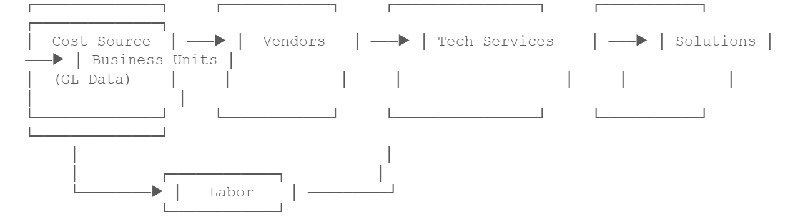

# Model Concepts Overview

The Cost model is at the heart of TBM Studio. It is a structured representation of how costs flow
through your organization — from the general ledger entries where money enters the system, through
intermediate allocation layers, to the final business units, applications, or services that consume
those resources.

Think of a cost model as a map. Raw financial data tells you how much you spent. A Cost model
tells you what you spent it on, who consumed it, and why. Without a model, you have numbers. With a
model, you have insight.

## What Is a Cost Model?

At its simplest, a Cost model answers the question: How do we fairly distribute shared costs to
the people and services that actually use them?

Consider a data center that costs $2 million per year to operate. The costs appear as a single
line in your general ledger,but six different business units use servers in that data center. A Cost
model lets you split (allocate) that $2 million across those six business units based on how many
servers each one uses, how much storage they consume, or any other driver that reflects actual
consumption.

Note:

**Key Concept: The Cost Model as a Map**

A Cost model is not raw data — it is a set of rules that describe how costs should flow. The
model defines the paths; the data provides the amounts. When you run a calculation (called a
“build”), TBM Studio applies those rules to your current data and produces allocated results.

**Purpose of a Cost model:** 

- Transform raw financial data into allocated, actionable insights
- Distribute shared costs fairly based on measurable consumption drivers
- Enable showback and chargeback to business units
- Support budget planning by modeling what-if allocation scenarios
- Provide an auditable trail from source cost to final consumer

## Model vs. Data vs. Reports: The Three Studios

TBM Studio has three main workspaces and understanding how they relate to each other is essential
before diving into model architecture.

|  |  |  |
| --- | --- | --- |
| **Studio** | **Role** | **Analogy** |
| Data Studio | Ingests, cleans, and transforms raw data into tables | The kitchen pantry — raw ingredients, organized and ready |
| Model Studio | Defines how costs flow from source tables to target tables through allocations | The recipe — rules for combining ingredients into a finished product |
| Report Studio | Presents the allocated results to stakeholders in charts, tables, and dashboards | The dining table — the finished meal, plated and served |

Data flows through these studios in a specific sequence. First, Data Studio prepares transform
tables from uploaded files. Then, Model Studio references those transform tables as inputs to model
objects and applies allocation rules. Finally, Report Studio queries the model to display results.
If your data changes, you re-run the build and the model recalculates. If your allocation logic
changes, you modify the model and re-run.

## Reading a Model Diagram

TBM Studio provides a visual diagram view that displays all model objects and their connections.
This is one of the most valuable tools for understanding a Cost model at a glance.

Note:

**What the Diagram Shows**

Each rectangle (node) represents a model object — a container for costs at a particular level.
Lines between nodes represent allocations — rules that move costs from one object to another. The
width of each line is proportional to the value being allocated (Sankey-style visualization). Cost
flows from left to right (or bottom to top), from sources toward final consumers.

Here is a conceptual representation of a typical Cost model diagram:

In TBM Studio’s actual diagram view, you can click any node to open the Single Object Modeler,
which shows that object’s drivers, allocations, and connections in detail. The diagram updates
automatically when model objects change, and you cannot modify allocations directly from the diagram
— it is a read-only visualization of the deployed model.

Tip:

**Using the Diagram Effectively**

Use the diagram view for onboarding new team members, debugging unexpected allocation results,
and communicating model structure to stakeholders. It provides an immediate, intuitive sense of how
costs flow through your organization.
