# 2025 Release Notes

## Server 12.11.18.1 - December 16, 2025

Fixed server error when creating tables/reports with special or Japanese characters in
names

## Client 2.18 - November 21, 2025

All new features require upgrade to server version 12.11.18. Please refer to the server
updates.

## Server 12.11.18 - November 21, 2025

- The New IBM Apptio Report Studio is currently in the Private Preview phase and is
  available only in temporary preview environments for a select group of customers. This
  will be followed by a Public Preview (Beta) phase, which will be open to all customers
  who choose to opt in, and then progress to General Availability (GA).
  - The new report studio now complies with Section 508 accessibility standards,
    ensuring an inclusive experience for all users.
- Introduced [Auto-pause Calc feature](../admin/build-anomaly-detection.html#build-ano-det__autopause) (Public Preview/Beta) for Build Anomalies
  Detection.
- Costing Standard (templates v120)
  - IBM Apptio Product TCO is a purpose-built solution designed to provide a clear and
    defensible view of product costs and composition. See [Overview](/docs/SSI71A/cost-transparency/configuration/product-tco-overview.html) for more information.To learn more, see
    [video](https://youtu.be/7LD-1gRE6nQ?si=0lgkUTplvW1lS9Jy "(Opens in a new tab or window)").
  - New Executive dashboard reports in IBM Apptio Costing that provides role-specific,
    high-level financial and operational insights tailored for CIOs, CTOs, and CFOs
    (Public Preview/Beta).
  - [Mainframe TCO](/docs/SSI71A/cost-transparency/configuration/mainframe-tco-overview.html#aitco__benchmarking) Enhancement: Added peer cost pool
    comparisons powered by industry benchmarks.

## Server 12.11.17.1 - November 07, 2025

- Quarterly Java update.
- Fixed the version creation issue during DL upload.

## Server 12.11.17 - September 26, 2025

- Introducing the New IBM Apptio Report Studio (Preview).
  - Access is limited to users who opted into the Preview. Enrollment is currently
    closed until further notice.
- Recommendations Workflow feature allows you to deactivate [unused reports
  (Beta)](../troubleshooting/unused-repors.html).
- In Calc Explorer, introduced [Additional Secondary Metrics](../admin/calc-explorer.html#calc-explorer__additional-drills) for drills - Total Matrix Rows, Total Matrix
  Columns, Assignment Ratio Rows, Matrix Type
- Costing Standard (templates v120)
  - Mainframe TCO is a purpose-built solution that delivers a clear, defensible view
    of mainframe costs, enabling accurate cost allocation, comprehensive utilization
    tracking, and data-driven decision making. See [Overview](/docs/SSI71A/cost-transparency/configuration/mainframe-tco-overview.html) and [Config Guide](/docs/SSI71A/cost-transparency/configuration/mainframe-config-guide.html) for more information. To learn more, see [video](https://www.youtube.com/watch?v=XyLAwalou4M "(Opens in a new tab or window)") and [blog](https://www.apptio.com/blog/introducing-ibm-apptio-mainframe-tco-complete-visibility-into-mainframe-costs-and-usage/ "(Opens in a new tab or window)").
  - Cost Take-Out Analytics & Insights are out-of-the-box consolidated reports
    that simplify cost optimization by bringing together insights across vendors,
    applications, and labor, enabling organizations to quickly identify savings
    opportunities and drive faster, data-driven decisions. See [Overview](/docs/SSI71A/cost-transparency/configuration/cost-take-out-reports.html) and [Config Guide](/docs/SSI71A/cost-transparency/configuration/cost-takeout-config-guide.html) for more information. To learn more, see [video](https://youtu.be/ImnfrjRxEVI "(Opens in a new tab or window)").
  - Added reference files for TBM Taxonomy v5
- Maximo Solution (template v200) Performance Enhancement.

**Fixed in this release**

- Fixed security vulnerabilities

## Client 2.16 - August 15, 2025

- Preventing Editable Table error when only Schema is check-in.
- Introduced [Calc
  Management Scheduler](../admin/cacl-mgmt-scheduler.html "Applies to: 2.16 and later. This feature will automate the staging calculations at a project level and branch level.") feature to automate the staging calculations at a
  project level and branch level.

## Server 12.11.16 - August 15, 2025

- [Build Anomaly](../admin/build-anomaly-detection.html "The anomaly detection feature is designed to help you identify unusual changes in calculation effort, which can help you optimize your reports and transforms. This feature is based on the data collected by Calc Explorer, which provides detailed information about the calculation effort for each build.")
  Detection is now GA.
- [The Enhanced
  Excel Parsing](../reports/tables/enhanced-excel-parsing.html) feature is automatically enabled for new customers, while
  existing customers may adopt it through a [manual migration
  process](../reports/tables/enhanced-excel-parsing.html)
- Costing Standard (templates v120)
  - [AI TCO & Usage](../../cost-transparency/configuration/ai-tco-overview.html "Artificial Intelligence (AI) is a key priority for many organizations, with CIOs increasingly being tasked with leading AI strategies across the organization. As AI spending accelerates, so does the complexity. CIOs admit that managing costs limits their ability to unlock the true value from AI. For organizations to adopt, scale, and manage AI initiatives sustainably and unlock their full value, they need clear visibility into AI costs, usage and adoption.") – added a new Definition Tab.
  - [Hybrid IT TCO Impact](https://www.ibm.com/docs/en/apptio-commercial/costing-standard/saas?topic=collection-hybrid-it-tco-impact-admin "(Opens in a new tab or window)") – New Detailed Trend
    Popup on the Analysis report and added Avg Cost per App metric to Summary report
  - Mainframe TCO - Added a detail report and Invoice Report.
  - Added Application tag to [Public cloud TCO](https://www.ibm.com/docs/en/apptio-commercial/costing-standard/saas?topic=collection-public-cloud-tcoreports "(Opens in a new tab or window)") reports.
  - Added new field “Code” in Planning Integration master data tables.
- Costing Essentials Enhancements (templates v200)
  - Added a new fields in [Labor Missing Mapping](https://www.ibm.com/docs/en/apptio-commercial/costing-essentials/saas?topic=workbench-labor-mapping "(Opens in a new tab or window)") Workbench Report &
    [Vendor Missing Mapping](https://www.ibm.com/docs/en/apptio-commercial/costing-essentials/saas?topic=workbench-vendor-mapping#VendorMapping__MissingMappings__title__1 "(Opens in a new tab or window)") Workbench
    Report.
  - Added new fields in [Organization Mapping](https://www.ibm.com/docs/en/apptio-commercial/costing-essentials/saas?topic=workbench-organization-mapping "(Opens in a new tab or window)") Workbench Report.
  - Row count formula is updated for TS Infrastructure & TS Platform.
  - Added Application tag to [Public cloud TCO](https://www.ibm.com/docs/en/apptio-commercial/costing-standard/saas?topic=collection-public-cloud-tcoreports "(Opens in a new tab or window)") reports.
  - Added new field “Code” in Planning Integration master data tables.
  - Added depreciation metrics to the Technology Services Model.

**Fixed in this release**

- Fixed the issue of KPIs not displaying for Japanese language.

## Server 12.11.15.1 - July 25, 2025

- Fixed performance issue by configuring JVM to use default G1 GC setting.

## Server 12.11.15 - July 4, 2025

- Introduced IBM Maximo **Maintenance Cost Insights** (MCI), powered by IBM Apptio
  Costing (v200). This solution provides Maximo customers with an out-of-the box
  bi-directional integration between IBM Maximo and IBM Apptio Costing. It empowers Maximo
  maintenance managers with visibility into their Total Cost of Maintenance across work
  orders, assets, and locations. Identifying key cost drivers such as labor, materials,
  tools, and services, the solution empowers financial accountability and improved
  planning across maintenance operations. See [Overview](https://www.ibm.com/docs/en/masv-and-l/maximo-manage/cd?topic=applications-integrating-maximo-maintenance-cost-insights-apptio "(Opens in a new tab or window)") for more information.
- Costing Standard (Templates v120)
  - AI TCO & Usage report enhancements; solution added to Reference projects
  - Mainframe TCO enhancements (BETA)
  - Japanese language localization for Hybrid IT TCO Impact and AI TCO & Usage
- Costing Essentials Enhancements (v200) - Removed the ‘Global’ option from [all slicers](https://www.ibm.com/docs/en/apptio-commercial/costing-essentials/saas?topic=reports-labor-review "(Opens in a new tab or window)") to better leverage Saved
  Views, removed a few advanced [End User Device reports](https://www.ibm.com/docs/en/apptio-commercial/costing-essentials/saas?topic=started-end-user-devices-reports "(Opens in a new tab or window)"), added FTE
  Headcount allocation strategy.
- Calc Explorer now loads on scroll, improving initial load time.
- The dashboards have been refreshed with the latest benchmarking data​.

**Fixed in this release**

- Fixed the error in Calc Explorer when searching under Show Dev Builds.
- Fixed the issue where Sankey Diagram in Calc Explorer was disrupted when searching
  or paging before drilling.
- Fixed security vulnerabilities.

## Client 2.15 - July 4, 2025

- Costing Essentials enhancements (v200) - Removed the ‘Global’ option from [all slicers](https://www.ibm.com/docs/en/apptio-commercial/costing-essentials/saas?topic=reports-labor-review "(Opens in a new tab or window)") to better leverage Saved
  Views.

## Server 12.11.14.1 - June 20, 2025

- Fixed the issue with scheduled recurring jobs not triggering.

## Server 12.11.14 - May 30, 2025

**New
Features**

- Introduced IBM Apptio’s **AI TCO & Usage** solution empowering CIOs, Business &
  Solution Leaders, and AI & Data Science teams with end-to-end visibility into
  their AI total cost of ownership and usage. By unlocking insights across AI models and
  AI solutions, it drives smarter decisions for AI investments, enables responsible
  scaling, and establishes the foundation for AI value conversations. See [Overview](https://www.ibm.com/docs/en/apptio-commercial/costing-standard/saas?topic=tco-ai-overview "(Opens in a new tab or window)"), [Config Guide](https://www.ibm.com/docs/en/apptio-commercial/costing-standard/saas?topic=tco-ai-configuration-guide "(Opens in a new tab or window)"), and [Report Collection](https://www.ibm.com/docs/en/apptio-commercial/costing-standard/saas?topic=collection-ai-report "(Opens in a new tab or window)") for more information.
- *Costing Standard (v120)*
  - Introduced [Model overview](https://www.ibm.com/docs/en/apptio-commercial/costing-standard/saas?topic=collection-model-views-overview "(Opens in a new tab or window)") reports to visualize cost
    flows, providing detailed insights and enhance transparency.
  - Added new [Hybrid IT Impact Admin](https://www.ibm.com/docs/en/apptio-commercial/costing-standard/saas?topic=collection-hybrid-it-tco-impact-admin "(Opens in a new tab or window)") reports with Copy
    Table button to simplify the setup and remove the need for Apptio-to-Apptio
    datalink connectors.
  - Updated [Public Cloud TCO](https://www.ibm.com/docs/en/apptio-commercial/costing-standard/saas?topic=cloud-public-overview "(Opens in a new tab or window)")
    report with Definition tab, dual-axis charts for unit rates, a resized Attributes
    table, and a revised column picker order that follows a taxonomy hierarchy.
- *Usage Project* - Added new formulas for User Type, Role, and Persona in March
  2025 version.
- *Recommendation workflows*
  - Introduced a new [Unused Metrics](../troubleshooting/studio-unused-metrics.html "This feature provides automatic recommendations on unused calculated metrics, offering visibility into user-created metrics that are not utilized in other metrics or reports. The system will automatically check in changes and mark issues as resolved.")​ (Beta) workflow to optimize system.
  - Introduced the [Positive and Negative Weights](../troubleshooting/positive-and-negative-recom.html "This feature helps fix weight problems by finding and warning about mixed positive and negative weights, so you can correct them and get accurate results.") workflow
- *Build Anomaly Detection (Beta)* - Introduced a new feature to detect [build anomalies](../admin/build-anomaly-detection.html "The anomaly detection feature is designed to help you identify unusual changes in calculation effort, which can help you optimize your reports and transforms. This feature is based on the data collected by Calc Explorer, which provides detailed information about the calculation effort for each build.") to improve
  calculation times and performance.

**Enhancements**

- [Public Cloud TCO](https://www.ibm.com/docs/en/apptio-commercial/costing-standard/saas?topic=cloud-public-overview "(Opens in a new tab or window)") report
  for Costing Essentials is enhanced with Definition tab,
  dual-axis charts for unit rates, a resized Attributes table, and a revised column picker
  order that follows a taxonomy hierarchy.
- [Model Overview Report](https://www.ibm.com/docs/en/apptio-commercial/costing-essentials/saas?topic=reports-model-views-overview "(Opens in a new tab or window)") Enhancements in Costing Essentials

**Fixes**

- Fixed the issue with the Previous Year function in Calculated Metrics for Costing Essentials
- Vulnerability and security fixes

## Client 2.14 - May 30, 2025

**New Features**

- Added features to improve [Email
  subscription](../reports/email-subscription.html) user experience, including enable/disable subscriptions, search
  functionality, and increased email body character limit.
- Calc Explorer Change Set and Changes columns can now be filtered (searched) for
  anything that appears within the dialogs they open up.
- Editable Tables - Added the ability to download, edit, and upload [transform table](../data_studio/create-table-from-et.html) data for a
  specific period to correct previous errors.

**Fixes**

- Fixed the error issue in Editable table report after adding or deleting a column value
  and saving.
- Fixed the issue of “cellEdit“ script ignoring the validation error for the existing
  cells.
- Fixed the unique value validation on file upload/button script

## Server 12.11.13.1 - April 25, 2025

- Quarterly Java update.
- Fixed the issue with MySQL connection pool causing prepared statement exhaustion.

## Server 12.11.13 - April 11, 2025

**Costing Standard (v120)**

This release includes the following key enhancements to improve user experience and
functionality.

- Usage Project – role-based reporting based on Frontdoor persona.
- IBM Apptio Turbonomic Integration is now GA. To learn more, see this [video](https://youtu.be/-FY7WfDBK1g?si=20-TTKhVDBaPRo0v "(Opens in a new tab or window)").
- Japanese language support for Public Cloud TCO.
- Public Cloud TCO added to Costing
  Standard reference project

**Costing Essentials(v200)**

This release includes two key enhancements:

- Japanese language support for Public Cloud TCO.
- Public Cloud TCO added to Costing
  Essentials reference project

**Usage Project – role-based reporting on Frontdoor persona**

This release introduces role-based reporting on Frontdoor personas, providing
administrators with greater visibility into user engagement and adoption. The Apptio Usage
dashboard now enables admins to monitor report engagement, user activity, and report
performance, segmented by user roles and personas defined in Frontdoor. This feature
allows administrators to understand who is engaging with Apptio and identify areas where
to focus adoption efforts, driving targeted enablement.

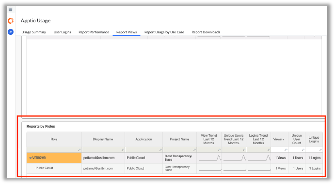

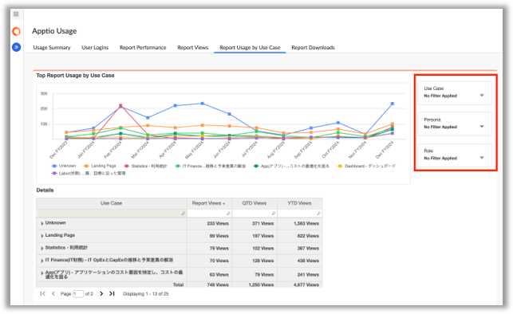

**Automatic !ALL\_ROWS settings enabled by default​**

From this release, Automatic !ALL\_ROWS is enabled by default on all projects, enhancing
reporting accuracy. If issues occur, Apptio Admins can temporarily disable it via project
settings, but are encouraged to review and reconcile projects to enable automatic
!ALL\_ROWS by default. Enabling automatic !ALL\_ROWS may have a minor impact on calc
performance. This override may be removed in future releases to improve report accuracy
and reduce errors for a better user experience.

**Fixed in this release** 

- Added support for multiple dimensions per rows, columns, and values quadrant in
  table data queries.
- Table data support on biit-server now accepts multiple values.
- Fixed security and vulnerability issues.

## Client 2.13 - April 11, 2025

Application template: 8314

**Table Upload of Filtered Email Subscriptions​**

The email distribution has been designed to streamline the process of managing numerous
filtered views with unique recipients. This update is particularly beneficial for admins
who need to send personalized, filtered views of reports via email to many users without
manual effort.

To use this feature, select **Export** icon in "View" mode and select **Email
Subscription**. Enable the **Bulk Upload XLS** toggle to download a template. This
template lists all available filters for the report in context and provides a space to add
recipients against each row. Add unique filter combinations for each set of recipients,
save the file, and upload it back. Upon uploading a valid file, you will observe two key
changes: the Subscription Rules File is enabled, indicating that you have uploaded a file
which can be downloaded for viewing or editing, and a successful upload message is
displayed. The table upload feature supports a logical AND of the filters applied for each
row. The data validation system checks for correct column additions, non-blank email
recipient columns, and other essential fields to ensure data integrity. The
*Recipients* field is mandatory, while only one of the other fields is required to
filter the dataset. Data validation is primarily focused on the table metadata (ex:
correct columns) and not necessarily the values within the columns.

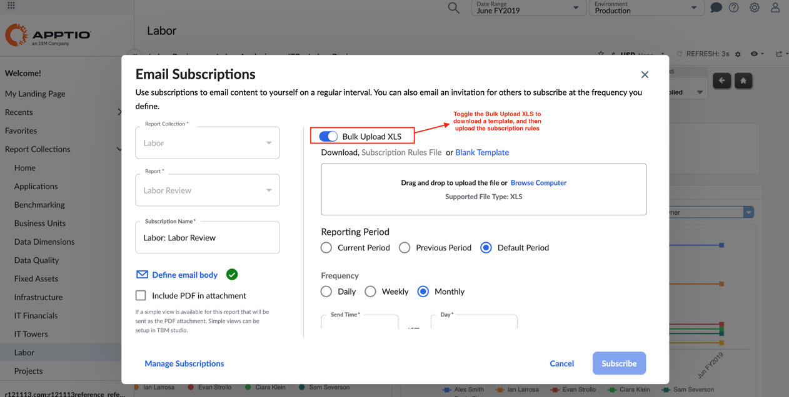

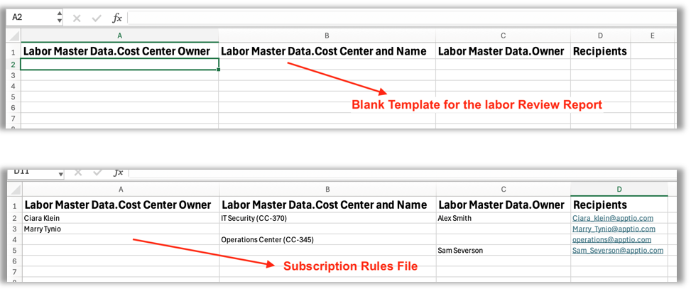

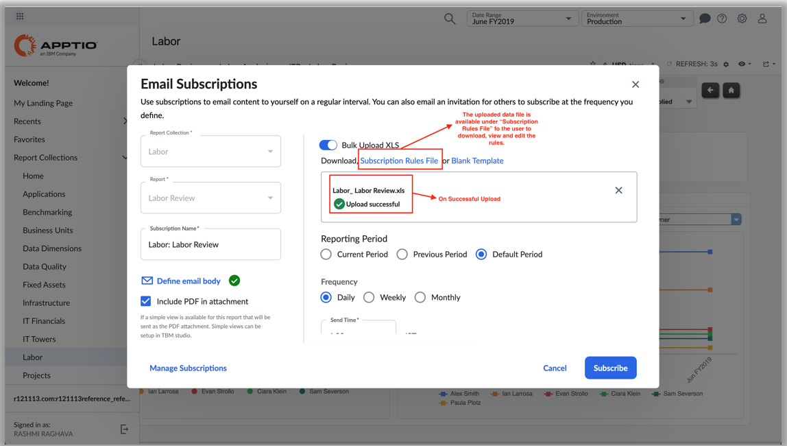

To know more, see [Email
Subscriptions](../reports/email-subscription.html).

**Fixed in this release**

- Resolved the dynamic formatting issue causing unwanted table refresh/load in the
  report component.
- Resolved the issue in new report viewer.
- Fixed vulnerability issues.

## Server 12.11.12 - February 28, 2025

Application template: 8191

**New Application Features**

**Hybrid IT TCO Impact for IBM Apptio Costing Standard
(v120)**

The Hybrid IT TCO Impact solution is designed to help organizations measure
and understand the financial impact of their evolving hybrid IT environments. It empowers end
users such as C-Suite executives and Application Owners to make informed decisions and ensure
migrations deliver the intended financial value.

This solution provides several key benefits
(as demonstrated by the below reports), including the ability to compare current vs. target
hybrid IT footprint, evaluate migration financial benefit, and perform detailed
pre-/post-migration analysis. These features enable users to make informed decisions about
application migration and optimize their hybrid IT environments.

Level 100 Report:
Hybrid IT TCO Impact Summary

Level 200 Report: Hybrid IT TCO Impact
Insights

Level 300 Report: Hybrid IT TCO Impact
Analysis

To enable this new solution, get started as
follows:

For further configuration details, go [here](../../cost-transparency/reports/hybrid-it-tco-config.html).

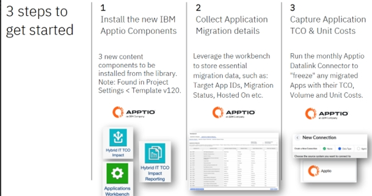

**Public Cloud TCO for Costing Standard
(v120) and Costing Essentials (v200)**

The Public Cloud TCO release for Costing
Standard (v120) and Costing Essentials (v200) offers multiple
benefits for primary users, mainly IT finance teams. This version provides a simple and
transparent financial lens across monthly public cloud costs, helping to avoid unexpected
bill shock. It also enables teams to drive accountability and ensure optimal efficiency of
public cloud services, minimizing waste.

The new release includes the installation of
new components, such as Public Cloud TCO in v120 and Public Cloud TCO and Public Cloud TCO
Reporting in v200. Users can connect to cloud data and utilize features like Account
Name, Business Unit, and Cloud Tower Mapping Table to tailor reports and gain insights into
their organization's cloud practices. With this release, users can assess if their
organization is applying "Best in Class" cloud practices, including RI Coverage and
Utilization Rates, to optimize their cloud services.

For more information on configuration, see [here](../../cost-transparency/reports/public-cloud-config.html).

**Costing Essentials (v200)**

The Model Overview Reports are a new feature designed to provide users with a comprehensive
view of cost flows within the model. This release includes reports
for Labor, Vendor, Solutions, Consumers, and Cost Model, and is available to all users with
report access. The reports are designed to enhance transparency and clarity for users,
providing a clear and detailed view of cost flows within the model. The Labor Model View is
included in the Cost-Labor Reporting component, while the Cost Model View is found in the
Model View collection. The Vendor, Solutions, and Consumers Reports are located in their
respective collections.

Users can click on fields to select and see how cost is
flowing between different objects, providing a clear and intuitive way to navigate the
reports. The reports are accessible to anyone with report access, without requiring TBM Studio access. The primary users of the Model Overview Reports
are Admin and Power User, to refine cost allocations, make informed decisions, and optimize
their cost management processes.

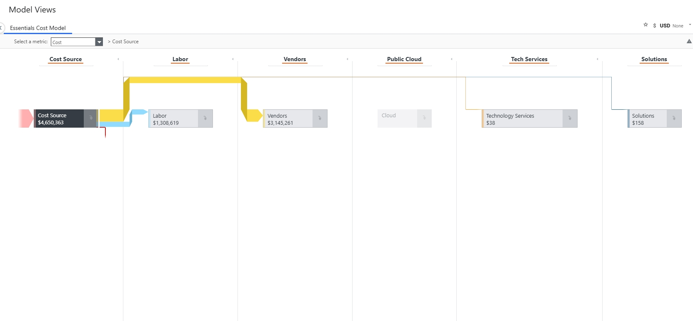

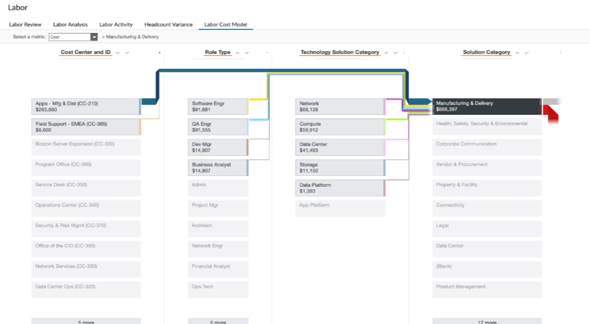

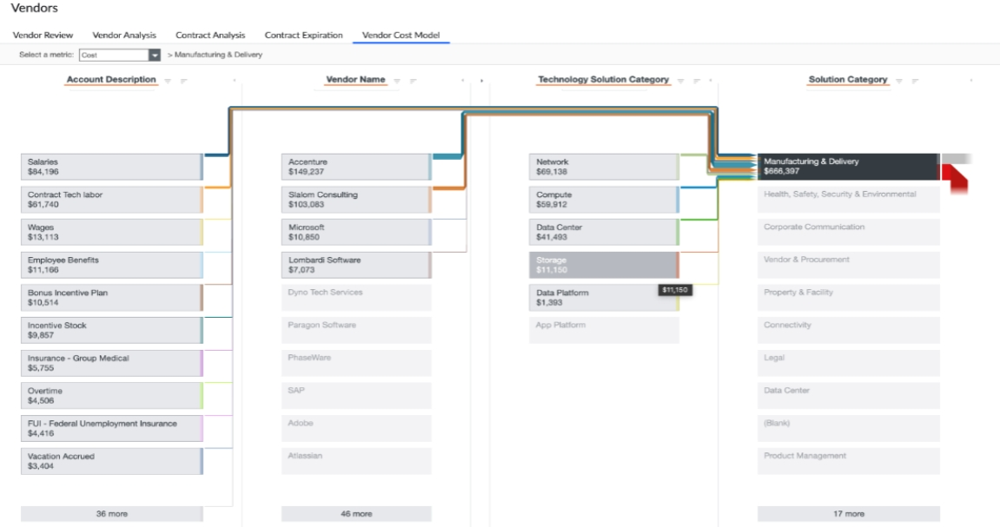

To view all report cost models, see [here](../../apptio-cost-management/out_of_the_box_reports/model-views-ce.html).

**Billing Essentials (v200)**

The following enhancements have been made to Billing Essentials V200.

- Japanese language support has been added to improve accessibility for users.
- The Rate Management report now includes a new Rate Adjustment Impact metric, providing
  additional insights into rate changes.

  

  

  To know
  more, see the configuration [here](../../billing-essentials/configure-billing-essentials/configuration.html).
- A new Model Overview Report has been added to provide a summary of key billing
  information.

  

  To know more, see [here](../../billing-essentials/reports/model-views-be.html).

**Fixed in this release**

- Resolved the issue of number parsing of strings containing ’e’.
- Unused Allocations is now GA.
- Fixed vulnerability issues.

## Client 2.12 - February 28, 2025

**Dependency**

\*Client v2.12 is compatible with Server 12.11.12 and 12.11.11.x

**New Client Features**

**Email Subscription enhancements**

The email subscription functionality has
been enhanced to improve usability, customization, and the overall user experience. The
administrators can now configure and customize email settings, while the end users will
get clear interactive emailed reports. and clarity in managing and receiving emailed
reports.

**Dynamic PDF File Naming**: The PDF file attached to email
subscriptions now includes the report name and reporting period in its file name. This
change ensures easier identification and organization of reports for recipients.

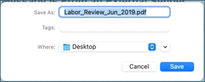

**Customizable Email Subject and Email Body**:
Administrators can now customize the email subject line using dynamic fields, like Report
name, Reporting period, and Report filters for more context-specific and relevant email
subjects. The email body can also be customized with dynamic fields, like Report name,
Reporting period, and Report filters to provide additional context or instructions
directly in the email.

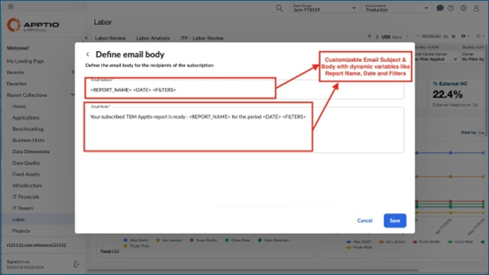

**Updated Call-to-Action Button**: The "View Report"
button in the email has been updated to "View Full Report in Apptio" so that recipients
understand where the link will take them.

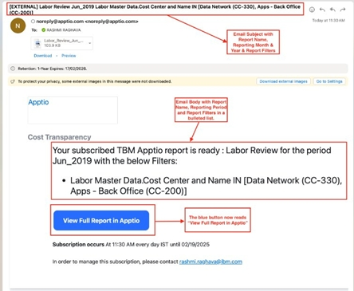

**Send Now**: This feature provides the
administrators a convenient way to verify that the email subscription is working as
intended, ensuring that subscribers receive the expected content. By using Send Now, users
can confidently test their email subscriptions, making it easier to manage and maintain
their subscriptions.

The Send Now feature is accessible from two locations: under
Manage Subscriptions for every email subscription, and on the edit screen of an individual
email subscription. To use Send Now on the edit screen, users must first save any changes
made to the subscription details. If changes are made but not saved, the Send Now feature
will be disabled until the changes are saved. Once saved, users can click Send Now to send
a test email to the subscribers, providing a quick and easy way to test and verify their
email subscriptions..

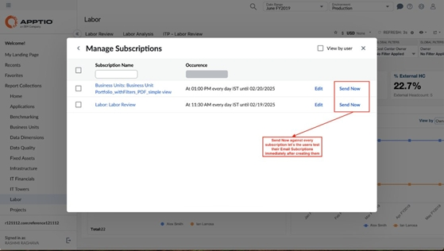

To know more, see [Email Subscriptions](../reports/email-subscription.html).

**Editable Tables**

**editCell function now works on a specific column only**: In this release,
the cellEdit function has been updated to allow more precise email notifications.
Administrators can now configure the SendMail() function to trigger exclusively when the
"Submission Status" column is changed from “In Progress” to “Submitted,” ensuring
Approvers are notified only when the status is updated. Previously, edits to other columns
would also trigger emails if the status remained “Submitted.” This update introduces
the cellEdit(“column\_name”) syntax, which ensures actions are triggered only when the
specified column is modified.

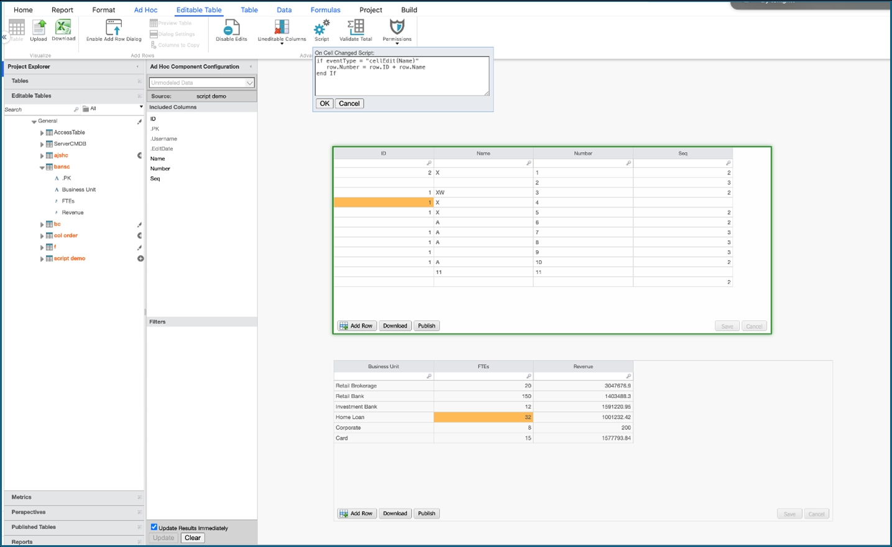

**Show Changes enhancements**: The Show Changes feature
has been updated with the following enhancements:

The primary key (PK) is now
displayed in the Show Changes view, allowing for easier identification of modified
records.

For enriched editable tables, the Show Changes view
only displays changes made to the underlying source table. This is indicated by the
presence of a value for modified fields and the absence of a value for unmodified
fields.

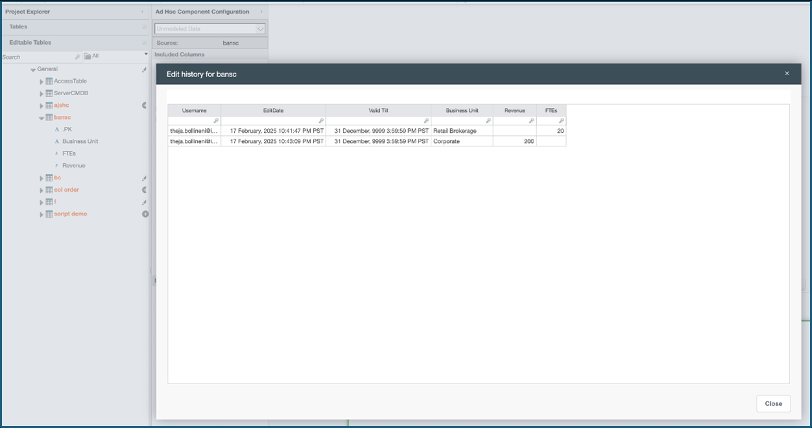

**Fixed in this release**

- 'Show Changes' views now align with Data Pipeline > Editable Table step.
- Fixed security vulnerabilities.

## Server 12.11.11.2 - February 27, 2025

- Fixed security vulnerabilities.

## Server 12.11.11.1 - February 5, 2025

- Quarterly Java update.
- Fixed the environment 'not found' issue in Apptio BI.

## Server 12.11.11 - January 17, 2025

Application template: v120-8191

**New Application Features**

**Billing Essentials GA
(v200)**

This release provides the following enhancements to improve the overall
user experience and provide more efficient management of billing and data upload processes.

- **Enhanced Reporting**: The Billing Process Admin Report has been integrated into
  the Billing collection, with role-based access control (RBAC) permissions configured
  to restrict access to authorized Billing Process Owner(s).
- **Journal Entry Export and Archiving:** The Billing Journal Archive tab now
  enables users to export journal entries to an Excel file (.xlsx) and create a
  flattened table for audit reporting purposes, utilizing a CopyTable script to ensure
  data integrity.
- **Invoice Archiving**: The Bill Invoice Archive tab features a Copy Invoice
  Details button script, which facilitates the archiving of bill invoices by creating a
  duplicate copy of the original invoice, ensuring a permanent record for auditing and
  compliance purposes.

  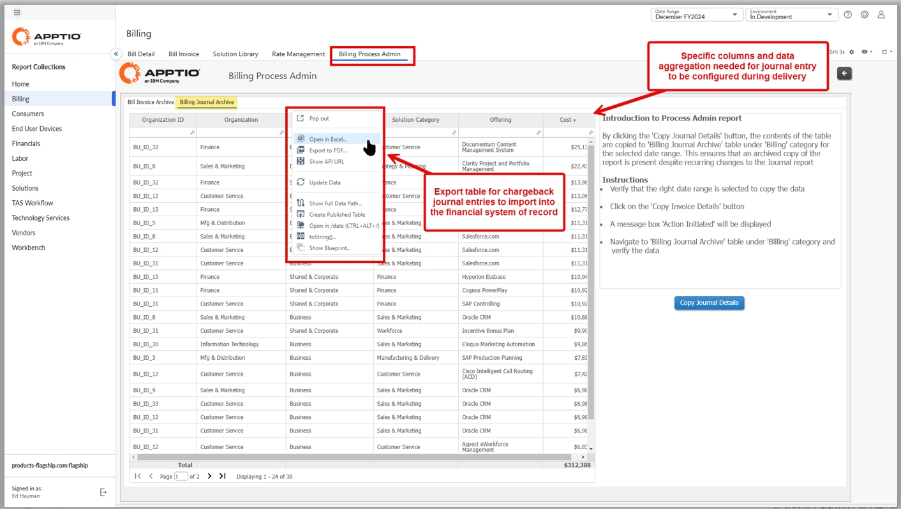

  

**Fixed in this release**

- Deleted data permanently for a table in data pipeline.
- Fixed vulnerability issues.
- Precision calc optimizations

## Client 2.11 - January 17, 2025

**Dependency**

\*Client v2.11 is compatible with Server 12.11.11 and 12.11.10.x

\*Some
Client v2.11 features are dependent on new Server 12.11.11 features.

**New Client Features**

**Table Upload feature is now GA**

The Table Upload
Component was released two years ago and the visibility in the Studio Ribbon was controlled
via the Enable Features feature. With it moving to GA, no impact will happen to any existing
project.

**Email Distribution Enhancements**

- **Filtered views subscriptions**: This feature enables users to share filtered
  reports with specific recipients through a subscription system. The recipients will
  receive a hyperlink to access the report with pre-applied slicer selections, thereby
  allowing them to view the report with the desired filter settings. Additionally,
  recipients have the option to receive an attached PDF document, which can be configured to
  include or exclude the linked Simple View while maintaining the selected filter settings.
  This feature provides a flexible and secure way to share reports with others, ensuring
  that recipients receive the information they need in a format that is easy to
  consume.

  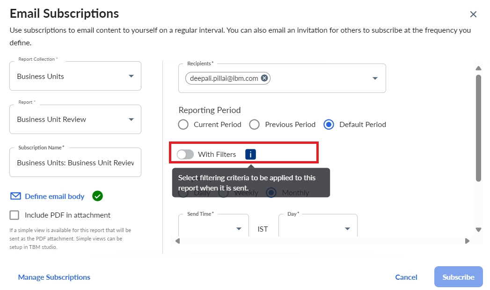

  To know more, see [Email Subscriptions with Filtered
  View](../reports/email-subscription.html).
- **Duplicate Subscription**: This feature enables users to create a copy of an
  existing email subscription and simplifies the subscription management process. To
  implement this feature, a new "Duplicate Subscription" icon has been added to the Manage
  Subscription dialog, which allows users to create a copy of an existing subscription. The
  duplicated subscription is automatically named with the prefix "Copy of" followed by the
  original subscription name, and users can edit the details of the duplicated subscription,
  including the name, frequency, and attached email template.

  

  To know more, see [Duplicate Email
  Subscriptions](../reports/email-subscription.html).

**Horizontal scroll bar for open Studio document tabs**​

To improve the management of
multiple bottom tabs opened in the studio, a horizontal scroll bar has been introduced. It
allows users to easily navigate through multiple open tabs. Additionally, the latest tab
opened will be highlighted, providing a clear visual indicator of the current tab in
focus.

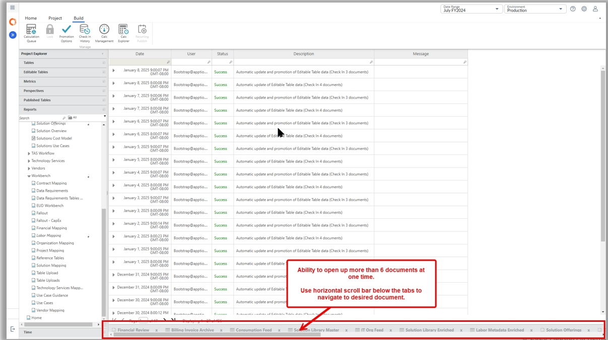

Previously the tabs would disappear if there was no
space, and hence it was tedious to open them again.

**Editable Tables**

- **Create branch has option to auto-check out all editable tables**: A new feature has
  been introduced to improve the management of editable tables in branches. This enhancement
  provides a more streamlined and efficient workflow for managing schema and data changes in
  branches and helps to prevent unintended changes to the trunk.

  When creating a branch,
  user can now select the option to automatically check out all editable tables, which
  will update them in the development workspace. The need for manual checkout of
  individual tables is not required, thereby reducing the risk of data inconsistencies and
  errors. The checkout process is now automated, ensuring that all editable tables are
  properly updated in the branch.

  Previously, when data was updated in a branch, it
  was automatically updated to the trunk. There was no control to validate or confirm the
  changes in a branch. To know more, see [Create Branch with Auto-Checkout Option](../admin/bp-branching-projects.html "Applies to: TBM Studio 12.1 and later").
- **Expose Username and Edit Date from change history**: The editable table solution
  configuration process is enhanced by exposing two new reporting columns -
  .Username and .Edit Date system columns. Administrators can now easily access these
  columns in Project Explorer when an Editable Table is opened and drag them into the ad hoc
  configuration panel for an editable table report component. Additionally, these columns
  are now visible in the report view mode, allowing users to order and resize them as
  needed. This update eliminates the need to create separate columns and use ApptioScript to
  populate the information, streamlining the configuration process and improving the overall
  user experience.

  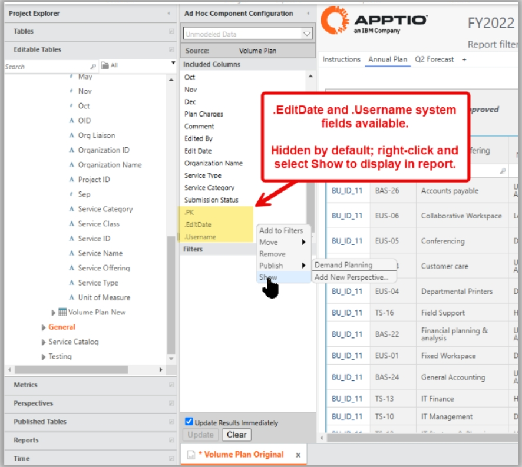

  

  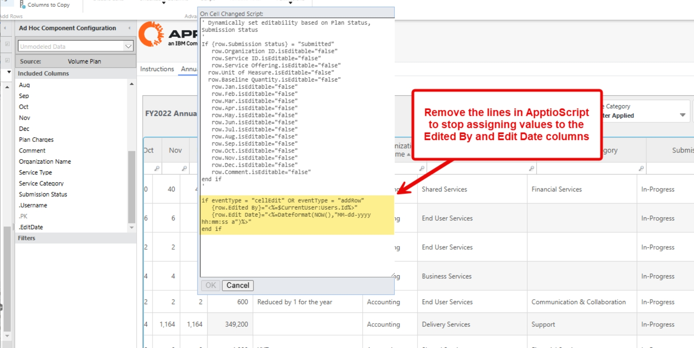

  Previously, both these columns were available only in
  Show Changes. To avoid confusion, the column names in Show Changes table have been
  renamed to Username and EditDate.

  To know more, see [Show/hide .Username and
  .EditDate](../reports/tables/component-config-panel.html "Applies to: TBM Studio 12.0 and later").
- **Save/Bulk Update Performance Improvement**: A significant performance improvement
  has been made to the save and bulk upload functionality, resulting in faster and more
  efficient processing of large datasets.

  | Number of rows updated | Number of columns updated | Old time (in seconds) | New time (in seconds) |
  | --- | --- | --- | --- |
  | 10,000 | 3 | 179 | 2 |
  | 20,000 | 3 | 578 | 4 |
  | 30,000 | 3 | 1189 | 7 |
  | 1 lakh | 1 | timeout | 47 |
  | 2 lakhs | 5 | timeout | 110 |

**Fixed in this release**

- Fixed the issue of dropdown menus not respecting the Row Level Security for standard
  table.
- Fixed the issue of Table Auto Sizing not working properly with Tree option.
- Fixed the issue of Pseudo Translations of Missing Strings.
