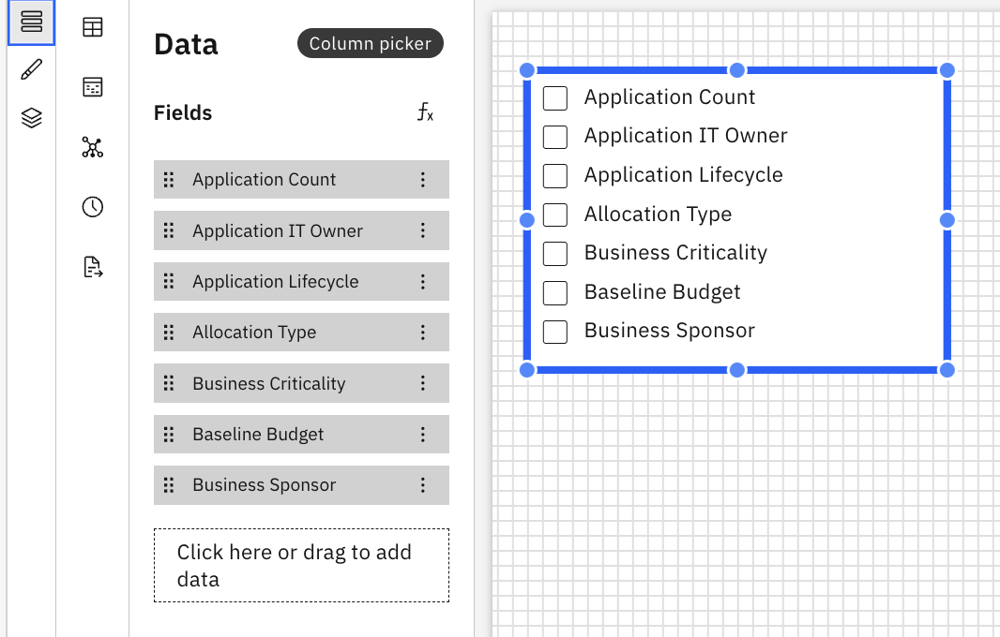

# Column Picker

A Column Picker lets users control which columns are displayed in a normal table,
editable table or a chart. It enables flexible exploration of tabular data without requiring
changes to the report configuration.

## When to use a Column Picker

Use a column picker when you want the users to:

- Show or hide table columns based on their needs
- Focus on specific metrics or dimensions
- Reduce visual clutter in wide tables

## Add a Column Picker to the Report

1. Add a Column Picker from the Components pane on the toolbar
2. Click on the Column Picker to enable the Data and Format panels.
3. Data Panel
   1. Select the model object from the dropdown list
   2. Drag dimensions from the Dimension Explorer to the fields section in the data panel
4. Format Panel
   1. General Properties – See [Component
      Properties](components.html#abt-comp__comprop)
   2. Column Picker-specific Properties
      1. Selection
         1. Multiple Selection – The columns appear as set of checkboxes.
         2. Single Selection With – The picker fields appear as radio buttons.
      2. Enable Select All
         1. Toggle to see the **Select All** option in the column picker component.
      3. Orientation
         1. Vertical
         2. Horizontal

Example: Column Picker

Column Picker supports custom formulas and formula dimensions. For more details, see [Custom Formulas](../create-first/custom-formula.html "Custom formulas (also referred to as formula dimensions) allow you to define new calculated dimensions using existing fields in your data model. This enables deeper analysis and richer insights without requiring any changes to the underlying dataset or schema.")
