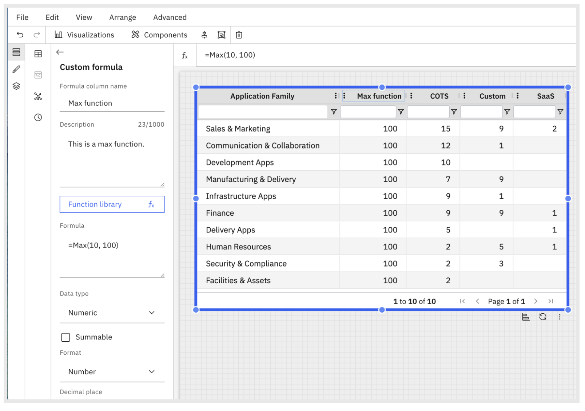

# Custom Formulas

Custom formulas (also referred to as formula dimensions) allow you to define new
calculated dimensions using existing fields in your data model. This enables deeper analysis and
richer insights without requiring any changes to the underlying dataset or schema.

## Why use Formula Dimensions?

Formula dimensions help you:

- Derive new dimensions from existing data
- Perform calculations directly within the report experience
- Explore data more flexibly without depending on data model changes

## How Formula Dimensions Work

- Instead of selecting only predefined dimensions from the underlying schema, you can
  - Define a custom formula using supported fields and functions
  - You can now add descriptions to custom formulas to provide additional context about the formula
    logic or intended usage
  - Save the formula as a reusable formula dimension
- Once created, formula dimensions behave like standard dimensions and can be used for
  grouping, slicing, filtering, and visualization

## Availability Across Components & Visualizations

Formula columns are supported across all components and visualizations.

Below is an example of a custom formula configured in a table.

