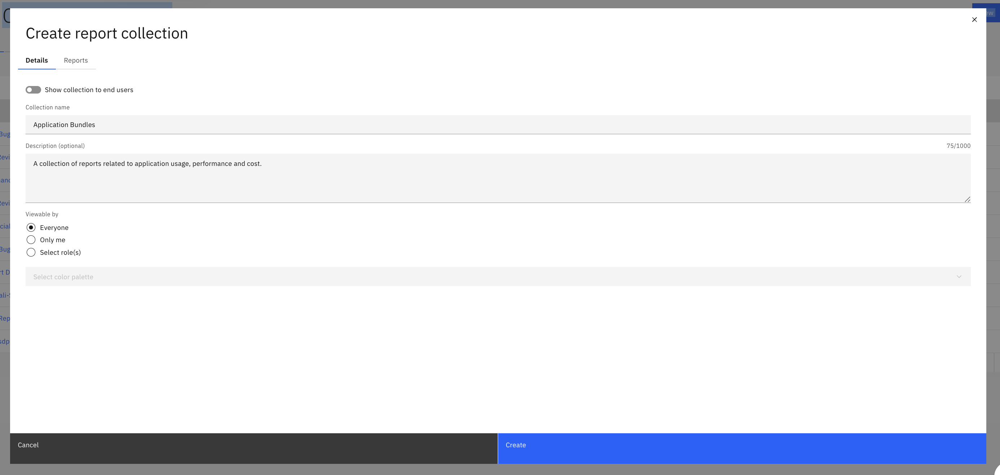
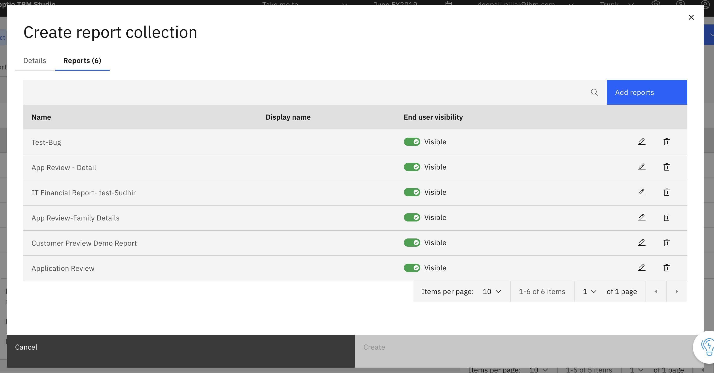

# Create Your First Report Collection

This topic helps you create a report collection to organize related reports and control user
access.

1. Navigate to the Report Collections tab
   1. On the landing page, select the Report Collections tab.
   2. Click the **New** button and select **Report Collection**
2. Enter Collection Details
   - Show Collection to End Users – Enable this option to make this available to end
     users in the New Report Viewer.
   - Collection Name – Enter a meaningful name for the collection
   - Description (optional) - Add a short description to explain the purpose if the
     collection.
   - Viewable by – This property controls who can see and access the report.
     - Everyone – The report is visible to all users with access to the reporting area.
     - Only Me – The report is visible only to you. Useful for drafts, experimentation,
       or personal analysis.
     - Select Roles – The report is visible only to users assigned to the selected
       roles. Roles are selected from a drop-down list. Enables role-based access control
       for reports.

   
3. Add Reports to the Collection
   - Select one or more reports to include in the collection
   - You can add reports during creation or update the collection later.
   - You can control end user visibility on individual reports
   - Click on Create

   
