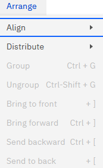
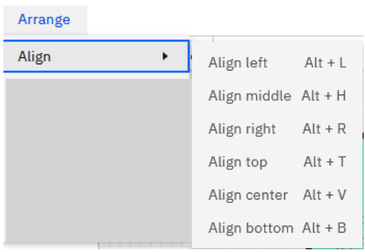

# Arrange Menu

The new report studio offers flexible layout tools for placing and organizing
components on a report. Most of these layout tools are in the **Arrange** menu. At least one
component must be selected to activate the commands on the **Arrange** menu. To get started,
click on the component you wish to modify.

The Arrange menu in the report canvas is

*Align*

Use the commands in the Align group to control how two or more components appear relative to
each other. These commands are active only after you select two or more components in a
report.

Select the components you wish to align. Go to **Arrange** > **Align** and select the
alignment option you want. The options are

For horizontal alignments, use **Left**, **Center**, and **Right**options, while for
vertical alignment, choose **Top**, **Middle**, and **Bottom**options.

*Move report components*

In a report, you can reposition the components, there are more than one.

Click and hold the report component header and then drag the component to a new location. If
you move a component to a position where it overlaps with another component, you can select
which components should be in front of the other.

From the **Arrange** menu, select the component and choose any of the following options:

- Bring to front - moves the component all the way to the front
- Bring forward - moves the component forward one step
- Send to back - moves the component all the way to the back
- Send backward - moves the component back one step

***Distribute***

Use the Distribute option to evenly space components horizontally or vertically, adjusting
layout automatically - even when some components are hidden for certain users. The shortcuts
to distribute are:

- Shift+Alt+H – Distribute Horizontally
- Shift+Alt+V – Distribute Vertically
