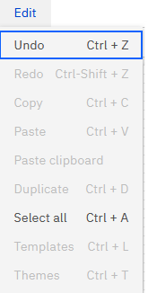

# Edit Menu

The Edit menu in the report canvas is

*Undo/Redo*

These options are used for rolling back small, discrete changes while editing documents in
your workspace. When documents are checked out, you can return to a previous version or redo
it. Some scenarios to undo or redo the changes are:

- Positioning of reporting elements within a report
- Discrete edits to the configuration of reporting elements (for example: button text, HTML
  contents, and so on)
- Edits to formulas for columns in a table's formula step

*Select all*

This option selects all the components present in the report canvas.
