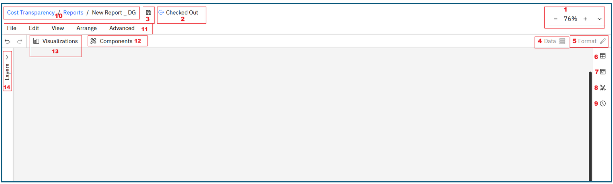

# New Report Studio Layout

The layout for a new/blank report is shown below:

|  |  |  |
| --- | --- | --- |
| 1 | Zoom | Adjust the canvas view in or out. |
| 2 | Report check-in/checkout status | Displays the check in/check out status of the report in context. |
| 3 | Save | Saves the report |
| 4 | Data Panel | Select a model object and add data dimensions. |
| 5 | Format Panel | Customize properties such as color, font, size, and other styling options. |
| 6 | Tables | Represent structured data sources you can pull dimensions from. |
| 7 | Editable tables | Represent structured data sources you can pull dimensions from. |
| 8 | Metrics | Represent numerical values or measures that can be used for analysis. |
| 9 | Time Dimensions | Date and time dimensions that let you analyze data across periods (daily, monthly, quarterly, yearly) |
| 10 | Breadcrumbs Navigation | Let’s you know where exactly you are in the report hierarchy. |
| 11 | Report actions menu | Provides key actions such as Check In, Revert Changes, Undo, Redo, Copy and Paste, along with layout controls like grids, rulers, alignment, and distribution options. |
| 12 | Components | Houses the different report components used to build the report. Includes Compact Slicers, Quick Pivots, Column Pickers, HTML, Group, Tabs etc. |
| 13 | Visualizations | Lists all the different data visualizations available. Includes Tables, Editable Tables, Bar charts, Column charts, Line charts, Pie charts etc. |
| 14 | Layers panel | Shows all report components in the report hierarchy, allowing you to copy, paste, reorder, delete or group them. |
