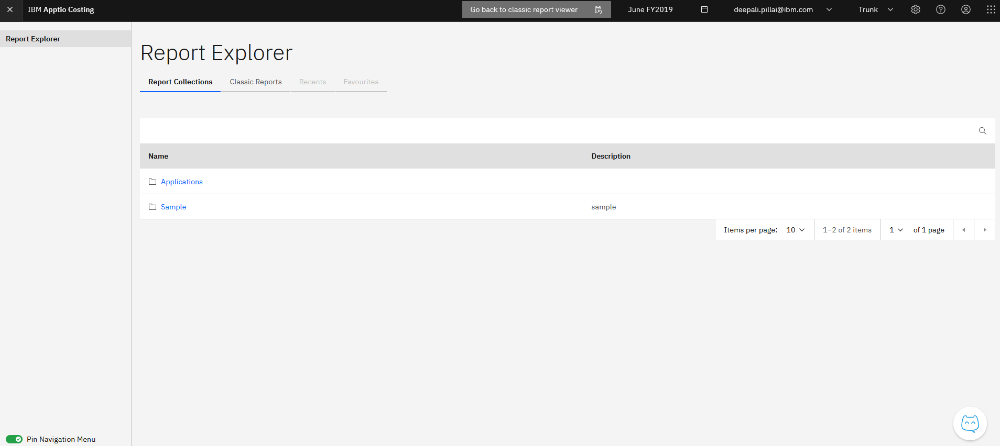

# Report Viewer Overview

The Report Viewer is designed for end users to view, interact with, and consume reports
created in Report Studio.

## Accessing the Report Viewer

You can navigate to the **New Report Viewer** in the following ways:

- From the **New Report Studio home page**, use the “**Take me to**” menu in the
  top navigation and select **Modern IBM Costing**.
- From the **Classic Report Viewer**, click the blue “**Open New Report Viewer**”
  button to switch to the modern viewer experience.

## Landing Page

The Report Viewer landing page displays all available reports and collections in a
structured way:

- The Reports tab lists all report collections that have been made available to end users.
- The Classic Reports tab lists reports created using the classic reporting experience.

To make a report visible in the Report Viewer, it must be bundled into a report collection.
Selecting a collection opens the list of reports available within that collection.

## Viewing Reports and Interacting with Data

End users can open reports from the Report Viewer and interact with the data in the
following ways:

- Apply filters using slicers
- Search and filter records within tables
- Interact with charts to explore data visually

All interactions in the Report Viewer are non-persistent. Any changes made while viewing a
report are session-based and do not modify or save the report configuration.
