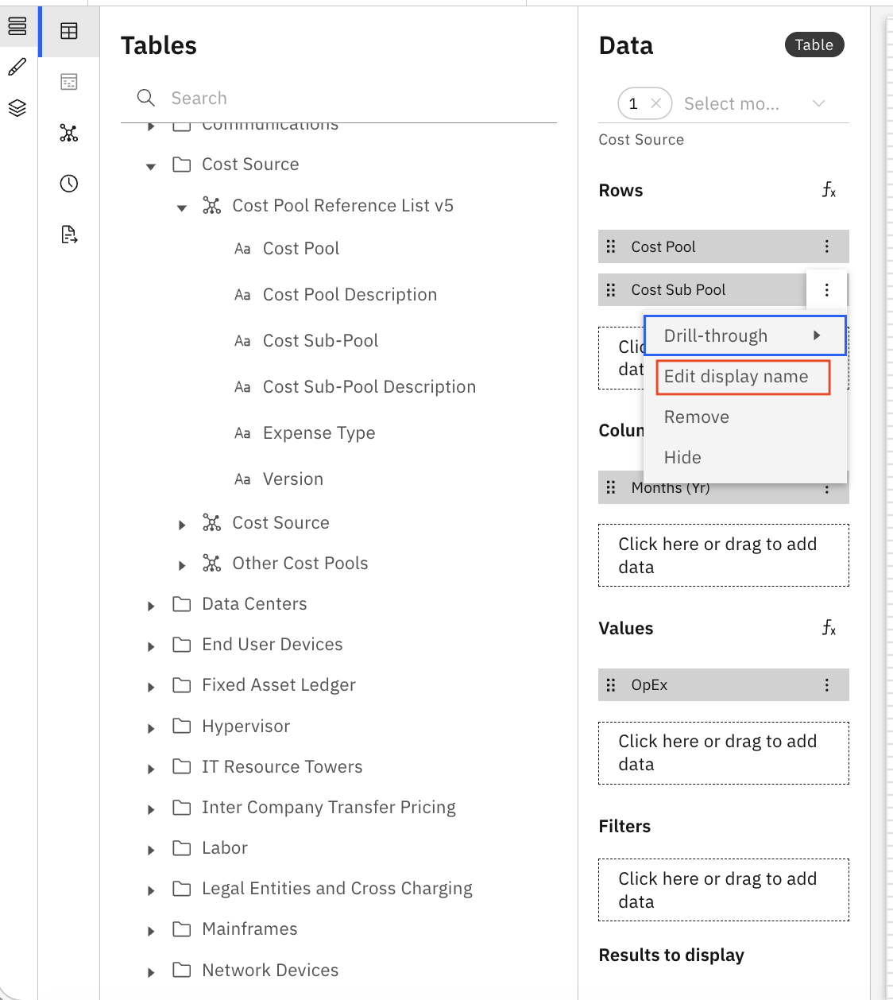
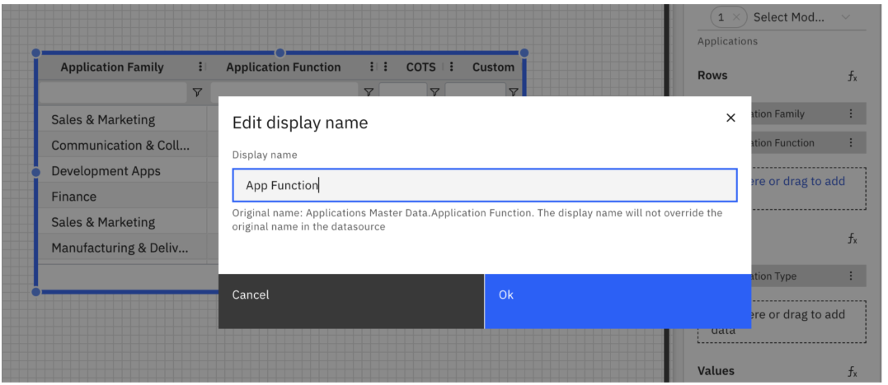

# Renaming Columns in Table

Rename column headers directly from the data configuration panel, allowing you to present
data in a more meaningful or user-friendly way without changing the underlying dimension
name.

Steps to use

1. **Open the Data Configuration Panel of your table**
   1. Go to the **Data** tab.
   2. Dimensions added under the **Rows** section define the table’s columns.
2. **Rename a Dimension (Column Header)**
   1. In the **Rows** section, click the overflow menu next to the dimension
      name.

      
   2. Select **Edit Display Name**.
   3. In the **Edit Display Name** dialog, enter the new display name for the column.
   4. The **original dimension name** is shown below for reference.

      
3. **Save Changes**
   1. Click **Ok** to confirm your changes.
   2. The updated name appears as the column header in the table.

Note: Renaming affects only the display name in the table view. The original dimension name in
the dataset remains unchanged.

**Parent topic:** [Table](../../../studio/report-studio/visualizations/rs-table.html "The table component displays data in a structured, tabular format. It is ideal for showing detailed information, summarizing metrics, and supporting interactive filtering within a report.")
