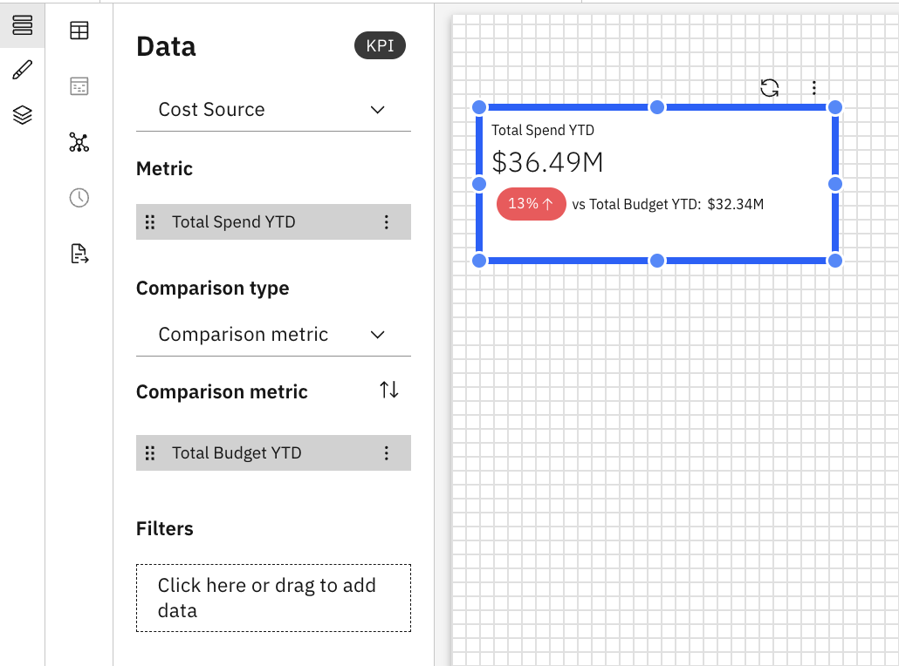

# KPI

The KPI (Key Performance Indicator) component is used to highlight important metrics in
a report. It helps users quickly understand key metrics at a glance

## When to use a KPI

Use a KPI component when you want to:

- Display metrics prominently
- Highlight performance, totals, or key outcomes
- Draw attention to critical values in a report

## Add a KPI to the Report

1. Add a KPI from the Visualizations pane on the toolbar
2. Click on the KPI to enable the Data and Format panels.
3. Data Panel
   1. Select the model object from the dropdown list
   2. Primary Metric - Drag or add a primary metric
   3. Comparison Type - The primary metric can be compared to the following:
      1. None – No comparison.
      2. Comparison Metric – Choose a secondary metric to compare with the primary metric
      3. Previous Period – Choose to compare with the previous period of the primary metric
   4. Comparison Metric - Drag or add a secondary metric for comparison
   5. Filters - Drag or add the filter criteria
4. Format Panel
   1. General Properties – See [Component Properties](../components/components.html#abt-comp__comprop)
   2. KPI-specific Properties
      1. Trend
         1. Choose the color for positive, negative and neutral trends
         2. Choose the indicator to represent the trend (arrow and value)
         3. Pick the trend indicator size
      2. Primary/ Comparison Metric
         1. Edit the following properties, as required for the primary metric’s name and
            value
         2. Font size and style (bold, italics, underline)
         3. Color of the title text (with option to reset the color)
      3. Shorthand notations - Shorten values for the primary and secondary metrics.

Example: KPI Component

Note: KPI supports custom formulas and formula dimensions. For more details, see [Custom Formulas](../create-first/custom-formula.html "Custom formulas (also referred to as formula dimensions) allow you to define new calculated dimensions using existing fields in your data model. This enables deeper analysis and richer insights without requiring any changes to the underlying dataset or schema.")
