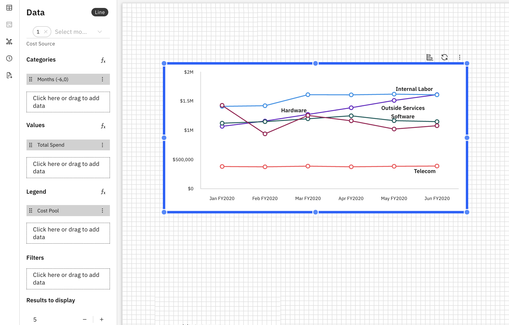

# Line Charts

A line chart displays data points connected by lines, making it ideal for showing
trends, patterns and changes over time. It is best suited for continuous data or sequential
categories.

## When to use a Line Chart

Use a line chart when you want to:

- Show trends over time or sequential categories
- Compare multiple series for correlation or pattern analysis
- Highlight increases, decreases, or fluctuations in data

## Add a Line Chart to a Report

1. Add a Line Chart from the Visualizations pane on the toolbar
2. Click on the Line Chart to enable the Data and Format panels.
3. Data Panel
   1. Select the model object from the drop-down menu
   2. Categories – Defines the X-axis, usually a time-based or sequential dimension. Click
      here or drag to add dimensions from the Dimension Explorer
   3. Values – Specifies the metric(s) displayed as data points connected by lines
   4. Legend – Splits values into multiple series based on a dimension.
   5. Filters – Limits the data displayed in the chart based on selected conditions
   6. Results to display – Indicate the number of lines to display
   7. Configure Sorting – Controls the order of categories on the X-axis.
4. Format Panel
   1. General Properties – See [Component Properties](../components/components.html#abt-comp__comprop)
   2. Line chart specific Properties
      1. Categories
         1. Show category title
         2. Show category labels
         3. Choose the Font size, style (bold, italics, underline) and color
         4. Toggle to switch categories position
         5. Show grid lines
      2. Values
         1. Show values title
         2. Show values labels
         3. Choose the Font size, style (bold, italics, underline) and color
         4. Toggle to invert range
         5. Show grid lines
      3. Legend
         1. Toggle to show the legend
         2. Font size and style for the legend (bold, italics, underline)
         3. Color of the legend text (with option to reset the color)
      4. Lines
         1. Choose the line color and line style
      5. Data Labels
         1. Toggle to show the data labels – centre, right, left
         2. Choose the Font size, style (bold, italics, underline) and color
         3. Set colors automatically – automatically assigns colors to bars based on the
            selected data and theme.
         4. Define a label outline and color

Example: Line chart

Line charts support custom formulas and formula dimensions. For more details, see [Custom Formulas](../create-first/custom-formula.html "Custom formulas (also referred to as formula dimensions) allow you to define new calculated dimensions using existing fields in your data model. This enables deeper analysis and richer insights without requiring any changes to the underlying dataset or schema.").

Line charts also support compatible visualizations. For more details, see [Compatible Visualizations](visualizations.html#abt-visual__compvis).
