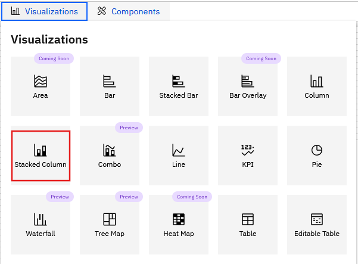
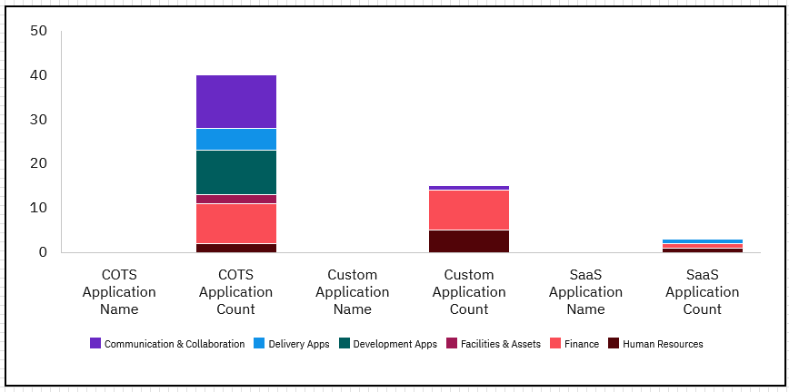

# Stacked Column

To create a Column chart,

1. Open a new or existing report.
2. Go to **Visualizations** and then select the **Column** tile.

   
3. Click on the Stacked Column component to enable the **Data** and **Format** panels.
4. Expand the panels to configure the data and format options:

   |  |  |
   | --- | --- |
   | **Data** | |
   | Select Model Object | Select the model object from the dropdown list |
   | Legend | Drag or add a legend data |
   | Y-axis | Drag or add the data for Y-axis |
   | X-axis | Drag or add the data for Y-axis |
   | Filters | Drag or add the filter criteria |
   | **Format - Properties** | |
   | X-axis | Edit the following properties, as required - Toggle to show X-axis title - Toggle to show X-axis values - Font size and style (bold, italics, underline) - Color of the X-axis title text and values (with option to reset the color) - Toggle to switch X-axis position - Toggle to show X-axis grid lines |
   | Y-axis | Edit the following properties, as required - Toggle to show Y-axis title - Toggle to show Y -axis values - Font size and style (bold, italics, underline) - Color of the Y-axis title text and values (with option to reset the color) - Toggle to invert range - Toggle to show Y -axis grid lines |
   | Legend | Edit the following properties, as required - Toggle to show the legend - Font size and style for the legend (bold, italics, underline) - Color of the legend text (with option to reset the color) |
   | Bars | Edit the following properties, as required - Number of Results to display - Padding between bars (thickness of the bars) - Padding between groups (spacing between groups) - Bar color for all parameters – Legend, X-axis, Y-axis |
   | Data Labels | Edit the following properties, as required - Toggle to show the data labels – the options are **inside** or   **outside** the bar. |

A sample column chart is shown here.

