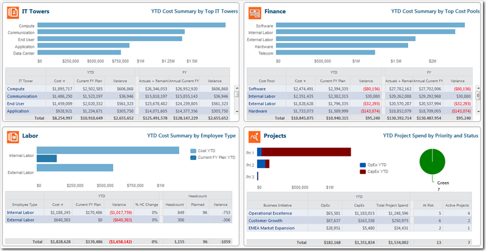
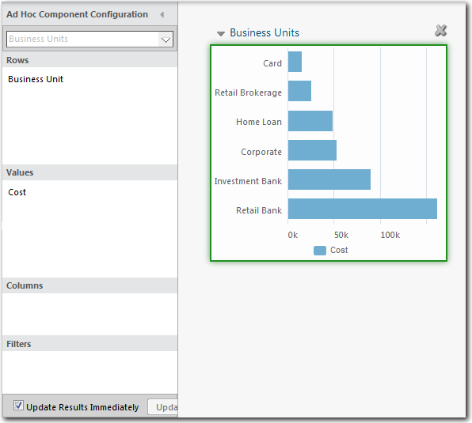

# Charts in reports

**Applies to**: TBM Studio 12.0 and later

Charts, when used correctly, can convey valuable information quickly. The application offers a
wide range of chart types, including:

1. Bar (bar and stacked bar)
2. Column (column and stacked column)
3. Line
4. Pie
5. KPI

Several sample charts follow:

## Create charts

Create charts using the **Component Configuration** panel shown in the following image:

## Sort data in a chart

You can sort data in a chart in ascending or descending order by clicking the **Sort** icon on
the **Data** tab. The application displays a dialog where you can select up to four criteria to
use for sorting.

## Link to reports

You can set up links from charts to reports. When a user clicks on a pie chart segment or a bar
in a bar chart, they will be taken to a designated report. To define links for a chart, you must
perform the following steps:

- Convert the chart to a table.
- Define the links.
- Convert the table back to a chart.

For information on defining links, see [Link to reports](link-to-reports.html "Applies to: TBM Studio 12.1 and later").

## Color Palette

**Applies to**: 12.10.10 and later

You can apply custom color palettes to all the chart types, except Treemap and Waterfall. The
color palette is not applicable for Tables, Font/label colors, Slicers, Background, and KPI.

## Legacy charts

Prior to the addition of the Ribbon to Report Studio, charts were created and edited using a wide
variety of tools. The charts often were modified and formatted by editing the data path for the
chart. Legacy charts can be modified using many of the tools in the Ribbon. However, not all tools
available to ad-hoc charts are available to legacy charts.

You can convert an ad-hoc chart to a legacy chart. However, once you convert the chart, you
cannot convert it back to an ad-hoc chart. To convert a chart, open the **Chart** menu in the
upper-left corner of the chart frame and **select Convert to Legacy Chart**.
