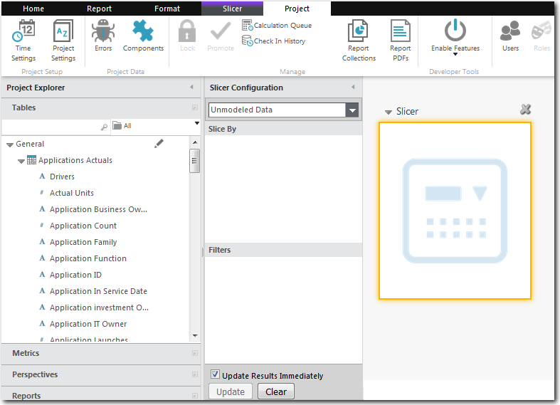
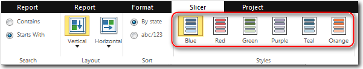

# Add a slicer

**Applies to**: TBM Studio 12.0 and later

You can add an unlimited number of slicers to a report. After you add the slicers, you can move
and size the slicers.

Slicers can be a list or a slider. Text fields create list slicers. Numeric fields create slider
slicers.

## Add a slicer

To add a slicer to a report:

1. Display the report where you want to add the slicer.
2. Select **Row Slicer** from the **Report** tab. The application adds a blank slicer object
   to the report and displays the **Slicer Configuration** panel shown in the following
   image:

   
3. Drag a field from a perspective (Dimensions, Calculations, or Time) into the **Slice By**
   area.

The field values are displayed in the slicer. Text fields create list slicers. Numeric fields
create sliders. Locked fields are fields that have been added to custom dimensions. For more
information on custom perspectives, see [Creating custom perspectives](creating-custom-perspectives.htm "(Opens in a new tab or window)").

## Move and size slicers

After you have placed a slicer in a report, you can perform the following actions:

- Move the slicer by clicking the title bar and dragging the slicer to a new position.
- Change the size of the slicer by dragging the left, right, and bottom borders and corners.

## Change slicer styles

There are several different color schemes available for slicers. To apply a color scheme, select
a style from the Slicer tab.

## Set the search options

If there are many values in a slicer, uses can enter text in the auto search box at the top of
the slicer to limit the list of values. When you add the slicer to a report, you can select one of
the following two search options.

- **Contains** - Finds all values that include the entered characters. If the user types abc,
  the filter will find abcefg, defabc, and defabcefg, but not abdc or adbc.
- **Starts With** - Finds all values that begin with the entered characters. If they user types
  abc, the filter will find abcefg and abc, but not dabc or 1abc.

For a more detailed discussion of these options, see [Select a search option](select-search-option.html "Applies to: TBM Studio 12.0 and later").

## Hide the search field

A search field is displayed at the top of a slicer. Users can enter text in the field to limit
the number of elements displayed in the slicer. If you are creating a slicer with a small number of
elements, and there will be no scroll bar in the slicer, you can hide the search field. To hide the
search field:

1. Open the **Properties** for the slicer by clicking the down arrow to the left of the slicer
   name.
2. Clear the **Show Auto Search Filter** option on the **General** tab.
