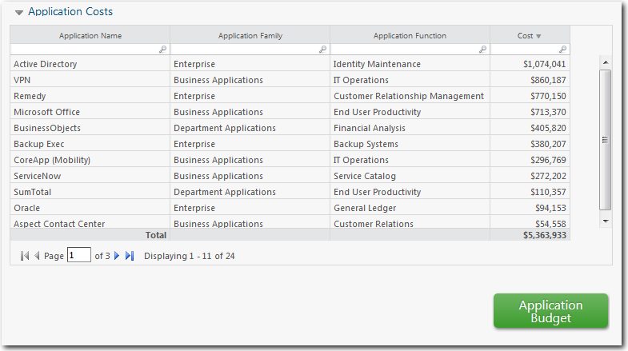
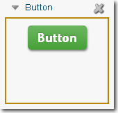
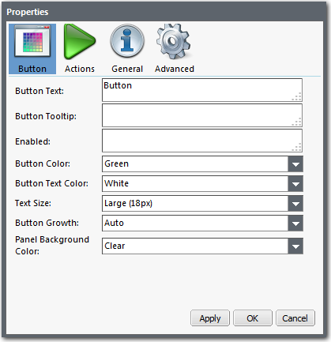
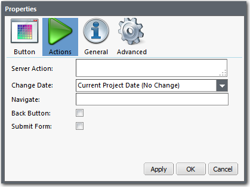
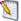

# Button component

**Applies to**: TBM Studio R.12.0 and later.

Use the **Button** component in reports to provide links to any report in a project. Also, use
buttons to change the currently-displayed time period for a report, and to add and delete rows in a
table. For example, see the Application Budget button below:



When you add a button to a report, you can change its appearance, add graphics, and define
actions for the button.

Note: Be careful when you create a button that navigates to a report. If it displays a report that
requires significant calculation, this can impact system performance.

## Add a button

From the **Report** tab, click the **Button** icon. The application adds the button object
to the report as shown in the following image. The button is contained inside a standard report
component panel.



## Change the appearance of a button

After adding a button to a report, you can change its appearance. Also, you can replace or
supplement the button text with a custom image.

To change the appearance of the button:

1. In the upper-left corner of the button component, click the small triangle  to open the **Actions** menu, and the click **Properties**. The
   **Properties** dialog box appears:
2. Use the fields on the **Button** tab to change the appearance of the button. The fields are
   described below.
   - **Button Text** - Text entered in this field is displayed in the button. Usually, this will
     be a static label. However, you can use dynamic text in this field. For information on dynamic text,
     see [HTML text box](html.html "Applies to: TBM Studio 12.0 and later").You can also replace or
     supplement the text in a button with an image from the Apptio image library by inserting HTML code
     that references the image.
   - **Button Tooltip** - Text entered in this field will be displayed as a tool tip when a user
     moves the mouse pointer over the button.
   - **Enabled** - Determines if the button is active, disabled, or hidden.
     - To hide the button, enter the word "hidden" in the field.
     - To disable the button, enter the word "disabled" in the field. The button will appear gray and
       cannot be selected.
     - You can enter a function that will be evaluated to determine the state of the button. For
       example, to enable a button if the cost is more than $5,000, you would enter
       `<%=IF(Cost>5000,"enabled","disabled")%>`. For more information on functions, see
       "Introduction to Formulas and Functions" in the *Studio Guide*.
   - **Button Color** - Sets the background color for the button.
   - **Button Text Color** - Sets the color for the text.
   - **Text Size** - Sets the size of the button and the text displayed in the button. Also, you
     can resize a button by dragging the border of the panel that surrounds the button. The minimum size
     of the button is restricted by the amount of text displayed.
   - **Button Growth**
     - **Auto**: Sets the button to the default size.
     - **Horizontal**: Lengthens the button to fit the surrounding panel.
   - **Panel Background Color** - Sets the color of the panel that surrounds the button.
3. To preview your changes, click **Apply**. To save your changes, click **OK**.

## Set the actions for a button

When a user clicks a button, it can take a scripted action, change the date, and/or navigate to a
report.

To set the actions for a report:

1. In the **Properties** dialog, select the **Actions** tab in the header. The application
   displays the following fields:
2. Complete the fields.
   - **Server Action** - A server script can be entered in this field using the
     Apptio scripting language. The script is executed first before the entries in the **Change
     Date** and **Navigate** fields are executed. This is an advanced
     feature used by Apptio Customer Success consultants.
   - **Change Date** - Select an option from the drop-down list or enter a date in
     the **Date** field at the bottom of the list. The date format is period:year.
     Examples: January:FY2012, P3:FY2012.
     - To accept an entry in the **Date** field, click the plus sign to the right of
       the field.
     - To clear the **Change Date** setting, select **Clear Selected
       Date** from the drop-down list.
   - **Navigate** - Enter a link to a document using Wiki-style syntax. See [Coding Links to Other
     Reports](coding-links-to-other-reports.html "Applies to: TBM Studio 12.0 and later") for details and examples.
   - **Back Button** - When this option is selected, clicking the button will take
     the user back to the last report they were on. This provides the user with an alternative to the
     report breadcrumbs. This option overrides any entry made in the Server Action, Change Date, and
     Navigate fields.
   - **Submit Form** - If the button is placed in a form, it will submit the form
     when clicked.
3. To preview your changes, click **Apply**. To save your changes, click
   **OK**.

## Set the general properties

The General properties are described below.

- **Name** - Enter a name to appear in the button header above the component.
  The name is displayed when the **Show Header** option is selected.
- **Caption** - Enter additional information about the component. The
  information is displayed based on the setting of the **Caption Position**
  field.
- **Caption Position** - From the list, select a caption position relative to
  the button: **Top**, **Bottom**, **Left**,
  or **Right**, or select **Hide** to not display the
  caption.
- **Show Header** - The component header displays the contents of the
  **Name** field. Select this option to make the component header visible. When the
  header is hidden, you can pause the mouse pointer on the component to display the header.
- **Show Border** - Select this option to display a border around the table.
  When the border is hidden, you can pause the mouse pointer on the component to display the
  border.
- **Wrap Title** - Wraps the text entered in the **Name**
  field to accommodate the width of the component.

## Set Advanced properties

**Advanced** properties include:

- **Auto Refresh When Calculations Finish** - When the application displays a
  button, it displays it with the calculated data that is currently available. In many cases, the
  application may be calculating new values in the background. If you want the results displayed when
  the calculations are complete, select this option. This option applies only to the
  currently-selected table. This option is available only when the **Calculation
  Policy** (in the **Project Calculation** dialog) for a project is set
  to **Dynamic Publishing**.
- **Enable Application Tabs in Project** - This option is no longer active in
  version 12.0 of the product. It is a legacy feature from the v.11.x versions of the product.
- **Data URL** - Displays the path to the table that supplies the data for the
  report. You can enter a table function in this field by clicking the **Edit Data
  Path** icon  to the right of
  the field. The application displays the **Edit Path** dialog.
- **Create New Project** - If you select a value for this field, the
  application will create a new project when a user clicks the button. There are two options:
  - **Derived** - The application creates a separate project based on an existing
    project. Use this when you want to preserve the old project for reference. Deleting the original
    project does not delete the derived project.
  - **Current Project Snapshot** - The application marks a point in time in the
    existing project log and creates a new project. The new project is linked to the old project. If you
    delete the old project, the new project will be deleted.

  Note: If you are creating a new project, you must complete the **Derive Generated
  Project From** and **Project Start Date** fields.
- **Derive Generated Project From** - Use when creating a new derived project.
  Enter the name of the project that will be used as the basis for the derived project. The name must
  include the domain.For example:

  ```
  abc_company.com:Project
                123
  ```
- **Project Start Date** - Use when creating a new derived project. Enter the
  start date to be assigned to the derived project. You can use any of the supported date formats. A
  typical format is MMM-FYyyyy.For example: JAN FY2012.
- **Make Personal Project** - Creates a project only the person creating the
  project can access. Adds the user ID of the person clicking the button to the name of the project.
  For example, if psmith@abc\_company.com clicks the button and enters a project name of "new-project,"
  the full name of the project will be "\_psmith@abc\_company.com\_new-project."Note the underscore in
  front of the project name.
