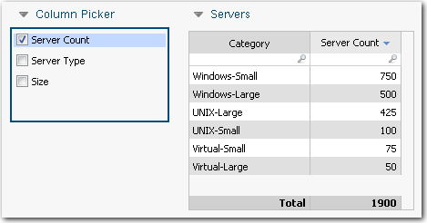
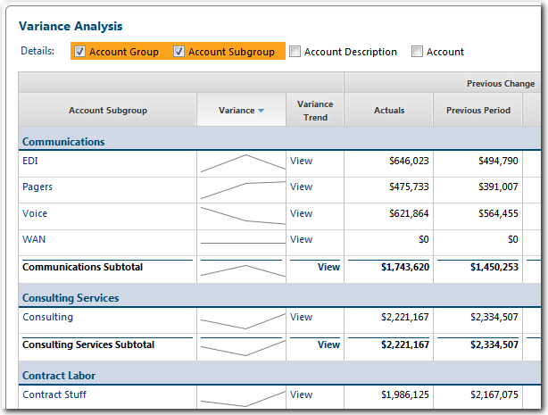
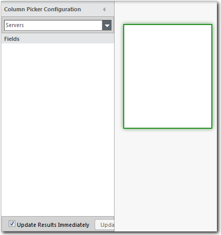
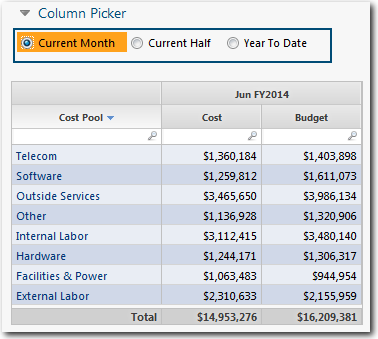
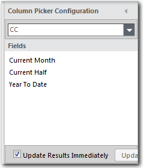

# Column picker component

**Applies to**: TBM Studio 12.0 and later

A column picker lets users customize a table in a report by adding columns to the table. An
example column picker and accompanying table are shown in the following image. A column picker
applies to all tables in a report unless it is contained within a group object. If the picker is in
a group object, it applies only to the tables within the group.

**Key points**:

Below are the key points about creating column pickers:

- Label fields added to a picker are added to tables as rows (in the context of the **Component
  Configuration** panel) grouped by the values in the first column of the table. A horizontal column
  picker with label options is shown in the following image:

  
- Numeric fields added to a picker are added to tables as values (in the context of the
  **Component Configuration** dialog) in separate columns. If the columns in the table are grouped,
  a column is added into each group.
- Locked fields give the most predictable results. However, generally, you will get satisfactory
  results if you use unlocked fields.
- A column picker can be displayed as a set of checkboxes or as radio buttons. Use check boxes for
  multiple selections. Use radio buttons for single selections.
- The checkboxes and radio buttons can be oriented vertically or horizontally.

## Add a column picker

1. From the **Report** tab, click **Column Picker**. A **Column Picker** component is
   added to the report. The Column Picker Configuration pane is displayed as shown in the following
   image:

   
2. From the field at the top of the dialog, select the object representing the table where the
   columns will be added.
3. From the **Project Explorer**, drag one or more values into the **Available Fields**
   area.
4. Close the dialog by clicking in a blank area of the report.

## Choose checkboxes or radio buttons

In a column picker, the columns can be displayed as a set of checkboxes or radio buttons.
Checkboxes let the user select one or more columns. Radio buttons allow the user to select a single
column. The **Multiple Selection** option displays checkboxes. The **Single Selection** option
displays radio buttons.

To change the display option:

1. Select the column picker component in the report.
2. From the **Picker** tab, select the **Single Selection** or **Multiple Selection**
   option.

## Vertical or horizontal orientation

The picker options can be oriented vertically or horizontally using the **Layout** options on
the **Picker** tab.

## Use as a date picker

You can use a column picker to give users the ability to filter a table by dates. In the report
shown in the following image, a user can select from Current Month, Current Half, and Year To Date.
The selection is reflected in the Jun FY2014 heading above the two grouped columns: Cost and
Budget.

To create this type of report:

1. Group the columns in the table and enter the following dynamic text for the group title:
   <%=CurrentDate()%>.
2. Add the column picker using the date values as shown in the following image:

   
