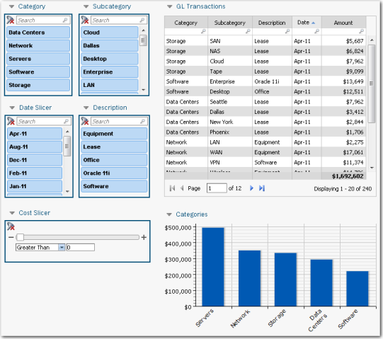
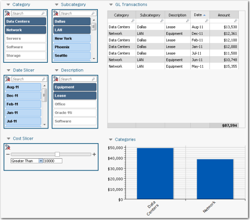

# Use reports for data discovery

**Applies to**: TBM Studio 12.0 and later

Watch this demo video from Apptio Education Services: [Using Model
Reports](https://community.apptio.com/videos/1583 "(Opens in a new tab or window)"). Or, browse [all Apptio videos](https://community.apptio.com/docs/DOC-7714 "(Opens in a new tab or window)").

Static reports can provide valuable information using tables and charts. And, if the tables and
charts contain links, users can drill down to get more detail about individual elements. You can
make the reports even more useful by giving users the ability to filter reports and find
relationships using slicers. Using slicers, the user can focus on specific elements in the tables
and charts and get insights they might not otherwise see.

A GL Transaction report with several slicers is shown in the following image. Using the slicers,
the user can filter the **GL Transactions** table and **Categories** chart by category,
subcategory, date, and description. Also, they can use the slider at the bottom of the report to
filter by **Cost**.

For example, in the following image, the report has been filtered by Category (**Data
Centers** and **Network**), Subcategory (**Dallas** and **LAN**), and Description
(**Equipment** and **Lease**), as well as for costs greater than $10,000. The advantage of
slicers is that they enable many combinations of filters.

