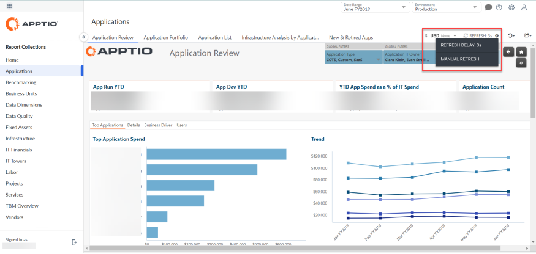
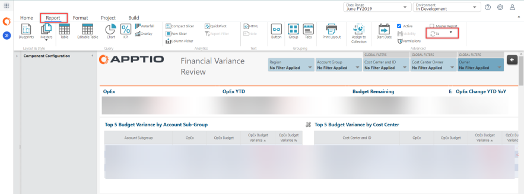
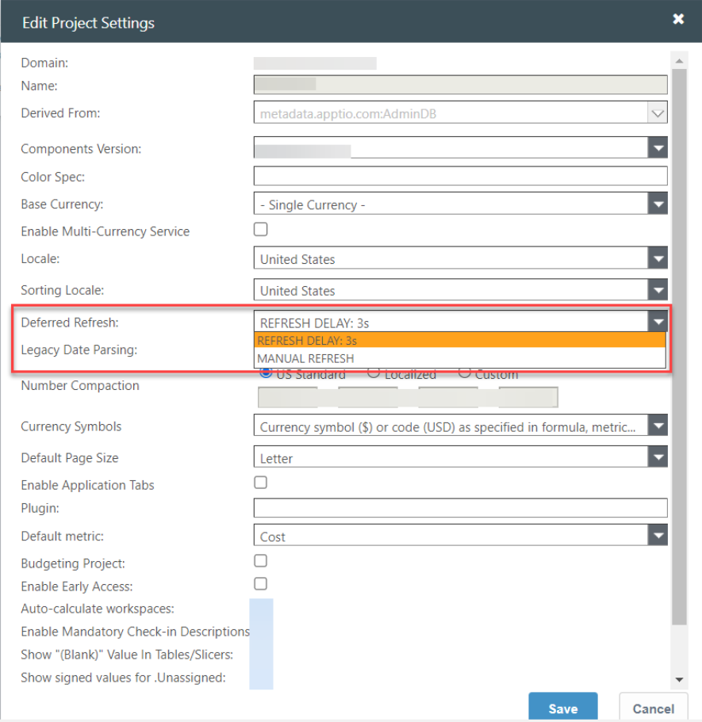
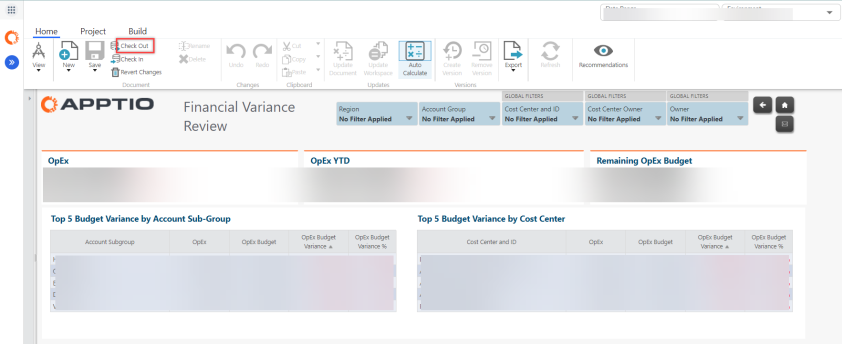
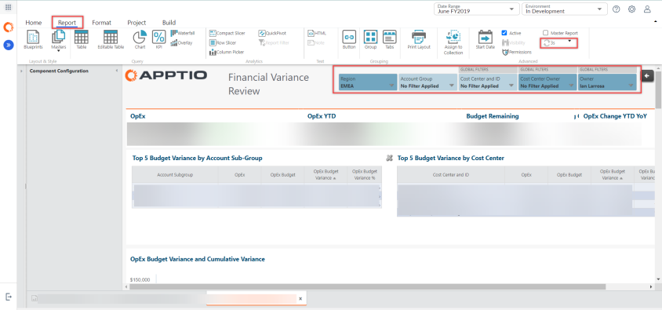
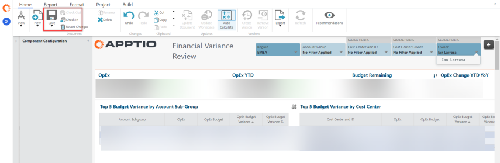

# Deferred Refresh

The Delayed Refresh feature provides deferred time for the users to select filters, pickers, or
slicers and see the updated results based in the report. This is useful for large, complex reports
where multiple interactive selections are made.

In 12.10.8, this feature was available as part of Report Studio > Navigation bar, with the
options Live, 2 seconds, 5 seconds, and Manual refresh.

From 12.10.9, the feature has been enhanced to remove the Live, 2 seconds, and 5 second options.
The new options are:

- **Refresh Delay: 3s**: The system waits for 3 seconds before refreshing the screen.
- **Manual Refresh**: This mode requires the user to select Refresh to update the report.

This feature is available in three views:

## Cost Transparency

Note: Changes done in the CT Report Studio are not user persistent. If the user is logged out, the
default settings of 3 seconds will be again be applicable.

## TBM Studio

The Deferred Refresh feature is available to all users, with the default of **Refresh Delay:
3s** for all the projects, but the Admin can change the setting to Manual Refresh. For simple
reports, you can set to 3 seconds, while for a large report with numerous slicers, pickers, pivots,
the user may switch to **Manual Refresh** option. To change the refresh settings, navigate to
**Project** tab > **Project Settings** and change the value in **Deferred Refresh** field
in the Edit Project Settings popup.

This setting will apply to all reports. But you can change the refresh settings for specific
reports by following these steps:

1. From the **Home** tab of a report, select **Checkout**

   
2. The **Report** tab is enabled. Apply the appropriate filters and modify the refresh settings
   as applicable.

   
3. From **Home** select **Save**, and then select **Checkin** option.

   
