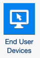

# End User Devices

End User Devices (EUD) provides insights for IT Asset Managers and Desktop Support Managers to
make data-driven decisions around fleet consolidation, optimization and expected costs. As of today,
there are 3 components related to End user devices.

- CT Apps-End user devices: This is an old component, and does not have reports
- BoIT–End user devices: This is an old component, and does not have reports
- **End user devices**: This is the latest component with reports that customers have to
  install to see the reports with 7 solutions and 27 use cases. Below is the screenshot of the
  component for installation:

[Configure End User
Devices](component%20end%20user%20devices.htm "(Opens in a new tab or window)")

[End User Devices
reports](end_user_dev_dashboard.htm "(Opens in a new tab or window)")
