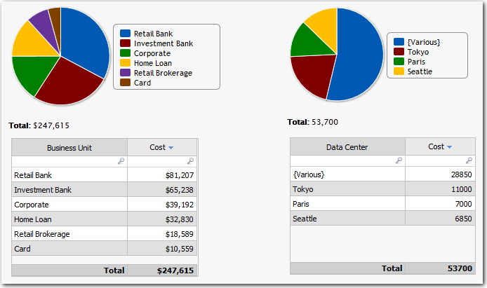
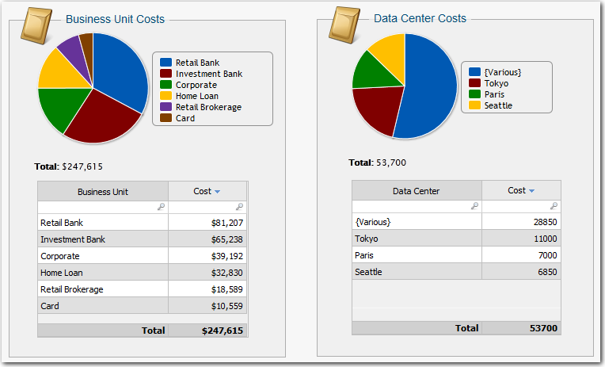
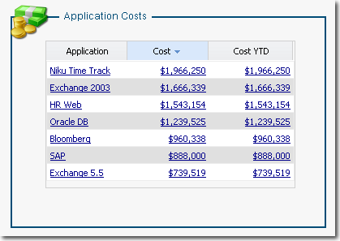

# Group components in a box

**Applies to**: TBM Studio 12.0 and later

If you are creating a report with many components, you may find it useful to visually group the
components by adding a border around the components. For example, the following image shows two sets
of components without borders. One set of components shows business unit costs, the other set shows
data center costs:

Adding borders as shown in the following image clarifies the relationship between the chart and
table in each set. Placing report components inside a group box physically groups them together so
they can be moved as a group.

## Add a group box

1. On the **Report** tab, click the **Group** icon. The
   application adds the group box to the report.
2. Move and resize the box as needed.
3. To move the box, click in the header and drag it to the new location.
4. To resize the box, drag the edges of the border.

## Add components to a group box

To add components to a group box, select the components and drag them into the box. Resize the
group box to accommodate the objects. When you drag the group box, the boxed objects will be moved
as well, retaining their relative positions in the box.

## Arrange components in a group box

If you place several objects in a group box, you can arrange the components manually or by using
the **Group Layout** tools on the **Group** tab. The advantage
of the **Vertical** and **Horizontal** layout options is that
if a component placed in the group is hidden for a set of users, the remaining components will be
arranged to fill in the space occupied by the missing component.

The group layout options are described below:

- **Manual** - You can position the components anywhere in the group and they
  will stay where you put them.
- **Vertical** - Automatically aligns components vertically using settings in
  the **Spacing** option.
- **Horizontal** - Automatically aligns components horizontally using settings
  in the **Spacing** option.
- **Spacing** - Displays a dialog where you can set the vertical and horizontal
  spacing between the components.

## Auto size

The group box can be a fixed size or it can change size dynamically. If the box is a fixed size,
it does not change size based on the number of components displayed. If the number of components in
a group box causes the group box to display scroll bars, the scroll bars will be displayed even if
there is only one component displayed in the box.

If the box is set to size dynamically, it will adjust to accommodate the size of the components
included in the box. Use the **Auto Sizing** options on the
**Group** tab to control how the group box adjusts to components.

## Change a group box icon

You can change the default icon for a group box. The icon graphic files are stored on a central
server in an Icon Experience collection. To change the icon for a group box in a report, change the
icon path in the HTML for the group box.

To change the icon for a group box:

1. In a separate browser window, go to this link:
   http://<yourapptiodomain>.apptio.com/graphics/IconExperience/search.html
2. Search for the icon you want to use.
3. When you have located the icon, select it from the lists on the left.
4. On the right, locate the size icon you want to use.
5. Right-click on the icon and select Copy Image Location.
6. Paste it in Notepad and copy the URL for the icon beginning with the word "graphics." Example:
   graphics/IconExperience/v\_collections\_png/computer\_network\_security/24x24/plain/server\_lock.png.
7. Open the **Action** menu for the group box and select
   **Properties**.
8. On the **General** tab, paste the new URL into the **Grouping Image
   URL** field.

## Add a title to the border

A traditional element of many applications is an embedded title in the border of the group boxes.
You easily can add embedded titles to group boxes in reports as shown in the following image. In
this example, the title Application Costs has been added to the group box:

To add a title to the border of a group box:

1. Right-click inside the group box and select **Properties** from the pop-up
   menu.
2. On the **General** tab of the **Properties** dialog, enter
   the title text in the **Grouping Border Title** field.

## Add a color background

To add a color background to a group box:

1. Right-click inside the group box and select **Properties** from the pop-up
   menu.
2. On the **General** tab of the **Properties** dialog, open
   the drop-down list for the **Grouping Style** field and select a color.
3. To see the new color, click the **Apply** button.

## Group box borders

There are several options you can use to control the appearance of the borders on a group box.
The elements of the borders are identified in the following image. All but one of the options are
located on the **General** tab of the **Properties** dialog
for the group box:

How to control each of the elements is described below:

- The name of the group box comes from the **Name** field.
- To display the group box name, select the **Show Header** option.
- The outer border is controlled by the **Show Border** field. When the option
  is checked, the outer border is displayed.
- The icon and the title on the inner border are displayed when the **Show Inner
  Border** option is checked.
- The text for the inner border comes from the **Grouping Border Title** field
  on the **General** tab.
- The format of the text on the inner border title is controlled by the **Grouping Border
  Title** field on the **Styles** tab of the group box
  **Properties** dialog. The style is controlled by entering an Apptio CSS style.
  This is an advanced feature used by the Apptio Customer Success consultants.

## Auto-resize group boxes

If you have placed several tables in a group box, and one or more of those tables is set to auto
size based on their content, you can set the group box to re-size as well. This ensures the size of
the group box matches the size of the tables. You can set the width, height, or both to resize. The
resizing works only in View mode. When you are editing a report, the group box will not resize.

To set the re-size options:

1. Select the group box.
2. On the Group tab, select one of the resizing options.

## Set the properties

To edit the properties for a group box, display the **Properties** dialog by
doing one of the following:

- In the top-left corner of the icon, click the small triangle  next to the component name to display the **Actions**
  menu. From the **Actions** menu, click **Properties**.
- Right-click anywhere within the borders of the component and select
  **Properties** from the pop-up menu.

The **General** properties not described in the sections above are described below:

- **Name** - Enter a name to be displayed in the component header above the
  component when **Show Header** is selected.
- **Caption** - Enter additional information about the component. The
  information is displayed based on the setting of the **Caption Position**
  field.
- **Caption Position** - From the list, select a caption position relative to
  the button: **Top**, **Bottom**, **Left**,
  or **Right**, or select **Hide** to hide the caption.
- **Show Header** - The component header displays the contents of the
  **Name** field. Select this option to make the component header visible (the
  default). When the header is hidden, you can display the header by pausing the mouse pointer on the
  component.
- **Show Border** - Select this option to display a border around the group
  box. When the border is hidden, you can display the border by pausing the mouse pointer on the
  component.
- **Wrap Title** - Wraps the text entered in the **Name**
  field to accommodate the width of the component.
- **Show Inner Border** - Select this option to display a title on the inner
  border. The title text is taken from the Grouping Border Title field.
- **Grouping Image URL** - To change the icon displayed on the inner border,
  enter the URL to the icon image file. The URL for the default icon is shown
  below:`/graphics/IconExperience/v_collections_png/computer_network_security/48x48/shadow/envelope_cushioned.png`
- **Grouping Border Title** - Text entered in this field is displayed as the
  title on the inner border.
- **Background Color** - Controls the background color of the area inside the
  inner border.

The Styles property includes:

- **Grouping Border Title** - Formats the text displayed on the inner border of
  the group box. Enter an Apptio CSS (Cascading Style Sheet) style to apply a format. This is an
  advanced feature used by Apptio Customer Success consultants.

The **Advanced** property includes:

- **Auto Refresh when Calculations Finish** - When the application displays a
  Group Box component, it displays it with the currently available calculated data. In many cases, the
  application may be calculating new values in the background. If you want the results displayed when
  the calculations are complete, check this option.
