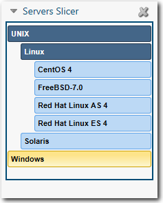

# Hierarchical slicers

**Applies to**: TBM Studio 12.0 and later

Using a hierarchical slicer, users can drill down into increasing levels of detail. For example,
in the slicer shown in the following image, a user can select types of servers. Hierarchical slicers
can be used in compact slicers.

## A hierarchical slicer is based on a group

A hierarchical slicer is based on a custom perspective group. The order of the entries in the
group determines the hierarchy. For example, the slicer shown in Figure A was created using a custom
perspective group with the following fields: 01\_Type, 02\_SubType, 03\_OS. The fields were renamed to
create the correct order.

## Create a hierarchical slicer

1. On the **Report** tab, click **Row Slicer**.
2. Create the custom perspective that will be used in the slicer. For more information, see [Create custom
   perspectives](creating-custom-perspectives.htm "(Opens in a new tab or window)").
3. In the **Perspectives** area of the **Project Explorer**, right-click and create a new
   group.
4. Drag fields into the newly created group.
5. Drag the group into the **Slice By** area of the dialog.

## Order the fields

By default, the fields in a hierarchical slicer are in alphabetical order. To change the order,
rename the fields, adding sequential numbers to the front of the names. To rename a field,
right-click the field and click **Edit**.

Note: You cannot use dashes (-) in a field name. However, you can use colons and underscores.
