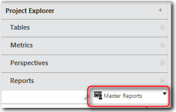

# Work with master reports

**Applies to**: TBM Studio 12.0 and later

If you want a set of reports to have the same layout, you can create a master report and apply it
to each of the reports. A master report can include all the components of a regular report such as
buttons, group boxes, and action items. The concept is similar to master slides in presentation
applications. Master reports, by default, always are top-level reports. To create a master report,
create a new report and click the **Master Report** option in the **Advanced** group on the
**Report** tab.

## Standard master reports

The application includes many standard master reports. These are listed on the **Masters**
drop-down menu on the **Report** tab. You can use these master reports as is or modify them and
save them using the **Save As** option. You cannot delete standard master reports.

## Master reports as wall paper

Think of master reports as wall paper. When applied to a custom report, the components in a
master report cannot be edited from a custom report. They are static. Components added to a custom
report sit on top of the wall paper. For example, if the master includes a group box, you can
position components so that they appear inside the group box, yet are not attached to the group
box.

If you add a tabbed component to a master report, the tabs will function when you apply the
master report to a report. However, you should avoid putting any components on top of the tabbed
component in the custom report because they will be displayed on top of all the tabs. Again, think
of the tabbed component as wall paper.

## Create and delete master reports

To create a master report:

1. Check out the report you want to use as the master.
2. In the **Advanced** group on the **Report** tab, click the **Master Report**
   option.
3. Save the report.

To delete a master report:

1. In Report Edit mode, click the **Reports** section in the **Project Explorer**. Filter the
   list of reports by **Master Reports**.

   
2. Check out the report you want to delete.
3. Click **Delete** on the **Home** tab.
4. Check in the report.

Note: You only can delete customer master reports. You cannot delete the standard master reports
that ship with the product.

## Apply a master report

To apply a master report to a custom report:

1. Check out the custom report in edit mode.
2. On the **Report** tab, open the **Masters** drop-down list and click the master report you
   want to apply.

You can apply master reports to other master reports, but this is not recommended.

## Remove a master report

To remove a master report from a custom report:

1. Select the **Report** tab.
2. Open the **Master** drop-down list and select **None** at the bottom of the list.

## Master report best practices

Below are several best practices for creating master reports.

1. Master reports are layout aids. Generally, you want to create containers such as group boxes
   within which you will place components, such as charts and tables.
2. If you add a tabbed component to a master report, be sure to add components to each of the tabs.
   You will not be able to add components to the individual tabs in the custom report where you apply
   the master. Components added on top of a tabbed component will be displayed on top of all the
   tabs.
3. Group boxes added to a master report lose their grouping abilities when the master is applied to
   a custom report. Use group boxes as a visual border around components.
4. If you add a button to a master report that uses Wiki text, and you have not specified a Data
   URL for the button, the application will use the current report as the context.
