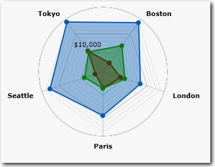
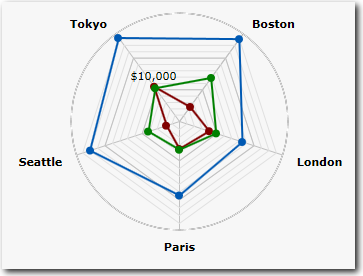

# Radar charts

**Applies to**: TBM Studio 12.0 and later

When you want to compare multiple characteristics across two or more entities, a radar chart is a
good choice. For example, you can compare budget and actuals across several departments. To create a
radar chart, select **Chart** from the **Report** tab, and then **Radar** from the Ad Hoc
tab.

## Types of radar charts

You can create the following types of radar charts. The filled radar chart is appropriate if
displaying three or fewer characteristics. The radar with markers chart can be used with any number
of characteristics.

## Filled Radar

## Radar with Markers

## Create a radar chart

1. Click **Chart** on the **Report** tab.
2. Drag a field into the **Axis** area of the **Ad Hoc Component Configuration** panel.
3. Drag one or more fields into the **Values** area of the **Ad Hoc Component Configuration**
   dialog.
4. On the **Ad Hoc** tab, click **Radar**.
5. From the **Radar** drop-down menu, select the type of radar chart.

## Apply a pivot to a radar chart

If you have a pivot that applies to a radar chart, the pivot is applied to the axis, not the row.
In other charts and tables, a pivot applies to rows.

## Set the radar chart properties

The **Radar** fields on the **Data** tab of the **Properties** dialog are described
below.

## Maximum Rows

Controls the number of axis displayed in the chart. The default setting is six. Unlike some other
types of charts, there is no **Other** axis.
