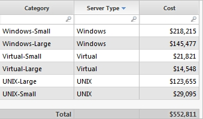
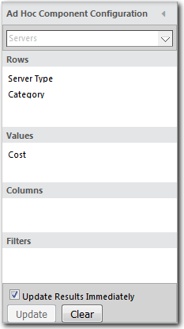
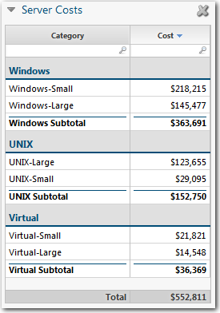
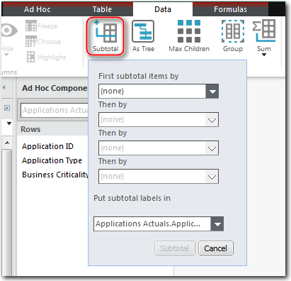

# Add subtotals to a table

**Applies to**: TBM Studio 12.0 and later

If you drag more than one field into the **Rows** area of the **Configuration** dialog, the
application automatically groups the values and presents subtotals for each group. If you sort the
table by the **Value** column, the sort will be for the subtotal values.

For example, assume you have the table shown in the following image:

You add a table to a report based on the table using the settings shown in the following
image:

The result is the table shown in the following image:

## Add subtotals

Control subtotals using the **Subtotals** dialog on the **Data** tab shown in the following
image. You can create subtotals for up to four columns. The **Put subtotal labels in** field
controls the column where the subtotal label is placed.

## Group entries

You can group table entries by any of the fields dragged into the **Rows** area of the
**Component Configuration** pane. To group a table, select **Group** from the **Data**
tab.

Note: If there is more than one field in the **Rows** area, you must group by at
least one of the fields.
