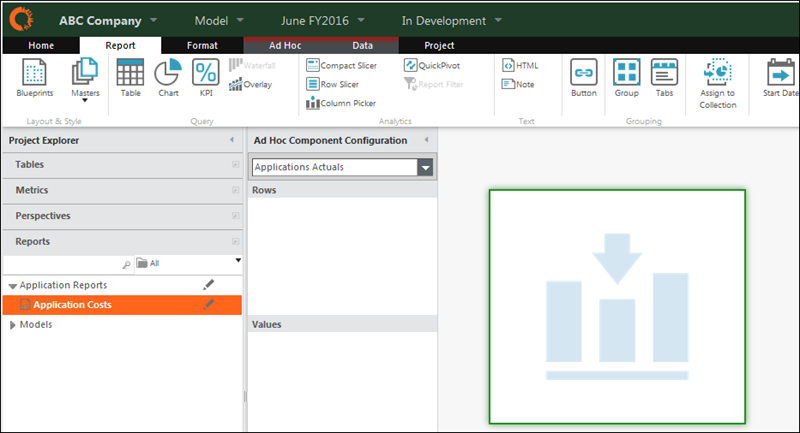
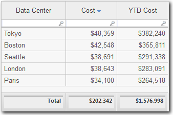
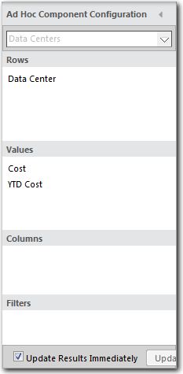
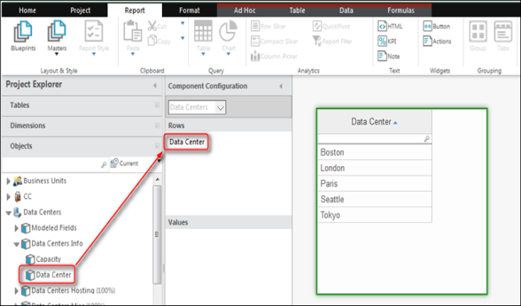

# Add a table to a report

**Applies to**: TBM Studio 12.0 and later

Add a table to a report by clicking the **Home** tab, clicking **New**, and clicking
**Table**. Add an editable table to a report by copying the table to the Report Clipboard and
pasting it into the report.

1. Open the report and check it out.
2. From the **Report** tab, click **Table**. The application adds a placeholder to the report
   and opens the **Ad Hoc Component Configuration** panel as shown in the following image:

   
3. Use the **Ad Hoc Component Configuration** panel to build the table.
4. To build the table, open the sections in the **Project Explorer** and drag fields into the
   four areas of the **Configuration** panel.

## Example

We describe how to build the table shown below.

The table is based on:

- A table called Data Centers
- Two metrics: Cost and YTD Cost

When you are done building the table, the **Ad Hoc Component Configuration** panel will look
like the panel shown below:

To build the table:

1. Open a report.
2. On the **Home** tab, click **New**, and then click **Table**.A table placeholder is
   added to the report and the **Ad Hoc Component Configuration** panel is displayed.
3. In the **Project Explorer**, click the **Tables** section, click **Data Centers Info**,
   and drag **Data Center** to the **Rows** section of the **Configuration** pane as shown in
   the following image:

   
4. In the **Project Explorer**, click the **Metrics** section.
5. Drag the Cost metric into the **Values** section of the **Configuration** pane.
6. Drag the YTD Cost metric into the **Values** section of the **Configuration** pane.
