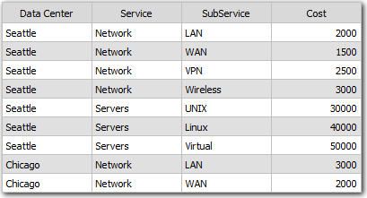
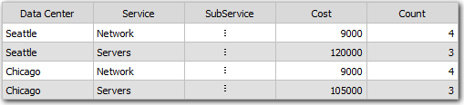
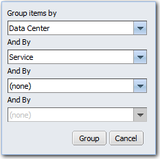

# Group the rows in a table

**Applies to**: TBM Studio 12.0 and later

You may want to consolidate the data in a table by grouping the data by the values in the first
column. To consolidate the data, use the Group feature. Tables are automatically grouped by at least
one field in the **Rows** area of the **Component Configuration** pane.

You can group the rows in a table by clicking **Group** on the **Data** tab. The following
images show a table before and after grouping. Columns with two or more different values will
display three vertical dots. A **Count** column is added to the table that displays the number of
units in the group.

An example is the **SubService** column in the following image.

If there are empty fields in the **Group By** column, a row will be displayed at the bottom of
the table that has the following values:

| In this column: | This value is displayed: |
| --- | --- |
| Group By column | blank |
| .Count | Number of blank rows |
| Numeric columns | Sum of all rows with blanks in the Group By column |

To group a table:

1. Select the table and then click the **Group** icon on the
   **Data** tab.
2. The **Group** dialog is displayed as shown in the following image:

   
3. Select the columns that will be used to group the table. In the previous image, **Data
   Center** and **Service** have been selected.
4. After making your selections, click **Group**. The application groups the
   table.
