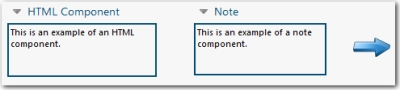
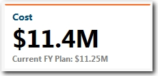

# Text components in reports

**Applies to**: TBM Studio 12.0 and later

When you create a report, you can add components that display text. These components are:

|  |  |
| --- | --- |
| **HTML text box** | Use to add text to a report that is visible to all users. |
| **KPI** | Use to add key performance indicators to a report. |

The report in the following image shows sample HTML and Note components. The arrow is an icon
component:

The following image shows a KPI component:

## Edit component properties

There are a wide range of properties available for components. The available properties differ
with each type of component. **Properties** are set using the Ribbon and a Properties dialog.

To edit the properties for a component, display the **Properties** dialog by doing one of the following:

- In the top-left corner of the chart or table, click the small triangle  to the left of the component name to display the **Action** menu as
  shown below in the following image. From the **Action** menu, select **Properties**.

  
- Right-click anywhere within the borders of the component and click **Properties** from the
  pop-up menu.

Report components are described in the following topics:

- [HTML](html.html "Applies to: TBM Studio 12.0 and later")
- [KPIs: key performance indicators](kpi.html "Applies to: TBM Studio 12.0 and later")
