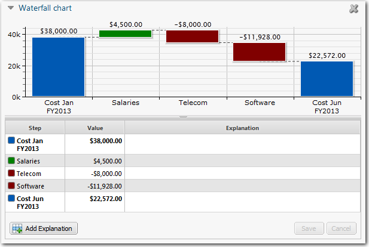
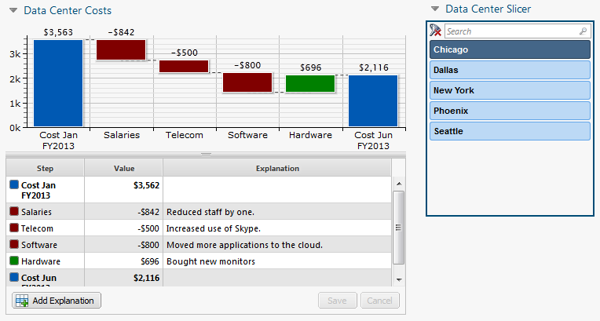
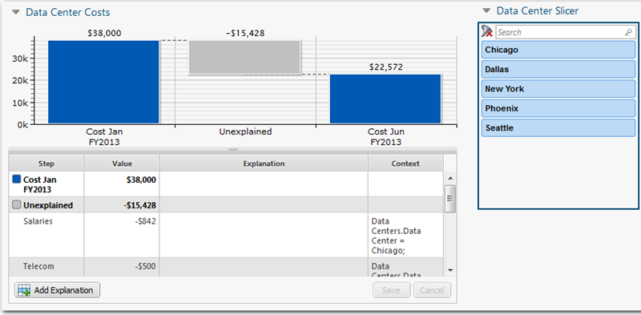
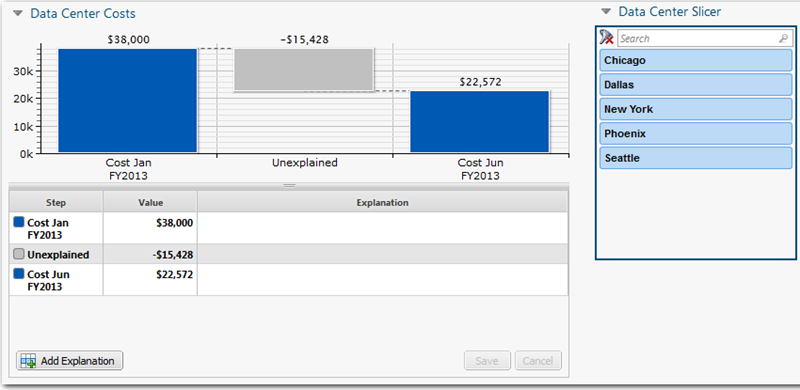
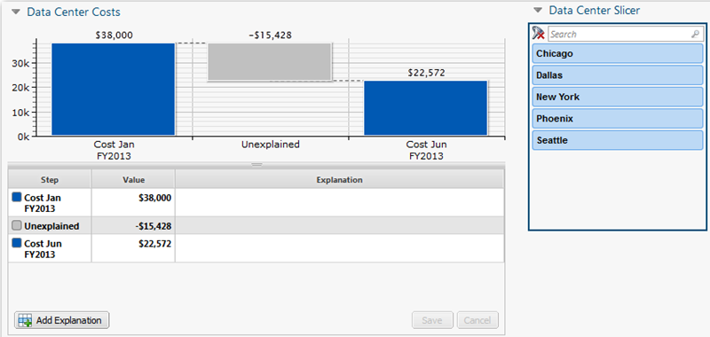
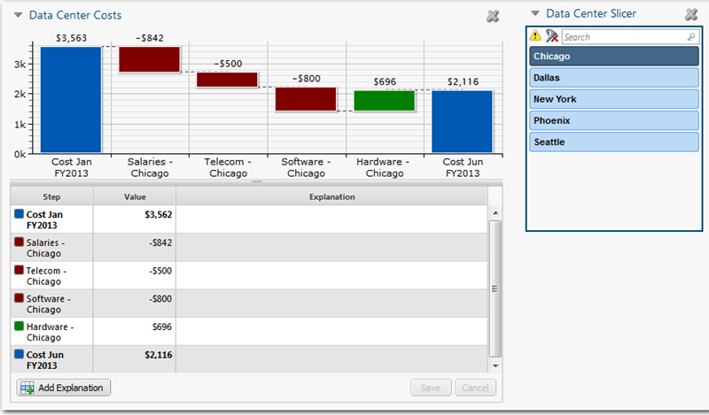
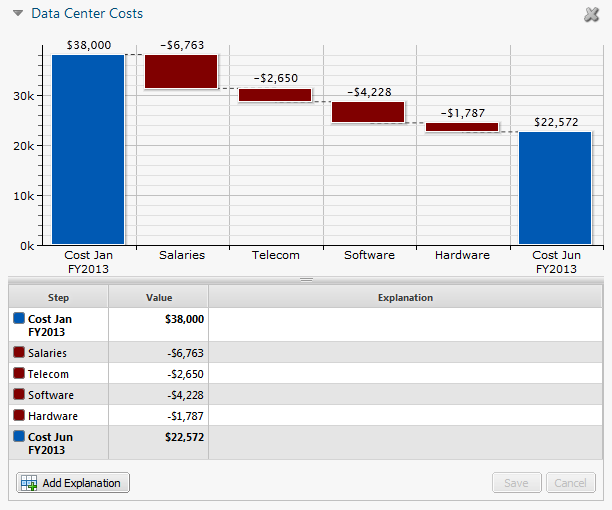

# Waterfall charts

**Applies to**: TBM Studio 12.2 and later

Waterfall charts show the impact of positive and negative values on an initial value. Usually,
the first and last values are displayed as whole columns. In some charts, there will be additional
whole columns displayed. Intermediate values are displayed between the whole columns, as floating
columns indicating positive and negative changes. Intermediate values often are referred to as
steps. For example, there might be whole columns for Q1, Q2, Q3, and Q4 with floating intermediate
values between the quarterly columns.

A sample waterfall chart is shown in the following image:

Note: The values in waterfall charts are always displayed in the base currency set for the project.
Waterfall charts do not support multi-currency.

## Use a waterfall chart with multiple contributors

If you are creating a waterfall chart and would like several contributors to enter intermediate
steps for the chart, you can define a slicer for the chart. Individuals can select a slicer value
and enter steps for that value. For example, you want to create a waterfall chart that summarizes
the change in costs across multiple departments. You want the heads of each department to enter the
intermediate steps for their department. You create a slicer that displays the departments. Each
department head selects their department and enters the steps.

The steps displayed in the chart correspond to the department selected in the slicer. For more
information, see [Use slicers with waterfall charts](#Waterfallcharts__Useslicerswithwaterfallcharts).

All waterfall charts must have at least a beginning and an ending value. A chart may also have
other intermediate values. For example, a chart may display only the beginning and end values for
the year, or it may include values for each quarter in the year.

## Create a waterfall chart

To create a waterfall chart with a beginning and an ending value:

1. Click the **Report** tab.
2. Click the **Waterfall** icon. A chart placeholder is added to the report and
   the **Waterfall Configuration** panel is displayed.
3. In the **Waterfall Chart Configuration** panel, select a model object from
   the drop-down list at the top of the panel.
4. From the **Metrics** section in the **Project Explorer**,
   drag a modeled metric into the **Values** area of the panel.
   - By default, the current time period is entered in the **Time** area of the
     dialog. If you want to change the time period, open the date picker in the header and select a
     different time period, and then create the chart. The time periods for all base values must be the
     same.
5. Drag a second modeled metric into the **Metrics** area.
   - As before, Current Month is entered in the **Time** area. Waterfall charts
     can display a change in value over time. To do this, you change one of the Current Month settings to
     a different time period.
6. To change the time period, right-click the time period and click
   **Shift**.
7. Enter a positive or negative number representing the number of periods to shift the date and
   click **OK**. For example, assume your periods are months and the current month
   is January 2013. If you enter +5, the month will be June 2013.
8. If appropriate, add additional columns representing other periods in time (see [Add intermediate values](#Waterfallcharts__Addintermediatevalues) below).
9. The chart will now display the beginning and ending columns, and an intermediate column called
   Unexplained. The Unexplained column represents the change in value between the beginning and ending
   columns. The next step is to add the intermediate values.

## Add intermediate values

The intermediate steps table displays the intermediate values that contributed to the change
between the beginning and ending values. Ideally, the intermediate values will account for the total
change between the beginning and ending values. Any value not identified in an intermediate step
will be displayed in a column called **Unexplained**. Intermediate values must be added in the
Production environment. Intermediate values can apply to specific slicer values.

To add intermediate values:

1. Switch to the Production environment.
2. Open the report with the waterfall chart.
3. Click the **Add Explanation** button at the bottom of the intermediate steps
   table.**NOTE**: Explanations are stored in the IT Planning database. If the IT
   Planning database has not been installed, you will not be able to add explanations.
4. In the blank row added to the table:
   - Enter a label for the step in the **Step** column.
   - Enter a positive or negative value in the **Value** column.
   - Enter an explanation in the **Explanation** column.
5. Continue adding intermediate values as needed.
6. You can change the order of the intermediate steps between base values by right-clicking and
   then clicking **Move Up** or **Move Down**.

## Filter the chart

You can apply fixed filters to the waterfall chart by adding one or more data fields to the
**Filters** area of the Waterfall Configuration panel. If you want to give users the ability to
select their own filters, create a slicer for the waterfall chart. For more information on applying
slicers, see [Use slicers with waterfall charts](#Waterfallcharts__Useslicerswithwaterfallcharts).

To apply fixed filters to the chart:

1. Drag a relevant field from the **Data** perspective or a custom perspective
   into the **Filters** area.
2. Right-click the filter entry and click **Edit Filter**.
3. In the **Edit Filter** dialog, make your selections and click
   **OK**.
4. To add more filters, repeat the above steps.

## Hide the intermediate steps table

The intermediate steps table is useful when you are building a waterfall chart, but you probably
will want to hide the table from users that will be viewing the waterfall chart.

To hide the intermediate steps table:

1. Click the **Waterfall** tab.
2. Clear the **Show table** option.

## Change the waterfall chart colors

You can change the default colors used in a waterfall chart.

1. Click the **Waterfall** tab, and then click the **Colors**
   icon.
2. Click the color square to the right of each item and click a color.

You can change the color of an individual value in a waterfall chart.

1. Select the chart.
2. Click the **Colors** icon on the **Waterfall** tab. The
   color selection dialog is displayed.
3. Click **Add**.
4. Click **Key**.
5. Enter the name of the value as it appears in the Step column.
6. Click the save icon .
7. Click the custom color icon  and select a color.
8. Click **Save**.
9. To delete a custom color, click the red x in front of the step name and click
   **Save**.

## Set the waterfall chart options

When you create a waterfall chart, a **Waterfall** tab is added. On this tab,
there are several options you can apply to the chart.

- **Show table** - When checked, displays the explanation table below the
  chart. If you want users to be able to edit the waterfall chart, display the explanation table. If
  the explanation table is hidden, users will be able to view the chart but not edit it.
- **Show detailed rows** - Displays intermediate steps associated with specific
  slicer values. The steps are displayed at the bottom of the step table and are read-only.
- **Explanation in Tooltips** - When checked, displays the
  **Explanation** field text in the tooltip for the bars in the waterfall
  chart.
- **Number** - Format the numbers in a waterfall chart using the
  **Number** options.

## Use slicers with waterfall charts

Slicers filter the values displayed in a waterfall chart. When using slicers, the interim steps
can be displayed or hidden in the steps table. Slicers and hierarchical slicers have slightly
different impacts on waterfall charts.

Slicers can limit the values used to generate a waterfall chart. However, when a user selects a
value in a slicer, the intermediate steps are replaced by a single **Unexplained** column in the
chart. If you want a user to see the intermediate steps, select the **Show Detailed Rows** option
on the **Waterfall** tab for the chart.

Note: Numeric and time slicers do not affect waterfall charts.

## Slicers

If a user selects a set of slicer values, and then enters intermediate steps on a waterfall
chart, the steps will be editable only when the same set of slicer values is selected. If the user
selects a different set of slicer values, or clears all selections in the slicer, the intermediate
steps are displayed as read-only entries below the Unexplained entry in the step table.

For example, in the following image, Salaries, Telecom, Software, and Hardware steps have been
entered for the Chicago data center. When Chicago is selected in the slicer, the entries are
editable in the step table. The **Context** column shows the filter being applied by the slicer.
Each step is represented by a bar in the chart:

If Chicago is deselected in the slicer, the steps are changed to read-only and moved below the
Unexplained entry in the step table as shown in the following image. Entries in the **Context**
column describe the slicer setting that is the source of the step. A single **Unexplained** bar
is displayed in the chart. You can promote a read-only step to an editable step by right-clicking on
the step and selecting **Copy to Explanation**.

If the **Show Detailed Rows** option on the **Waterfall** tab for the chart is not
selected, the step table will not display the steps as shown in the following image:

## Hierarchical slicers

Hierarchical slicers act much like regular slicers, except that when you select an element in a
hierarchical slicer, all explanations entered at the currently selected level of the slicer or a
level lower in the hierarchy are displayed. Explanations entered at the currently selected level are
editable. Explanations entered at lower levels are read-only.

## Multi-user waterfall chart example

The IT Department in ABC Company wants to use a waterfall chart to show the change in costs over
the first half of the year. The VP will build the base chart and have the head of each data center
enter explanations for the changes in their data centers. A data center slicer will be created that
the heads can use to filter the waterfall chart for their data center. After the heads have entered
their step information, the VP of the IT Department will consolidate the explanations into a few key
values.

There are five data centers: Chicago, Dallas, New York, Phoenix, and Seattle.

There are four cost centers: Salaries, Telecom, Software, and Hardware.

## Build the base chart

The VP builds the base chart and creates the data center slicer as shown in the following image.
He or she selects the **Show Detailed Rows** option for the waterfall chart.

## Enter data center intermediate steps

The head of the Chicago data center
logs into Apptio and opens the waterfall chart. He selects Chicago from the slicer. He
enters his intermediate steps as shown in the following image. The heads of the other data
centers do the same.

## Produce the final chart

After the heads of the data centers have entered
the intermediate steps, the VP combines the data and creates a single intermediate step for
each cost center. The final chart is shown in the following image:

