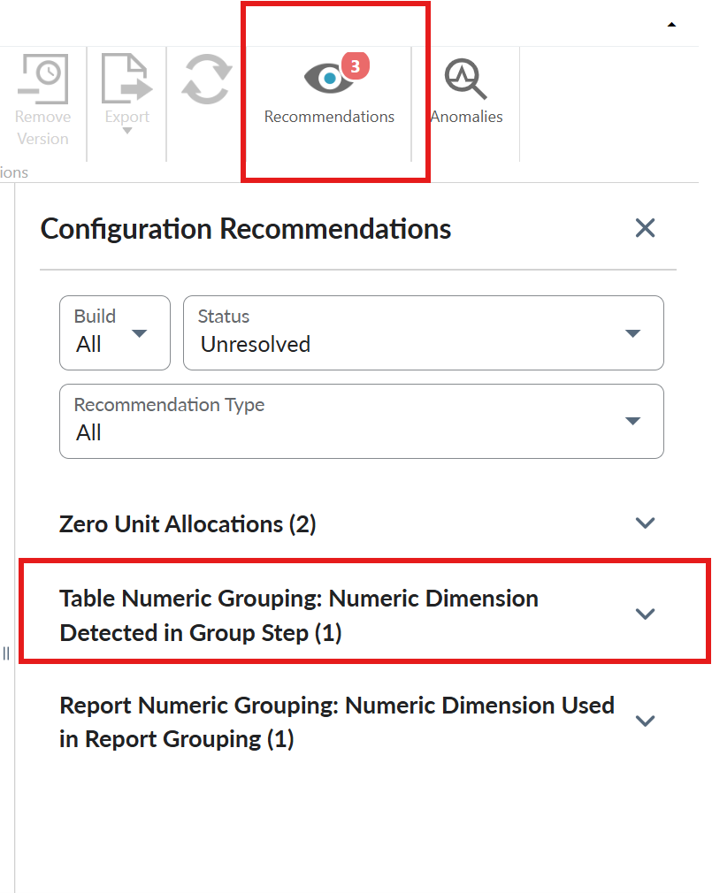
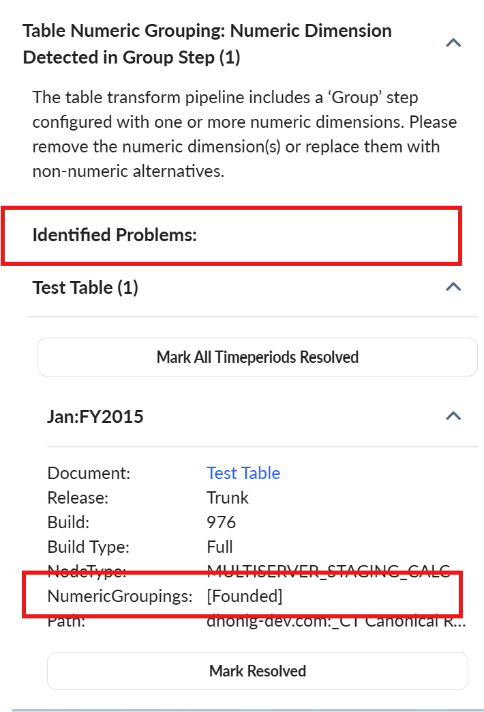
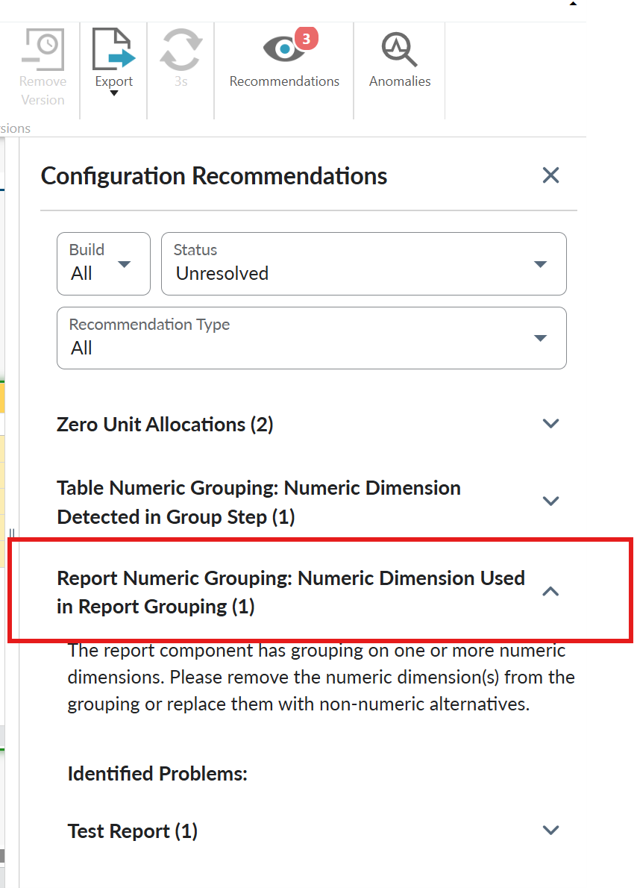
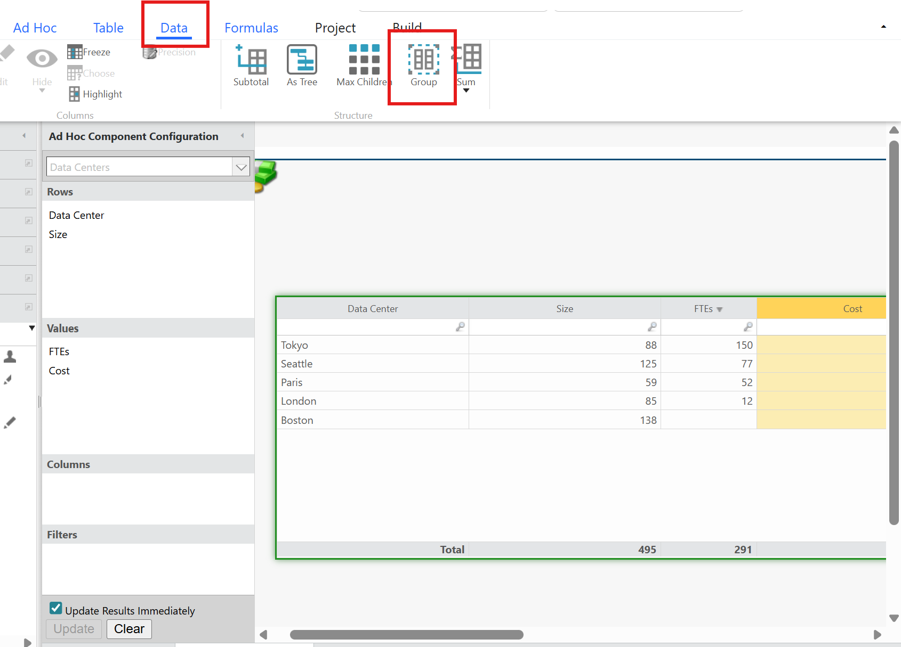
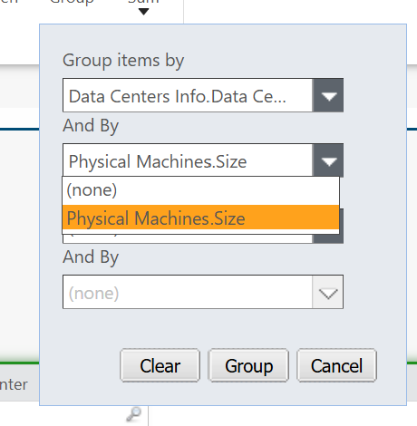
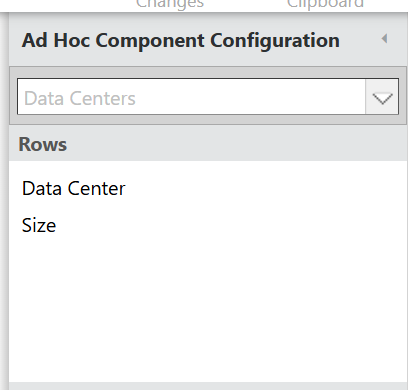
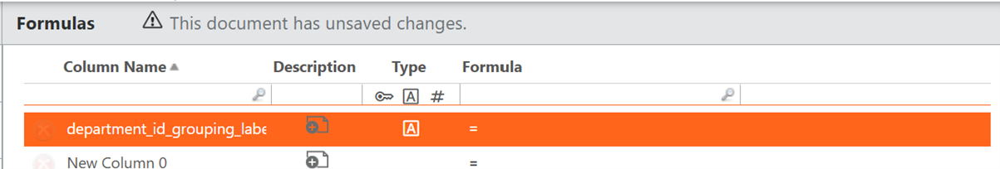
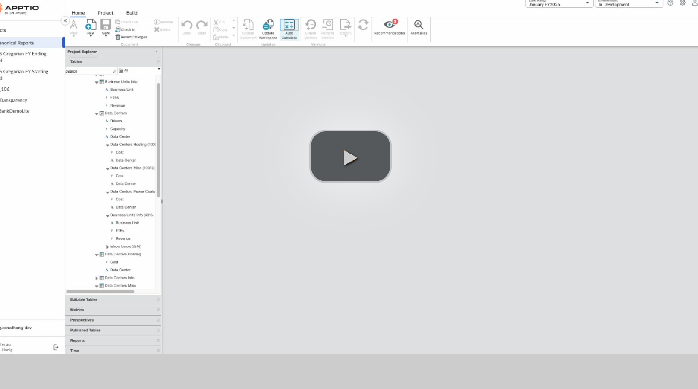

# Numeric Grouping Recommendations

The Cache Re-architecture effort in Q2 2026 will remove the ability to group on a numeric
dimension, whatsoever, regardless of calculation criteria. You must address recommendations before
next release to prevent unexpected changes in data behavior.

Recommendation engine identified configurations in your environment that currently use numeric
dimensions for grouping. Take action to ensure a smooth transition through all phases and prevent
disruption to your reporting and data pipelines.

CAUTION:

If you do not address these recommendations before 12.11.20 release, numeric
dimensions will be automatically filtered from grouping operations.

## How to Resolve

Use below options to determine the appropriate resolution path.

**Option 1**: (Recommended): This option is used when grouping involves computed fields, such
as amounts, percentages, or other calculated values. If a column contains a percentage or decimal
value, you must remove it from the grouping.

Note: Resolving the recommendation prior to check-in allows to verify that the configuration change
satisfies the numeric grouping alert. If the configuration change did not address the numeric
grouping issue, the alert will reappear post-calculation.

**Option 2**

**Table Numeric Grouping Recommendation**

1. Select **Recommendations** and then select **Table Numeric Grouping: Numeric Dimension
   Detected in Group Step** to see the affected table

   
2. Under **Identified problems:** section, select the affected table and review which field is
   affected in table in **NumericGroupings** field.

   
3. In the selected table, navigate to **Import** tab and change the numeric dimension to
   **Label** for the affected field.
4. Select **Save** and **Check in**
5. Verify that the recommendation is resolved in the recommendations list. If the alert reappears,
   follow the additional steps described in **Option 3**.

**Report Numeric Grouping Recommendation**

1. Select **Recommendations** and then select **Report Numeric Grouping: Numeric Dimension Used
   in Report Grouping** to see the affected report.

   
2. Under **Identified problems**: section, select affected report and review which field is
   affected in report in **NumericGroupings** field.
3. Navigate to **Data** tab and then select **Group**.

   
4. If the numeric dimension is included, select *(none)* in **And By** field and click
   **Group** button to save the changes.

   
5. If the dimension was not included in the **Group** ribbon bar button configuration, it may
   still be grouped automatically based on its position in the component configuration.
   1. This typically means the dimension is included in the rows of the component configuration, which
      will group by default.
   2. In this scenario, locate the dimension in the **Ad Hoc Component Configuration** accordion,
      right click the dimension to bring up the context menu, then select **Ungroup** and then select
      **Save**.

      
6. Resolve the Recommendations and select **Save** and **Check in**.
7. Verify that the recommendation is resolved in the recommendations list. If the alert reappears,
   follow the additional steps described in **Option 3**.

**Option 3** If the numeric dimension must remain numeric for computational purposes, follow
the steps below to create a label-based equivalent for grouping.

**Table Pipelines**

1. Select **Recommendations** and go to affected table.
2. Select **+** icon on **Group** tab and then select **Formula** >**Add a new
   column**.
3. Create a new column with a descriptive name (e.g., if grouping on department\_id, create
   department\_id\_grouping\_label)
4. Set the column **Type** to **Label**

   
5. Set the **Formula** to convert the numeric to text using the NumberFormat
   formula:

   ```
   =NumberFormat(numeric_dimension_name, "#")
   ```

   Example: If the numeric
   dimension is named DRIVE\_CAPACITY, the easiest formula would
   be:

   ```
    =NumberFormat(DRIVE_CAPACITY, "#")
   ```
6. Navigate to **Group** tab and replace the numeric dimension with your new label column.
7. Select **Save** and **Check in**.
8. Post calculation, confirm that the recommendation is resolved and has not reappeared.

**For Report Components:**

1. Select **Recommendations** and go to effected report.
2. Check out the report, and select the problem component to open the adhoc report component
   configuration panel.
3. Navigate to the **Data** tab, select the **Insert** dropdown arrow, and select **Insert a
   New Formula Column** .
   - If the **Insert** button is disabled, remove/move any columns currently in the Columns
     section of the adhoc report component configuration panel. You can add them back.
4. Add a column name, insert the provided formula column from above, and select the Type
   **Label**.
5. Replace the old numeric dimension with the new label equivalent in your adhoc report component
   configuration panel, then replace the numeric column with the new label equivalent by updating it in
   the ad hoc report component Group ribbon bar button, located under the **Data** tab
6. Select **Save** and **Check in**
7. Post calculation, confirm that the recommendation is resolved and has not reappeared

[](https://community.ibm.com/community/user/viewdocument/test-76?CommunityKey=44bcb0d2-5ce6-4504-89eb-019253d3b5d8 "(Opens in a new tab or window)")

## Validating Fix

- After you Save your changes and check in, If the recommendation reappears, the configuration
  change did not satisfy the numeric grouping requirement. In this case:
- - Verify you saved all configuration changes
  - Ensure you removed ALL numeric dimensions from the grouping operation
  - Check that your new label column is properly configured (if using the workaround)
