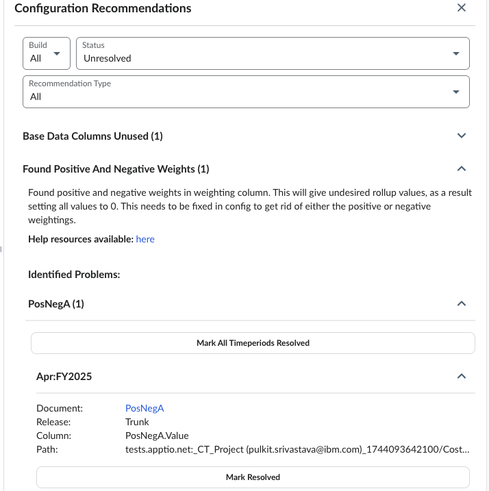

# Positive and Negative Weights

This feature helps fix weight problems by finding and warning about mixed positive and
negative weights, so you can correct them and get accurate results.

Navigate to  **TBM Studio**  >  **Recommendations**  tab, and then expand **Found
Positive and Negative Weights**.

Select the [help resource link](../model_studio/about-weighting-and-negative-numbers.html "◆ Applies to: TBM Studio 11.8.3.1 and later; TBM Studio 12.0 and later. The purpose of a weighting is to allocate the source number where the sum is the same in the target.") to know more.
